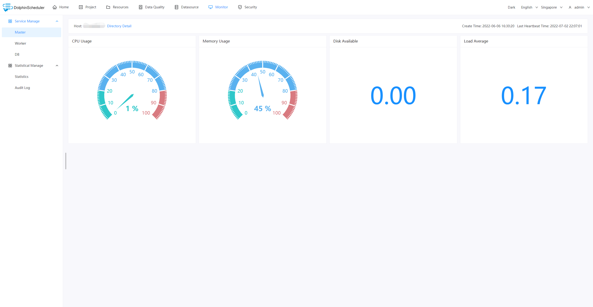

Dolphin Scheduler Official Website
[dolphinscheduler.apache.org](https://dolphinscheduler.apache.org)
============

[](https://www.apache.org/licenses/LICENSE-2.0.html)
[](https://github.com/apache/dolphinscheduler)
[](https://codecov.io/gh/apache/dolphinscheduler/branch/dev)
[](https://sonarcloud.io/dashboard?id=apache-dolphinscheduler)
[](https://twitter.com/dolphinschedule)
[](https://join.slack.com/t/asf-dolphinscheduler/shared_invite/zt-omtdhuio-_JISsxYhiVsltmC5h38yfw)


[](https://starchart.cc/apache/dolphinscheduler)

[](README.md)
[](README_zh_CN.md)

## Design Features

DolphinScheduler is a distributed and extensible workflow scheduler platform with powerful DAG visual interfaces, dedicated to solving complex job dependencies in the data pipeline and providing various types of jobs available `out of the box`.

Its main objectives are as follows:
 -  Highly Reliable, 
DolphinScheduler adopts a decentralized multi-master and multi-worker architecture design, which naturally supports easy expansion and high availability (not restricted by a single point of bottleneck), and its performance increases linearly with the increase of machines
 - High performance, supporting tens of millions of tasks every day
 - Support multi-tenant.
 - Cloud Native, DolphinScheduler supports multi-cloud/data center workflow management, also
supports Kubernetes, Docker deployment and custom task types, distributed
scheduling, with overall scheduling capability increased linearly with the
scale of the cluster
 - Support various task types: Shell, MR, Spark, SQL (MySQL, PostgreSQL, hive, spark SQL), Python, Sub_Process, Procedure, etc.
 - Support scheduling of workflows and dependencies, manual scheduling to pause/stop/recover task, support failure task retry/alarm, recover specified nodes from failure, kill task, etc.
 - Associate the tasks according to the dependencies of the tasks in a DAG graph, which can visualize the running state of the task in real-time.
 - WYSIWYG online editing tasks
 - Support the priority of workflows & tasks, task failover, and task timeout alarm or failure.
 - Support workflow global parameters and node customized parameter settings.
 - Support online upload/download/management of resource files, etc. Support online file creation and editing.
 - Support task log online viewing and scrolling and downloading, etc.
 - Support the viewing of Master/Worker CPU load, memory, and CPU usage metrics.
 - Support displaying workflow history in tree/Gantt chart, as well as statistical analysis on the task status & process status in each workflow.
 - Support back-filling data.
 - Support internationalization.
 - More features waiting for partners to explore...

## What's in DolphinScheduler

 Stability | Accessibility | Features | Scalability |
 --------- | ------------- | -------- | ------------|
Decentralized multi-master and multi-worker | Visualization of workflow key information, such as task status, task type, retry times, task operation machine information, visual variables, and so on at a glance.  |  Support pause, recover operation | Support customized task types
support HA | Visualization of all workflow operations, dragging tasks to draw DAGs, configuring data sources and resources. At the same time, for third-party systems, provide API mode operations. | Users on DolphinScheduler can achieve many-to-one or one-to-one mapping relationship through tenants and Hadoop users, which is very important for scheduling large data jobs.  | The scheduler supports distributed scheduling, and the overall scheduling capability will increase linearly with the scale of the cluster. Master and Worker support dynamic adjustment.
Overload processing: By using the task queue mechanism, the number of schedulable tasks on a single machine can be flexibly configured. Machine jam can be avoided with high tolerance to numbers of tasks cached in task queue. | One-click deployment | Support traditional shell tasks, and big data platform task scheduling: MR, Spark, SQL (MySQL, PostgreSQL, hive, spark SQL), Python, Procedure, Sub_Process |  |

## User Interface Screenshots





## QuickStart in Docker

Please refer the official website document: [QuickStart in Docker](https://dolphinscheduler.apache.org/en-us/docs/latest/user_doc/guide/installation/docker.html)

## QuickStart in Kubernetes

Please refer to the official website document: [QuickStart in Kubernetes](https://dolphinscheduler.apache.org/en-us/docs/latest/user_doc/guide/installation/kubernetes.html)

## How to Build

```bash
./mvnw clean install -Prelease
```

Artifact:

```
dolphinscheduler-dist/target/apache-dolphinscheduler-${latest.release.version}-bin.tar.gz: Binary package of DolphinScheduler
dolphinscheduler-dist/target/apache-dolphinscheduler-${latest.release.version}-src.tar.gz: Source code package of DolphinScheduler
```

## Thanks

DolphinScheduler is based on a lot of excellent open-source projects, such as Google guava, guice, grpc, netty, quartz, and many open-source projects of Apache and so on.
We would like to express our deep gratitude to all the open-source projects used in Dolphin Scheduler. We hope that we are not only the beneficiaries of open-source, but also give back to the community. Besides, we hope everyone who have the same enthusiasm and passion for open source could join in and contribute to the open-source community!

## Get Help

1. Submit an [issue](https://github.com/apache/dolphinscheduler/issues/new/choose)
2. [Join our slack](https://join.slack.com/t/asf-dolphinscheduler/shared_invite/zt-omtdhuio-_JISsxYhiVsltmC5h38yfw) and send your question to channel `#troubleshooting`

## Community

You are very welcome to communicate with the developers and users of Dolphin Scheduler. There are two ways to find them:
1. Join the Slack channel [Slack](https://asf-dolphinscheduler.slack.com/).
2. Follow the [Twitter account of DolphinScheduler](https://twitter.com/dolphinschedule) and get the latest news on time.

### Contributor over time

[](https://www.apiseven.com/en/contributor-graph?chart=contributorOverTime&repo=apache/dolphinscheduler)

## How to Contribute

The community welcomes everyone to contribute, please refer to this page to find out more: [How to contribute](https://dolphinscheduler.apache.org/en-us/community/development/contribute.html).

# Landscapes

<p align="center">
<br/><br/>
&nbsp;&nbsp;
<br/><br/>
DolphinScheduler enriches the <a href="https://landscape.cncf.io/?landscape=observability-and-analysis&license=apache-license-2-0">CNCF CLOUD NATIVE Landscape.</a >

</p >

## License

Please refer to the [LICENSE](https://github.com/apache/dolphinscheduler/blob/dev/LICENSE) file.
