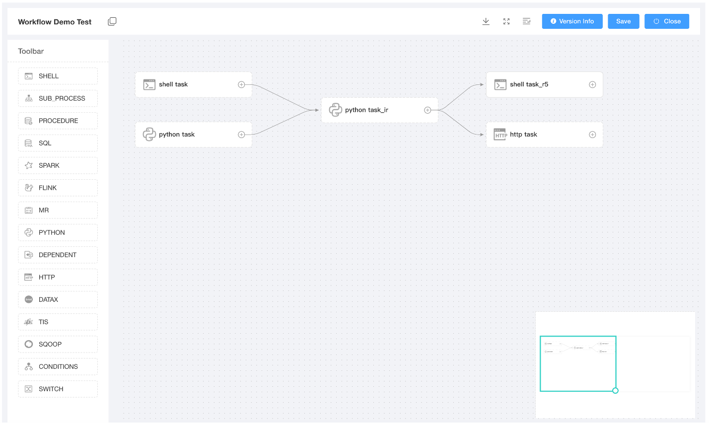
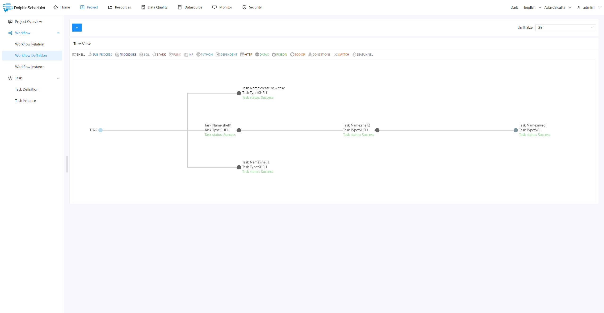
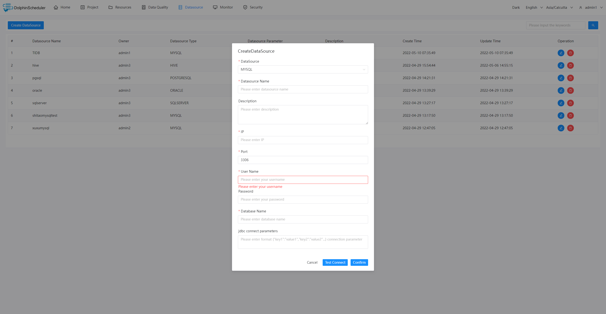
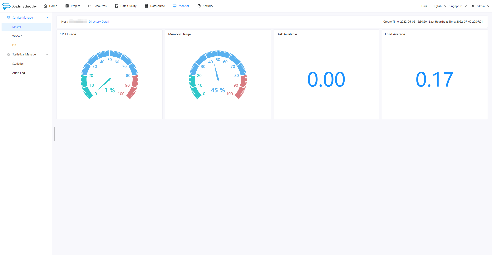

# Apache Dolphinscheduler

## 关于

一个分布式易扩展的可视化 DAG 工作流任务调度系统。致力于解决数据处理流程中错综复杂的依赖关系，使调度系统在数据处理流程中`开箱即用`。

DolphinScheduler 的主要特性如下：

- 易于部署，提供四种部署方式，包括Standalone、Cluster、Docker和Kubernetes
- 易于使用，可以通过四种方式创建和管理工作流，包括Web UI、[Python SDK](https://dolphinscheduler.apache.org/python/main/index.html)、Yaml文件和Open API
- 高可靠高可用，多主多从的去中心化架构，原生支持横向扩展
- 高性能，性能比其他编排平台快N倍，每天可支持千万级任务
- Cloud Native，DolphinScheduler支持编排多云/数据中心工作流，支持自定义任务类型
- 对工作流和工作流实例（包括任务）进行版本控制
- 工作流和任务的多种状态控制，支持随时暂停/停止/恢复它们
- 多租户支持
- 其他如回填支持（Web UI 原生），包括项目、资源和数据源的权限控制

## 快速开始

- 如果想要体验
    - [standalone 启动](https://dolphinscheduler.apache.org/zh-cn/docs/3.1.5/guide/installation/standalone)
    - [Docker 启动](https://dolphinscheduler.apache.org/zh-cn/docs/3.1.5/guide/start/docker)
- 想 Kubernetes 部署
    - [Kubernetes 部署](https://dolphinscheduler.apache.org/zh-cn/docs/3.1.5/guide/installation/kubernetes)

## 系统部分截图

* **主页**：项目和工作流概览，包括最新的工作流实例和任务实例状态统计。

* **工作流定义**： 通过拖拉拽创建和管理工作流，轻松构建和维护复杂的工作流。

* **工作流树状图**： 抽象的树形结构可以更清晰地理解任务之间的关系

* **数据源**： 支持管理多种外部数据源，为MySQL、PostgreSQL、Hive、Trino等，并提供统一的数据访问能力。

* **监控**：实时查看master、worker和数据库的状态，包括服务器资源使用情况和负载情况，无需登录服务器即可快速进行健康检查。

## 建议和报告 bugs

根据 [这个步骤](https://github.com/apache/dolphinscheduler/issues/new/choose) 来报告你的 bug 或者提交建议。

## 参与贡献

社区欢迎大家贡献，请参考此页面了解更多：[如何贡献](docs/docs/zh/contribute/join/contribute.md)，如果你是首次贡献 DolphinScheduler，在[这里](https://github.com/apache/dolphinscheduler/contribute)可以找到good first issue

## 社区

欢迎通过以方式加入社区：

- 加入 [DolphinScheduler Slack](https://s.apache.org/dolphinscheduler-slack)
- 关注 [DolphinScheduler Twitter](https://twitter.com/dolphinschedule) 来获取最新消息
- 订阅 DolphinScheduler 邮件列表, 用户订阅 users@dolphinscheduler.apache.org 开发者请订阅 dev@dolphinscheduler.apache.org

# Landscapes

  
&nbsp;&nbsp;
  
DolphinScheduler enriches the <a href="https://landscape.cncf.io/?landscape=observability-and-analysis&license=apache-license-2-0">CNCF CLOUD NATIVE Landscape.</a >

