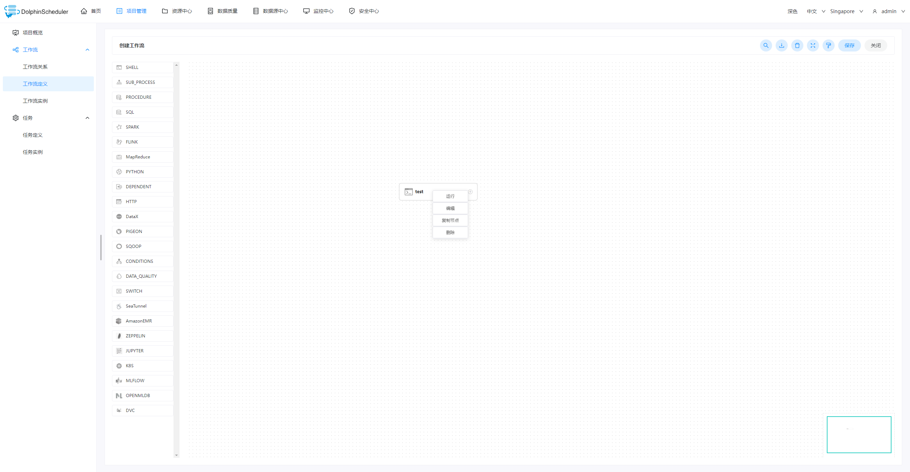
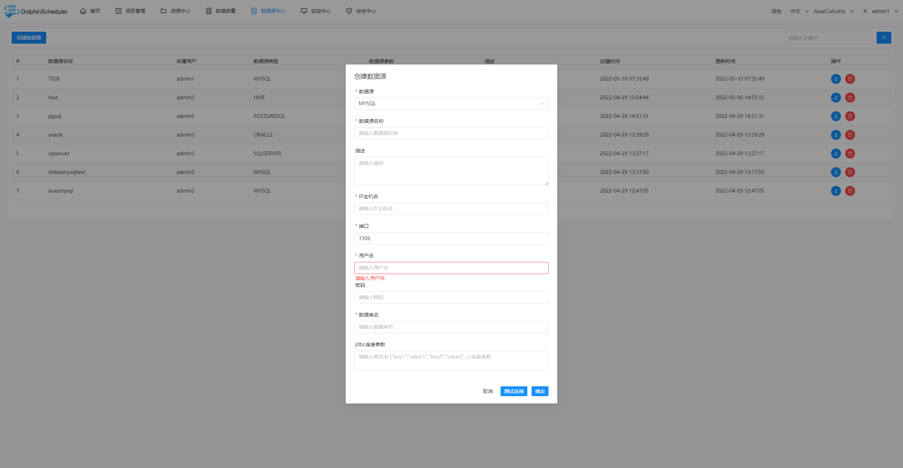
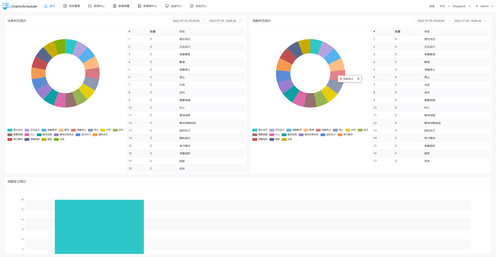

Dolphin Scheduler Official Website
[dolphinscheduler.apache.org](https://dolphinscheduler.apache.org)
==================================================================

[](https://www.apache.org/licenses/LICENSE-2.0.html)
[](https://codecov.io/gh/apache/dolphinscheduler/branch/dev)
[](https://sonarcloud.io/dashboard?id=apache-dolphinscheduler)

[](https://starchart.cc/apache/dolphinscheduler)

[](README_zh_CN.md)
[](README.md)

## 设计特点

一个分布式易扩展的可视化DAG工作流任务调度系统。致力于解决数据处理流程中错综复杂的依赖关系，使调度系统在数据处理流程中`开箱即用`。

其主要目标如下：

- 以DAG图的方式将Task按照任务的依赖关系关联起来，可实时可视化监控任务的运行状态
- 支持丰富的任务类型：Shell、MR、Spark、SQL(mysql、postgresql、hive、sparksql)、Python、Sub_Process、Procedure等
- 支持工作流定时调度、依赖调度、手动调度、手动暂停/停止/恢复，同时支持失败重试/告警、从指定节点恢复失败、Kill任务等操作
- 支持工作流优先级、任务优先级及任务的故障转移及任务超时告警/失败
- 支持工作流全局参数及节点自定义参数设置
- 支持资源文件的在线上传/下载，管理等，支持在线文件创建、编辑
- 支持任务日志在线查看及滚动、在线下载日志等
- 实现集群HA，通过Zookeeper实现Master集群和Worker集群去中心化
- 支持对`Master/Worker` cpu load，memory，cpu在线查看
- 支持工作流运行历史树形/甘特图展示、支持任务状态统计、流程状态统计
- 支持补数
- 支持多租户
- 支持国际化
- 还有更多等待伙伴们探索

## 系统部分截图






## 近期研发计划

DolphinScheduler的工作计划：<a href="https://github.com/apache/dolphinscheduler/projects/1" target="_blank">研发计划</a> ，其中 In Develop卡片下是正在研发的功能，TODO卡片是待做事项(包括 feature ideas)

## 参与贡献

非常欢迎大家来参与贡献，贡献流程请参考：
[[参与贡献](docs/docs/zh/contribute/join/contribute.md)]

## 快速试用 Docker

请参考官方文档: [快速试用 Docker 部署](https://dolphinscheduler.apache.org/zh-cn/docs/latest/user_doc/guide/start/docker.html)

## 快速试用 Kubernetes

请参考官方文档: [快速试用 Kubernetes 部署](http://dolphinscheduler.apache.org/zh-cn/docs/latest/user_doc/guide/installation/kubernetes.html)

## 如何构建

```bash
./mvnw clean install -Prelease
```

制品:

```
dolphinscheduler-dist/target/apache-dolphinscheduler-${latest.release.version}-bin.tar.gz: DolphinScheduler 二进制包
dolphinscheduler-dist/target/apache-dolphinscheduler-${latest.release.version}-src.tar.gz: DolphinScheduler 源代码包
```

## 感谢

Dolphin Scheduler使用了很多优秀的开源项目，比如google的guava、grpc，netty，quartz，以及apache的众多开源项目等等，
正是由于站在这些开源项目的肩膀上，才有Dolphin Scheduler的诞生的可能。对此我们对使用的所有开源软件表示非常的感谢！我们也希望自己不仅是开源的受益者，也能成为开源的贡献者,也希望对开源有同样热情和信念的伙伴加入进来，一起为开源献出一份力！

## 获得帮助

1. 提交 [issue](https://github.com/apache/dolphinscheduler/issues/new/choose)
2. [加入slack群](https://s.apache.org/dolphinscheduler-slack) 并在频道 `#troubleshooting` 中提问

## 社区

1. 通过[该申请链接](https://s.apache.org/dolphinscheduler-slack)加入slack channel
2. 关注[Apache Dolphin Scheduler的Twitter账号](https://twitter.com/dolphinschedule)获取实时动态

## 版权

请参考 [LICENSE](https://github.com/apache/dolphinscheduler/blob/dev/LICENSE) 文件.
