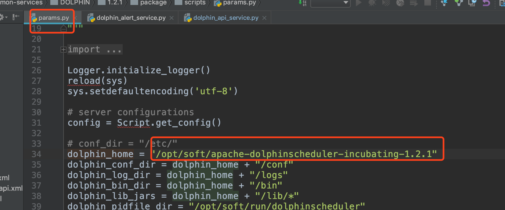
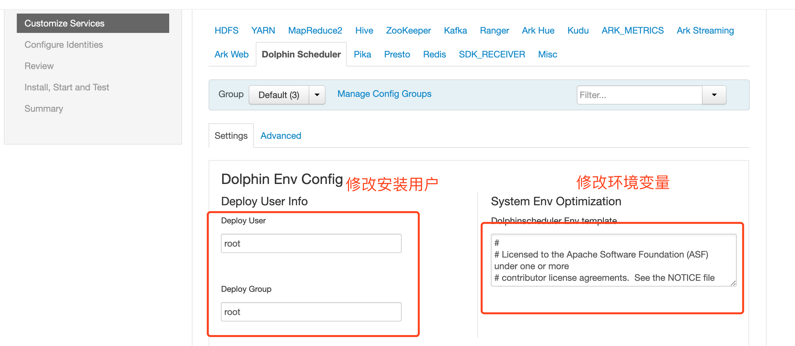
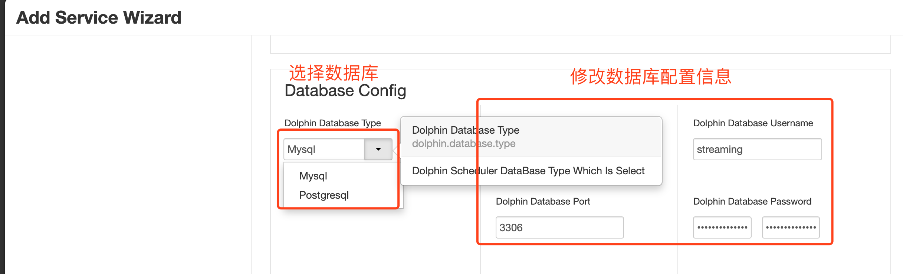
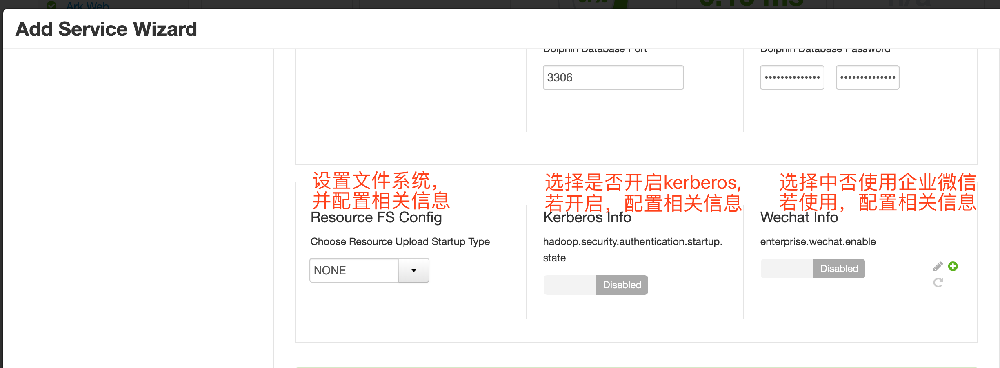

### ambari安装DS操作说明
#### 一. 安装准备
1. 准备RPM包 
2. 准备DS的安装用户--有sudo权限
3. 初始化数据库，设置用户密码:
```
CREATE DATABASE dolphinscheduler DEFAULT CHARACTER SET utf8 DEFAULT COLLATE utf8_general_ci;
GRANT ALL PRIVILEGES ON dolphinscheduler.* TO '{user}'@'%' IDENTIFIED BY '{password}';
GRANT ALL PRIVILEGES ON dolphinscheduler.* TO '{user}'@'localhost' IDENTIFIED BY '{password}';
flush privileges;
```


#### 二. 参数设置
1. 安装前设置安装目录--和rpm包中的配置保持一致：
    
3. 安装过程中设置必要的参数：
    
    
    
