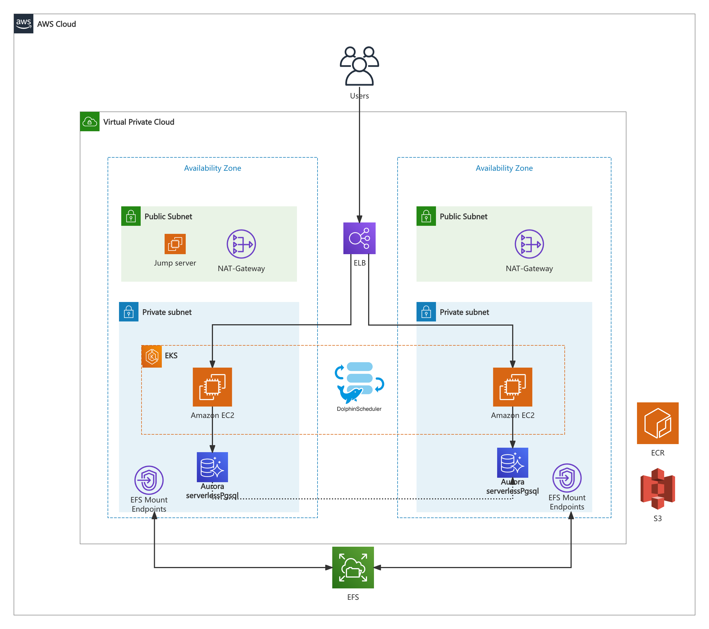

# Self-managed Apache DolphinScheduler deployment for EKS
Apache DolphinScheduler is a distributed and extensible open-source workflow orchestration platform with powerful DAG visual interfaces.You can obtain an analysis of the architecture and technical details by reviewing the official DolphinScheduler documentation.[Apache DolphinScheduler](https://dolphinscheduler.apache.org/en-us/docs/)

Core Architecture Details of the Deployment Script:

Architecture on EKS: The deployment is containerized on EKS and provides a publicly accessible ELB proxy domain name.

Core Components for DolphinScheduler:

Database: Utilizes AWS Aurora Serverless v2 [AWS Aurora Serverless](https://aws.amazon.com/cn/rds/aurora/serverless/), which allows configuration of elastic scaling ranges, with a default range of 2-16 ACUs. This provides elastic database capabilities for the system.

Persistent Storage: Uses AWS EFS for serverless, elastic persistent storage [AWS EFS](https://aws.amazon.com/cn/efs/).

Task Logging: Remote task logs are enabled by default and are stored in S3 [AWS S3](https://aws.amazon.com/cn/s3), where task-level logs can be reviewed.

Dependency and File Management: Dependencies and file management are stored in S3.

Namespace Management: DolphinScheduler namespace and node scaling are managed automatically by [Karpenter](https://karpenter.sh/)) .

## Architecture Preview


## Deployment Steps:

#### Install Basic Environment: 
Install Terraform, Helm, and kubectl.

#### Execute Installation Script: 

```
cd ${terraform}/
sh install.sh
```
Wait for Completion: The process will take approximately 30 minutes.

##### Retrieve Ingress Address: 
Obtain the ingress address after deployment.
```
# Create or update a kubeconfig file for your cluster. Replace region-code with the AWS Region that your cluster is in and replace my-cluster with the name of your cluster. eg.

aws eks --region us-east-1 update-kubeconfig --name dolphinscheduler

kubectl get ingress -n dolphinscheduler
NAME               CLASS   HOSTS                  ADDRESS 
dolphinscheduler   alb     dolphinscheduler.org   k8s-dolphins-dolphins-xxxx.us-east-1.elb.amazonaws.com   80      3m30s
```
To log in to DolphinScheduler using the ELB address and port with the default username and password. `http://your-elb-address:12345/dolphinscheduler/ui` 

#### Cleanup Steps

Execute Cleanup Script: 
```
sh cleanup.sh

```
## Requirements

| Name | Version |
|------|---------|
| <a name="requirement_terraform"></a> [terraform](#requirement\_terraform) | >= 1.0.0 |
| <a name="requirement_aws"></a> [aws](#requirement\_aws) | >= 5.0 |
| <a name="requirement_helm"></a> [helm](#requirement\_helm) | >= 2.9.0 |
| <a name="requirement_kubectl"></a> [kubectl](#requirement\_kubectl) | >= 1.30 |
| <a name="requirement_kubernetes"></a> [kubernetes](#requirement\_kubernetes) | >= 2.20.0 |
| <a name="requirement_random"></a> [random](#requirement\_random) | 3.5.1 |

## Providers

| Name | Version |
|------|---------|
| <a name="provider_aws"></a> [aws](#provider\_aws) | >= 5.0 |
| <a name="provider_aws.ecr"></a> [aws.ecr](#provider\_aws.ecr) | >= 5.0 |
| <a name="provider_kubectl"></a> [kubectl](#provider\_kubectl) | >= 1.14 |
| <a name="provider_kubernetes"></a> [kubernetes](#provider\_kubernetes) | >= 2.20.0 |
| <a name="provider_random"></a> [random](#provider\_random) | 3.5.1 |

## Modules

| Name | Source | Version |
|------|--------|---------|
| <a name="module_dolphinScheduler_irsa_scheduler"></a> [dolphinScheduler\_irsa\_scheduler](#module\_dolphinScheduler\_irsa\_scheduler) | aws-ia/eks-blueprints-addon/aws | ~> 1.0 |
| <a name="module_dolphinScheduler_irsa_webserver"></a> [dolphinScheduler\_irsa\_webserver](#module\_dolphinScheduler\_irsa\_webserver) | aws-ia/eks-blueprints-addon/aws | ~> 1.0 |
| <a name="module_dolphinScheduler_irsa_worker"></a> [dolphinScheduler\_irsa\_worker](#module\_dolphinScheduler\_irsa\_worker) | aws-ia/eks-blueprints-addon/aws | ~> 1.0 |
| <a name="module_dolphinScheduler_s3_bucket"></a> [dolphinScheduler\_s3\_bucket](#module\_dolphinScheduler\_s3\_bucket) | terraform-aws-modules/s3-bucket/aws | ~> 3.0 |
| <a name="module_amp_ingest_irsa"></a> [amp\_ingest\_irsa](#module\_amp\_ingest\_irsa) | aws-ia/eks-blueprints-addon/aws | ~> 1.0 |
| <a name="module_db"></a> [db](#module\_db) | terraform-aws-modules/rds-aurora/aws | ~> 5.0 |
| <a name="module_ebs_csi_driver_irsa"></a> [ebs\_csi\_driver\_irsa](#module\_ebs\_csi\_driver\_irsa) | terraform-aws-modules/iam/aws//modules/iam-role-for-service-accounts-eks | ~> 5.34 |
| <a name="module_eks"></a> [eks](#module\_eks) | terraform-aws-modules/eks/aws | ~> 19.15 |
| <a name="module_eks_blueprints_addons"></a> [eks\_blueprints\_addons](#module\_eks\_blueprints\_addons) | aws-ia/eks-blueprints-addons/aws | ~> 1.2 |
| <a name="module_eks_data_addons"></a> [eks\_data\_addons](#module\_eks\_data\_addons) | aws-ia/eks-data-addons/aws | ~> 1.2.9 |
| <a name="module_fluentbit_s3_bucket"></a> [fluentbit\_s3\_bucket](#module\_fluentbit\_s3\_bucket) | terraform-aws-modules/s3-bucket/aws | ~> 3.0 |
| <a name="module_security_group"></a> [security\_group](#module\_security\_group) | terraform-aws-modules/security-group/aws | ~> 5.0 |
| <a name="module_spark_logs_s3_bucket"></a> [spark\_logs\_s3\_bucket](#module\_spark\_logs\_s3\_bucket) | terraform-aws-modules/s3-bucket/aws | ~> 3.0 |
| <a name="module_spark_team_a_irsa"></a> [spark\_team\_a\_irsa](#module\_spark\_team\_a\_irsa) | aws-ia/eks-blueprints-addon/aws | ~> 1.0 |
| <a name="module_vpc"></a> [vpc](#module\_vpc) | terraform-aws-modules/vpc/aws | ~> 5.0 |


## Resources

| Name | Type |
|------|------|
| [aws_efs_file_system.efs](https://registry.terraform.io/providers/hashicorp/aws/latest/docs/resources/efs_file_system) | resource |
| [aws_efs_mount_target.efs_mt](https://registry.terraform.io/providers/hashicorp/aws/latest/docs/resources/efs_mount_target) | resource |
| [aws_iam_policy.dolphinScheduler_scheduler](https://registry.terraform.io/providers/hashicorp/aws/latest/docs/resources/iam_policy) | resource |
| [aws_iam_policy.dolphinScheduler_webserver](https://registry.terraform.io/providers/hashicorp/aws/latest/docs/resources/iam_policy) | resource |
| [aws_iam_policy.dolphinScheduler_worker](https://registry.terraform.io/providers/hashicorp/aws/latest/docs/resources/iam_policy) | resource |
| [aws_iam_policy.fluentbit](https://registry.terraform.io/providers/hashicorp/aws/latest/docs/resources/iam_policy) | resource |
| [aws_iam_policy.grafana](https://registry.terraform.io/providers/hashicorp/aws/latest/docs/resources/iam_policy) | resource |
| [aws_iam_policy.spark](https://registry.terraform.io/providers/hashicorp/aws/latest/docs/resources/iam_policy) | resource |
| [aws_prometheus_workspace.amp](https://registry.terraform.io/providers/hashicorp/aws/latest/docs/resources/prometheus_workspace) | resource |
| [aws_s3_object.this](https://registry.terraform.io/providers/hashicorp/aws/latest/docs/resources/s3_object) | resource |
| [aws_secretsmanager_secret.dolphinScheduler_webserver](https://registry.terraform.io/providers/hashicorp/aws/latest/docs/resources/secretsmanager_secret) | resource |
| [aws_secretsmanager_secret.postgres](https://registry.terraform.io/providers/hashicorp/aws/latest/docs/resources/secretsmanager_secret) | resource |
| [aws_secretsmanager_secret_version.dolphinScheduler_webserver](https://registry.terraform.io/providers/hashicorp/aws/latest/docs/resources/secretsmanager_secret_version) | resource |
| [aws_secretsmanager_secret_version.postgres](https://registry.terraform.io/providers/hashicorp/aws/latest/docs/resources/secretsmanager_secret_version) | resource |
| [aws_security_group.efs](https://registry.terraform.io/providers/hashicorp/aws/latest/docs/resources/security_group) | resource |
| [kubectl_manifest.dolphinScheduler_webserver](https://registry.terraform.io/providers/gavinbunney/kubectl/latest/docs/resources/manifest) | resource |
| [kubectl_manifest.efs_pvc](https://registry.terraform.io/providers/gavinbunney/kubectl/latest/docs/resources/manifest) | resource |
| [kubectl_manifest.efs_sc](https://registry.terraform.io/providers/gavinbunney/kubectl/latest/docs/resources/manifest) | resource |
| [kubernetes_cluster_role.spark_role](https://registry.terraform.io/providers/hashicorp/kubernetes/latest/docs/resources/cluster_role) | resource |
| [kubernetes_cluster_role_binding.dolphinScheduler_worker_spark_role_binding](https://registry.terraform.io/providers/hashicorp/kubernetes/latest/docs/resources/cluster_role_binding) | resource |
| [kubernetes_cluster_role_binding.spark_role_binding](https://registry.terraform.io/providers/hashicorp/kubernetes/latest/docs/resources/cluster_role_binding) | resource |
| [kubernetes_namespace_v1.dolphinScheduler](https://registry.terraform.io/providers/hashicorp/kubernetes/latest/docs/resources/namespace_v1) | resource |
| [kubernetes_namespace_v1.spark_team_a](https://registry.terraform.io/providers/hashicorp/kubernetes/latest/docs/resources/namespace_v1) | resource |
| [kubernetes_secret_v1.dolphinScheduler_scheduler](https://registry.terraform.io/providers/hashicorp/kubernetes/latest/docs/resources/secret_v1) | resource |
| [kubernetes_secret_v1.dolphinScheduler_webserver](https://registry.terraform.io/providers/hashicorp/kubernetes/latest/docs/resources/secret_v1) | resource |
| [kubernetes_secret_v1.dolphinScheduler_worker](https://registry.terraform.io/providers/hashicorp/kubernetes/latest/docs/resources/secret_v1) | resource |
| [kubernetes_secret_v1.spark_team_a](https://registry.terraform.io/providers/hashicorp/kubernetes/latest/docs/resources/secret_v1) | resource |
| [kubernetes_service_account_v1.dolphinScheduler_scheduler](https://registry.terraform.io/providers/hashicorp/kubernetes/latest/docs/resources/service_account_v1) | resource |
| [kubernetes_service_account_v1.dolphinScheduler_webserver](https://registry.terraform.io/providers/hashicorp/kubernetes/latest/docs/resources/service_account_v1) | resource |
| [kubernetes_service_account_v1.dolphinScheduler_worker](https://registry.terraform.io/providers/hashicorp/kubernetes/latest/docs/resources/service_account_v1) | resource |
| [kubernetes_service_account_v1.spark_team_a](https://registry.terraform.io/providers/hashicorp/kubernetes/latest/docs/resources/service_account_v1) | resource |
| [random_id.dolphinScheduler_webserver](https://registry.terraform.io/providers/hashicorp/random/3.5.1/docs/resources/id) | resource |
| [random_password.postgres](https://registry.terraform.io/providers/hashicorp/random/3.5.1/docs/resources/password) | resource |
| [aws_availability_zones.available](https://registry.terraform.io/providers/hashicorp/aws/latest/docs/data-sources/availability_zones) | data source |
| [aws_caller_identity.current](https://registry.terraform.io/providers/hashicorp/aws/latest/docs/data-sources/caller_identity) | data source |
| [aws_ecrpublic_authorization_token.token](https://registry.terraform.io/providers/hashicorp/aws/latest/docs/data-sources/ecrpublic_authorization_token) | data source |
| [aws_eks_cluster_auth.this](https://registry.terraform.io/providers/hashicorp/aws/latest/docs/data-sources/eks_cluster_auth) | data source |
| [aws_iam_policy_document.dolphinScheduler_s3_logs](https://registry.terraform.io/providers/hashicorp/aws/latest/docs/data-sources/iam_policy_document) | data source |
| [aws_iam_policy_document.fluent_bit](https://registry.terraform.io/providers/hashicorp/aws/latest/docs/data-sources/iam_policy_document) | data source |
| [aws_iam_policy_document.grafana](https://registry.terraform.io/providers/hashicorp/aws/latest/docs/data-sources/iam_policy_document) | data source |
| [aws_iam_policy_document.spark_operator](https://registry.terraform.io/providers/hashicorp/aws/latest/docs/data-sources/iam_policy_document) | data source |
| [aws_partition.current](https://registry.terraform.io/providers/hashicorp/aws/latest/docs/data-sources/partition) | data source |
| [aws_region.current](https://registry.terraform.io/providers/hashicorp/aws/latest/docs/data-sources/region) | data source |
| [aws_secretsmanager_secret_version.admin_password_version](https://registry.terraform.io/providers/hashicorp/aws/latest/docs/data-sources/secretsmanager_secret_version) | data source |

## Inputs

| Name | Description | Type | Default | Required |
|------|-------------|------|---------|:--------:|
| <a name="input_db_private_subnets"></a> [db\_private\_subnets](#input\_db\_private\_subnets) | Private Subnets CIDRs. 254 IPs per Subnet/AZ for dolphinScheduler DB. | `list(string)` | <pre>[<br>  "10.0.20.0/26",<br>  "10.0.21.0/26"<br>]</pre> | no |
| <a name="input_eks_cluster_version"></a> [eks\_cluster\_version](#input\_eks\_cluster\_version) | EKS Cluster version | `string` | `"1.29"` | no |
| <a name="input_eks_data_plane_subnet_secondary_cidr"></a> [eks\_data\_plane\_subnet\_secondary\_cidr](#input\_eks\_data\_plane\_subnet\_secondary\_cidr) | Secondary CIDR blocks. 32766 IPs per Subnet per Subnet/AZ for EKS Node and Pods | `list(string)` | <pre>[<br>  "100.64.0.0/17",<br>  "100.64.128.0/17"<br>]</pre> | no |
| <a name="input_enable_dolphinScheduler"></a> [enable\_dolphinScheduler](#input\_enable\_dolphinScheduler) | Enable Apache dolphinScheduler | `bool` | `true` | no |
| <a name="input_enable_dolphinScheduler_spark_example"></a> [enable\_dolphinScheduler\_spark\_example](#input\_enable\_dolphinScheduler\_spark\_example) | Enable Apache dolphinScheduler and Spark Operator example | `bool` | `false` | no |
| <a name="input_enable_amazon_prometheus"></a> [enable\_amazon\_prometheus](#input\_enable\_amazon\_prometheus) | Enable AWS Managed Prometheus service | `bool` | `true` | no |
| <a name="input_name"></a> [name](#input\_name) | Name of the VPC and EKS Cluster | `string` | `"self-managed-dolphinScheduler"` | no |
| <a name="input_private_subnets"></a> [private\_subnets](#input\_private\_subnets) | Private Subnets CIDRs. 254 IPs per Subnet/AZ for Private NAT + NLB + dolphinScheduler + EC2 Jumphost etc. | `list(string)` | <pre>[<br>  "10.0.1.0/24",<br>  "10.0.2.0/24"<br>]</pre> | no |
| <a name="input_public_subnets"></a> [public\_subnets](#input\_public\_subnets) | Public Subnets CIDRs. 62 IPs per Subnet/AZ | `list(string)` | <pre>[<br>  "10.0.0.0/26",<br>  "10.0.0.64/26"<br>]</pre> | no |
| <a name="input_region"></a> [region](#input\_region) | Region | `string` | `"us-west-2"` | no |
| <a name="input_secondary_cidr_blocks"></a> [secondary\_cidr\_blocks](#input\_secondary\_cidr\_blocks) | Secondary CIDR blocks to be attached to VPC | `list(string)` | <pre>[<br>  "100.64.0.0/16"<br>]</pre> | no |
| <a name="input_vpc_cidr"></a> [vpc\_cidr](#input\_vpc\_cidr) | VPC CIDR | `string` | `"10.0.0.0/16"` | no |

## Outputs

| Name | Description |
|------|-------------|
| <a name="output_configure_kubectl"></a> [configure\_kubectl](#output\_configure\_kubectl) | Configure kubectl: make sure you're logged in with the correct AWS profile and run the following command to update your kubeconfig |
| <a name="output_s3_bucket_id_dolphinScheduler_logs"></a> [s3\_bucket\_id\_dolphinScheduler\_logs](#output\_s3\_bucket\_id\_dolphinScheduler\_logs) | dolphinScheduler logs S3 bucket ID |
| <a name="output_s3_bucket_id_fluentbit_logs"></a> [s3\_bucket\_id\_fluentbit\_logs](#output\_s3\_bucket\_id\_fluentbit\_logs) | FluentBit logs S3 bucket ID |
<!-- END OF PRE-COMMIT-TERRAFORM DOCS HOOK -->
