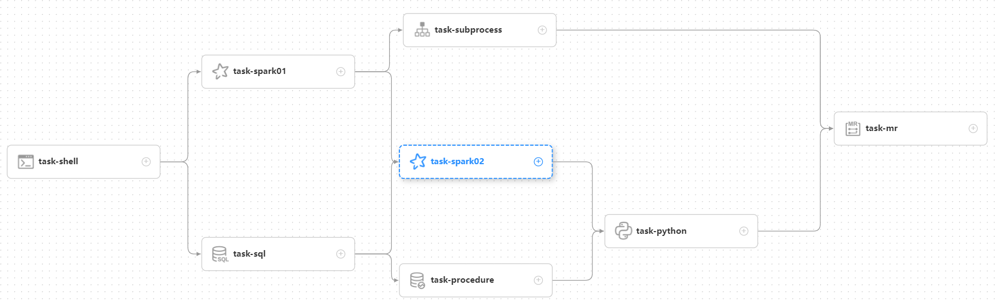

## System Architecture Design

Before explaining the architecture of the scheduling system, let's first understand the commonly used terms of the
scheduling system

### 1.Glossary

**DAG：** The full name is Directed Acyclic Graph, referred to as DAG. Task tasks in the workflow are assembled in the
form of a directed acyclic graph, and topological traversal is performed from nodes with zero degrees of entry until
there are no subsequent nodes. Examples are as follows:

**Process definition**: Visualization formed by dragging task nodes and establishing task node associations**DAG**

**Process instance**: The process instance is the instantiation of the process definition, which can be generated by
manual start or scheduled scheduling. Each time the process definition runs, a process instance is generated

**Task instance**: The task instance is the instantiation of the task node in the process definition, which identifies
the specific task

**Task type**: Currently supports SHELL, SQL, SUB_PROCESS (sub-process), PROCEDURE, MR, SPARK, PYTHON, DEPENDENT (
depends), and plans to support dynamic plug-in expansion, note: **SUB_PROCESS**  need relation with another workflow definition which also a separate process
definition that can be started and executed separately

**Scheduling method**: The system supports scheduled scheduling and manual scheduling based on cron expressions. Command
type support: start workflow, start execution from current node, resume fault-tolerant workflow, resume pause process,
start execution from failed node, complement, timing, rerun, pause, stop, resume waiting thread. Among them **Resume
fault-tolerant workflow** and **Resume waiting thread** The two command types are used by the internal control of
scheduling, and cannot be called from the outside

**Scheduled**: System adopts **quartz** distributed scheduler, and supports the visual generation of cron expressions

**Rely**: The system not only supports **DAG** simple dependencies between the predecessor and successor nodes, but also
provides **task dependent** nodes, supporting **between processes**

**Priority**: Support the priority of process instances and task instances, if the priority of process instances and
task instances is not set, the default is first-in-first-out

**Email alert**: Support **SQL task** Query result email sending, process instance running result email alert and fault
tolerance alert notification

**Failure strategy**: For tasks running in parallel, if a task fails, two failure strategy processing methods are
provided. **Continue** refers to regardless of the status of the task running in parallel until the end of the process
failure. **End** means that once a failed task is found, Kill will also run the parallel task at the same time, and the
process fails and ends

**Complement**: Supplement historical data，supports **interval parallel** and **serial** two complement methods, and two types of date selection which include **date range** and **date enumeration**.

### 2.Module introduction

- dolphinscheduler-master master module, provides workflow management and orchestration.

- dolphinscheduler-worker worker module, provides task execution management.

- dolphinscheduler-alert alarm module, providing AlertServer service.

- dolphinscheduler-api web application module, providing ApiServer service.

- dolphinscheduler-common General constant enumeration, utility class, data structure or base class

- dolphinscheduler-dao provides operations such as database access.

- dolphinscheduler-remote client and server based on netty

- dolphinscheduler-service service module, including Quartz, Zookeeper, log client access service, easy to call server
  module and api module

- dolphinscheduler-ui front-end module

### Sum up

From the perspective of scheduling, this article preliminarily introduces the architecture principles and implementation
ideas of the big data distributed workflow scheduling system-DolphinScheduler. To be continued

