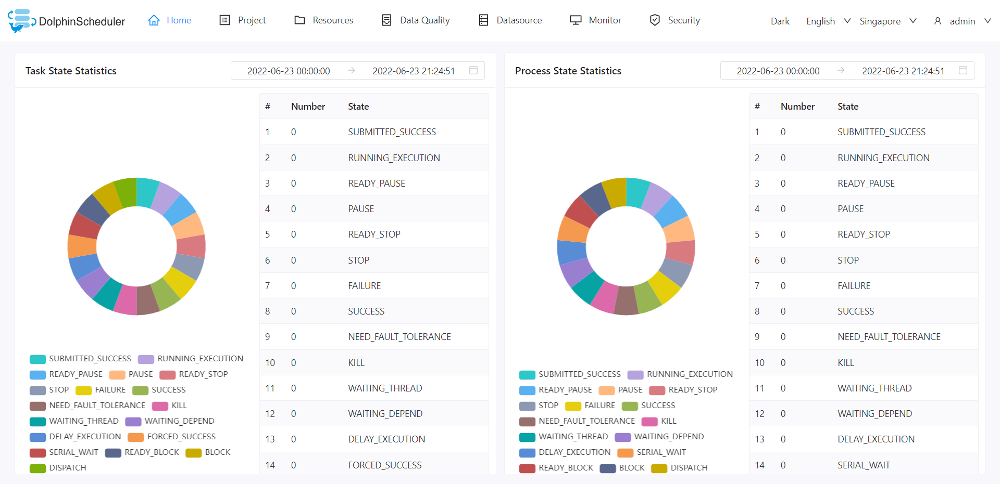

# About DolphinScheduler

Apache DolphinScheduler provides a distributed and easy to expand visual workflow task scheduling open-source platform. It is suitable for enterprise-level scenarios. It provides a solution to visualize operation tasks, workflows, and the entire data processing procedures.

Apache DolphinScheduler aims to solve complex big data task dependencies and to trigger relationships in data OPS orchestration for various big data applications. Solves the intricate dependencies of data R&D ETL and the inability to monitor the health status of tasks. DolphinScheduler assembles tasks in the Directed Acyclic Graph (DAG) streaming mode, which can monitor the execution status of tasks in time, and supports operations like retry, recovery failure from specified nodes, pause, resume, and kill tasks, etc.

