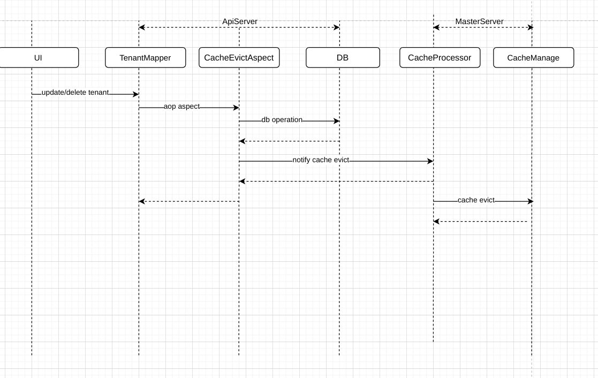

# Cache

## Purpose

Due to the large database read operations during the master-server scheduling process. Such as read tables like `tenant`, `user`, `processDefinition`, etc. Operations stress read pressure to the DB, and slow down the entire core scheduling process.

By considering this part of the business data is a high-read and low-write scenario, a cache module is introduced to reduce the DB read pressure and speed up the core scheduling process.

## Cache Settings

```yaml
spring:
  cache:
    # default disable cache, you can enable by `type: caffeine`
    type: none
    cache-names:
      - tenant
      - user
      - processDefinition
      - processTaskRelation
      - taskDefinition
    caffeine:
      spec: maximumSize=100,expireAfterWrite=300s,recordStats
```

The cache module uses [spring-cache](https://spring.io/guides/gs/caching/), so you can set cache config like whether to enable cache (`none` to disable by default), cache types in the spring `application.yaml` directly.

Currently, implements the config of [caffeine](https://github.com/ben-manes/caffeine), you can assign cache configs like cache size, expire time, etc.

## Cache Read

The cache module adopts the `@Cacheable` annotation from spring-cache and you can annotate the annotation in the related mapper layer. Refer to the `TenantMapper`.

## Cache Evict

The business data updates come from the api-server, and the cache side is in the master-server. Then it is necessary to monitor the data updates from the api-server (use aspect point cut interceptor `@CacheEvict`), and notify the master-server of `cacheEvictCommand` when processing a cache eviction.

Note: the final strategy for cache update comes from the expiration strategy configuration in caffeine, therefore configure it under the business scenarios;

The sequence diagram shows below:


