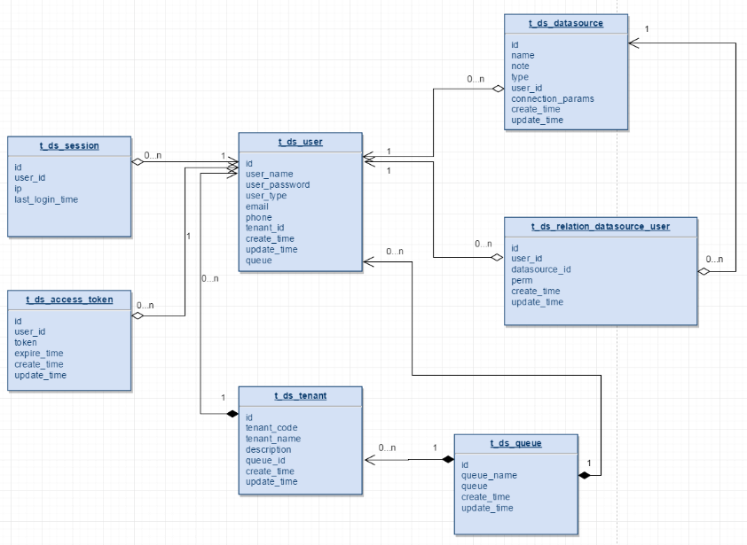
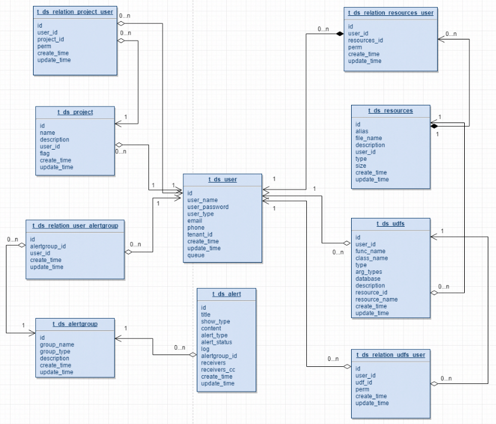
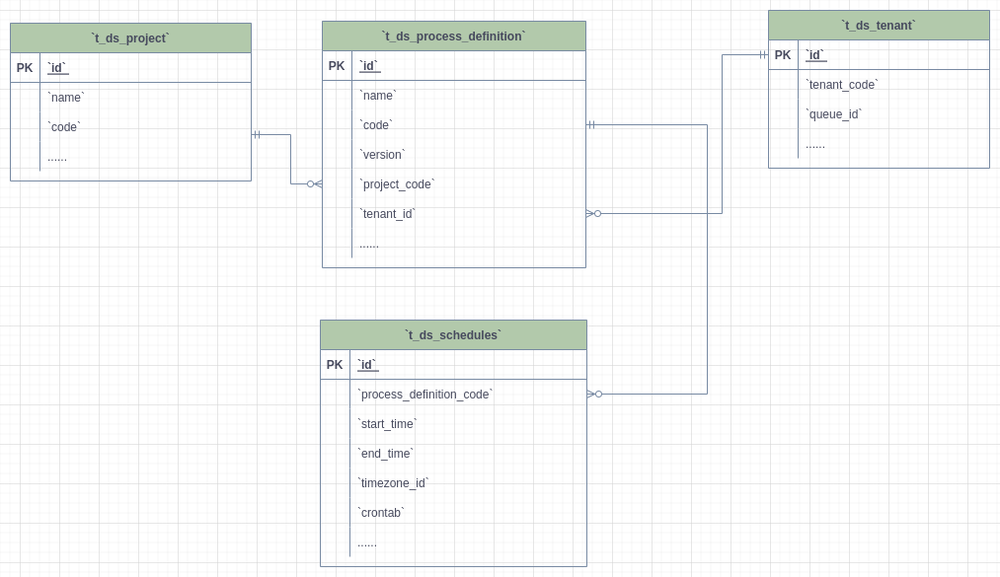
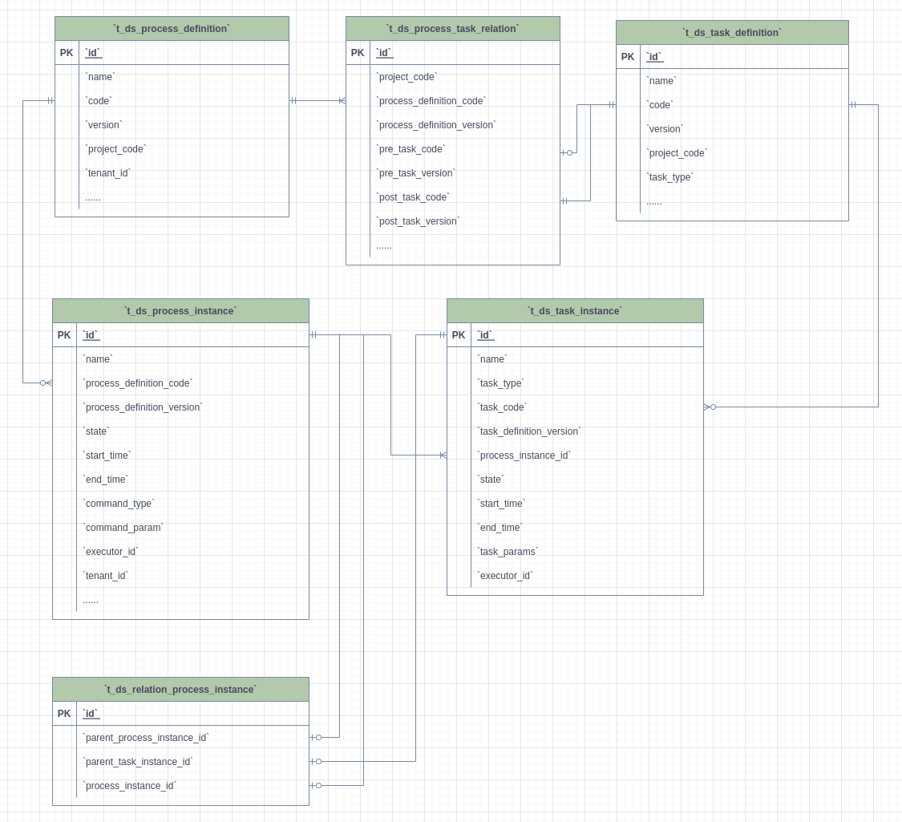

# MetaData

## Table Schema

see sql files in `dolphinscheduler/dolphinscheduler-dao/src/main/resources/sql`

---

## E-R Diagram

### User Queue DataSource

- One tenant can own Multiple users.
- The queue field in the `t_ds_user` table stores the `queue_name` information in the `t_ds_queue` table, `t_ds_tenant` stores queue information using `queue_id` column. During the execution of the process definition, the user queue has the highest priority. If the user queue is null, use the tenant queue.
- The `user_id` field in the `t_ds_datasource` table shows the user who create the data source. The user_id in `t_ds_relation_datasource_user` shows the user who has permission to the data source.

### Project Resource Alert

- User can have multiple projects, user project authorization completes the relationship binding using `project_id` and `user_id` in `t_ds_relation_project_user` table.
- The `user_id` in the `t_ds_projcet` table represents the user who create the project, and the `user_id` in the `t_ds_relation_project_user` table represents users who have permission to the project.
- The `user_id` in the `t_ds_resources` table represents the user who create the resource, and the `user_id` in `t_ds_relation_resources_user` represents the user who has permissions to the resource.
- The `user_id` in the `t_ds_udfs` table represents the user who create the UDF, and the `user_id` in the `t_ds_relation_udfs_user` table represents a user who has permission to the UDF.

### Project - Tenant - ProcessDefinition - Schedule

- A project can have multiple process definitions, and each process definition belongs to only one project.
- A tenant can be used by multiple process definitions, and each process definition must select only one tenant.
- A workflow definition can have one or more schedules.

### Process Definition Execution

- A process definition corresponds to multiple task definitions, which are associated through `t_ds_process_task_relation` and the associated key is `code + version`. When the pre-task of the task is empty, the corresponding `pre_task_node` and `pre_task_version` are 0.
- A process definition can have multiple process instances `t_ds_process_instance`, one process instance corresponds to one or more task instances `t_ds_task_instance`.
- The data stored in the `t_ds_relation_process_instance` table is used to handle the case that the process definition contains sub-processes. `parent_process_instance_id` represents the id of the main process instance containing the sub-process, `process_instance_id` represents the id of the sub-process instance, `parent_task_instance_id` represents the task instance id of the sub-process node. The process instance table and the task instance table correspond to the `t_ds_process_instance` table and the `t_ds_task_instance` table, respectively.

