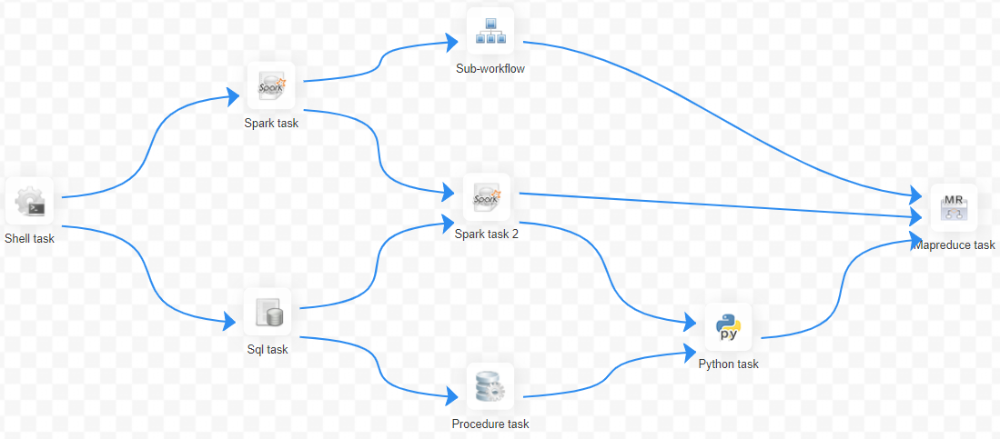
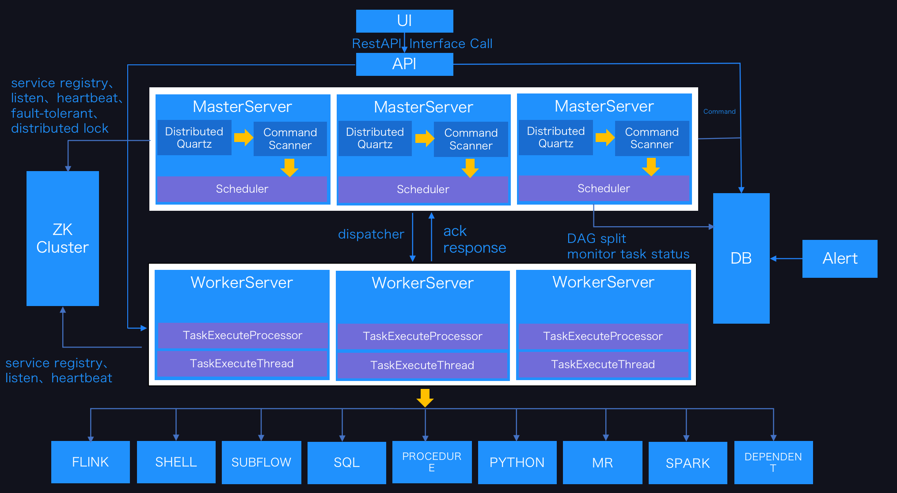
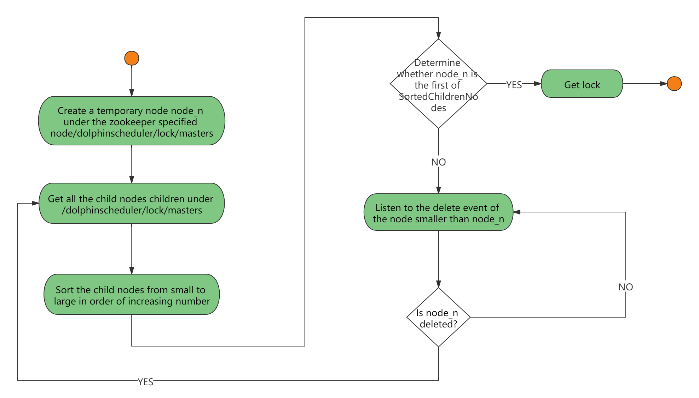
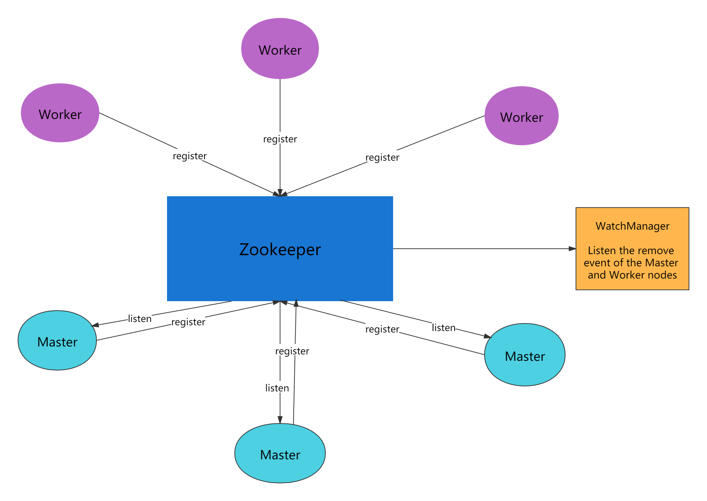
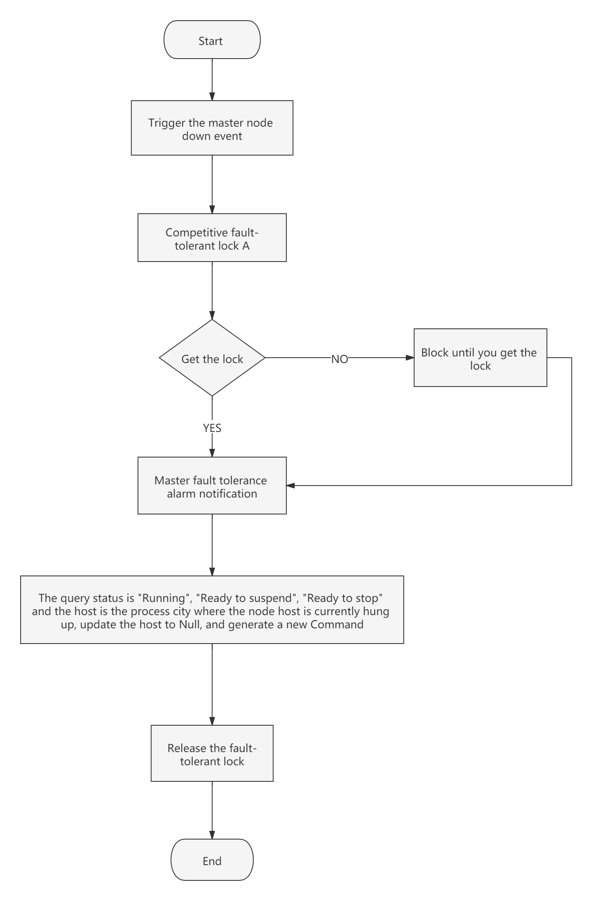
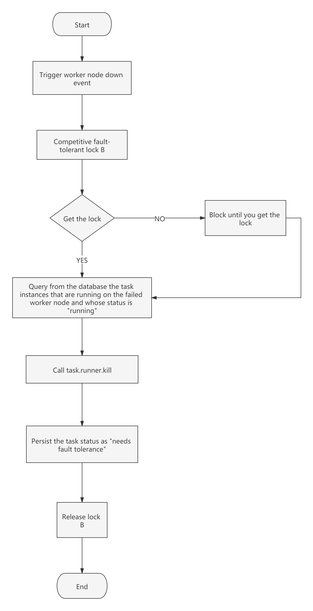
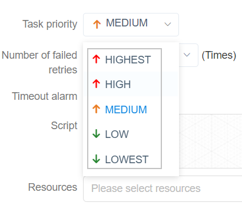

## Architecture Design

Before explaining the architecture of the schedule system, let us first understand the common nouns of the schedule system.

### 1.Noun Interpretation

**DAG：** Full name Directed Acyclic Graph，referred to as DAG。Tasks in the workflow are assembled in the form of directed acyclic graphs, which are topologically traversed from nodes with zero indegrees of ingress until there are no successor nodes. For example, the following picture:

<p align="center">
  
  <p align="center">
        <em>dag example</em>
  </p>
</p>

**Process definition**: Visualization **DAG** by dragging task nodes and establishing associations of task nodes

**Process instance**: A process instance is an instantiation of a process definition, which can be generated by manual startup or scheduling. The process definition runs once, a new process instance is generated

**Task instance**: A task instance is the instantiation of a specific task node when a process instance runs, which indicates the specific task execution status

**Task type**: Currently supports SHELL, SQL, SUB_PROCESS (sub-process), PROCEDURE, MR, SPARK, PYTHON, DEPENDENT (dependency), and plans to support dynamic plug-in extension, note: the sub-**SUB_PROCESS** is also A separate process definition that can be launched separately

**Schedule mode** : The system supports timing schedule and manual schedule based on cron expressions. Command type support: start workflow, start execution from current node, resume fault-tolerant workflow, resume pause process, start execution from failed node, complement, timer, rerun, pause, stop, resume waiting thread. Where **recovers the fault-tolerant workflow** and **restores the waiting thread** The two command types are used by the scheduling internal control and cannot be called externally

**Timed schedule**: The system uses **quartz** distributed scheduler and supports the generation of cron expression visualization

**Dependency**: The system does not only support **DAG** Simple dependencies between predecessors and successor nodes, but also provides **task dependencies** nodes, support for **custom task dependencies between processes**

**Priority**: Supports the priority of process instances and task instances. If the process instance and task instance priority are not set, the default is first in, first out.

**Mail Alert**: Support **SQL Task** Query Result Email Send, Process Instance Run Result Email Alert and Fault Tolerant Alert Notification

**Failure policy**: For tasks running in parallel, if there are tasks that fail, two failure policy processing methods are provided. **Continue** means that the status of the task is run in parallel until the end of the process failure. **End** means that once a failed task is found, Kill also drops the running parallel task and the process ends.

**Complement**: Complement historical data, support **interval parallel and serial** two complement methods

### 2.System architecture

#### 2.1 System Architecture Diagram

<p align="center">
  
  <p align="center">
        <em>System Architecture Diagram</em>
  </p>
</p>

#### 2.2 Architectural description

- **MasterServer**

  MasterServer adopts the distributed non-central design concept. MasterServer is mainly responsible for DAG task split, task submission monitoring, and monitoring the health status of other MasterServer and WorkerServer.
  When the MasterServer service starts, it registers a temporary node with Zookeeper, and listens to the Zookeeper temporary node state change for fault tolerance processing.

  ##### The service mainly contains:

  - **Distributed Quartz** distributed scheduling component, mainly responsible for the start and stop operation of the scheduled task. When the quartz picks up the task, the master internally has a thread pool to be responsible for the subsequent operations of the task.

  - **MasterSchedulerThread** is a scan thread that periodically scans the **command** table in the database for different business operations based on different **command types**

  - **MasterExecThread** is mainly responsible for DAG task segmentation, task submission monitoring, logic processing of various command types

  - **MasterTaskExecThread** is mainly responsible for task persistence

- **WorkerServer**

  - WorkerServer also adopts a distributed, non-central design concept. WorkerServer is mainly responsible for task execution and providing log services. When the WorkerServer service starts, it registers the temporary node with Zookeeper and maintains the heartbeat.

    ##### This service contains:

    - **FetchTaskThread** is mainly responsible for continuously receiving tasks from **Task Queue** and calling **TaskScheduleThread** corresponding executors according to different task types.
  - **ZooKeeper**

    The ZooKeeper service, the MasterServer and the WorkerServer nodes in the system all use the ZooKeeper for cluster management and fault tolerance. In addition, the system also performs event monitoring and distributed locking based on ZooKeeper.
    We have also implemented queues based on Redis, but we hope that DolphinScheduler relies on as few components as possible, so we finally removed the Redis implementation.

  - **Task Queue**

    The task queue operation is provided. Currently, the queue is also implemented based on Zookeeper. Since there is less information stored in the queue, there is no need to worry about too much data in the queue. In fact, we have over-measured a million-level data storage queue, which has no effect on system stability and performance.

  - **Alert**

    Provides alarm-related interfaces. The interfaces mainly include **Alarms**. The storage, query, and notification functions of the two types of alarm data. The notification function has two types: **mail notification** and **SNMP (not yet implemented)**.

  - **API**

    The API interface layer is mainly responsible for processing requests from the front-end UI layer. The service provides a RESTful api to provide request services externally.
    Interfaces include workflow creation, definition, query, modification, release, offline, manual start, stop, pause, resume, start execution from this node, and more.

  - **UI**

    The front-end page of the system provides various visual operation interfaces of the system. For details, see the [quick start](https://dolphinscheduler.apache.org/en-us/docs/3.1.2/about/introduction) section.

#### 2.3 Architectural Design Ideas

##### I. Decentralized vs centralization

###### Centralization Thought

The centralized design concept is relatively simple. The nodes in the distributed cluster are divided into two roles according to their roles:

<p align="center">
   
 </p>

- The role of Master is mainly responsible for task distribution and supervising the health status of Slave. It can dynamically balance the task to Slave, so that the Slave node will not be "busy" or "free".
- The role of the Worker is mainly responsible for the execution of the task and maintains the heartbeat with the Master so that the Master can assign tasks to the Slave.

Problems in the design of centralized :

- Once the Master has a problem, the group has no leader and the entire cluster will crash. In order to solve this problem, most Master/Slave architecture modes adopt the design scheme of the master and backup masters, which can be hot standby or cold standby, automatic switching or manual switching, and more and more new systems are available. Automatically elects the ability to switch masters to improve system availability.
- Another problem is that if the Scheduler is on the Master, although it can support different tasks in one DAG running on different machines, it will generate overload of the Master. If the Scheduler is on the Slave, all tasks in a DAG can only be submitted on one machine. If there are more parallel tasks, the pressure on the Slave may be larger.

###### Decentralization

 <p align="center"
   
 </p>

- In the decentralized design, there is usually no Master/Slave concept, all roles are the same, the status is equal, the global Internet is a typical decentralized distributed system, networked arbitrary node equipment down machine , all will only affect a small range of features.
- The core design of decentralized design is that there is no "manager" that is different from other nodes in the entire distributed system, so there is no single point of failure problem. However, since there is no "manager" node, each node needs to communicate with other nodes to get the necessary machine information, and the unreliable line of distributed system communication greatly increases the difficulty of implementing the above functions.
- In fact, truly decentralized distributed systems are rare. Instead, dynamic centralized distributed systems are constantly emerging. Under this architecture, the managers in the cluster are dynamically selected, rather than preset, and when the cluster fails, the nodes of the cluster will spontaneously hold "meetings" to elect new "managers". Go to preside over the work. The most typical case is the Etcd implemented in ZooKeeper and Go.
- Decentralization of DolphinScheduler is the registration of Master/Worker to ZooKeeper. The Master Cluster and the Worker Cluster are not centered, and the Zookeeper distributed lock is used to elect one Master or Worker as the “manager” to perform the task.

##### 二、Distributed lock practice

DolphinScheduler uses ZooKeeper distributed locks to implement only one Master to execute the Scheduler at the same time, or only one Worker to perform task submission.

1. The core process algorithm for obtaining distributed locks is as follows

 <p align="center">
   
 </p>

2. Scheduler thread distributed lock implementation flow chart in DolphinScheduler:

 <p align="center">
   
 </p>

##### Third, the thread is insufficient loop waiting problem

- If there is no subprocess in a DAG, if the number of data in the Command is greater than the threshold set by the thread pool, the direct process waits or fails.
- If a large number of sub-processes are nested in a large DAG, the following figure will result in a "dead" state:

 <p align="center">
   
 </p>

In the above figure, MainFlowThread waits for SubFlowThread1 to end, SubFlowThread1 waits for SubFlowThread2 to end, SubFlowThread2 waits for SubFlowThread3 to end, and SubFlowThread3 waits for a new thread in the thread pool, then the entire DAG process cannot end, and thus the thread cannot be released. This forms the state of the child parent process loop waiting. At this point, the scheduling cluster will no longer be available unless a new Master is started to add threads to break such a "stuck."

It seems a bit unsatisfactory to start a new Master to break the deadlock, so we proposed the following three options to reduce this risk:

1. Calculate the sum of the threads of all Masters, and then calculate the number of threads required for each DAG, that is, pre-calculate before the DAG process is executed. Because it is a multi-master thread pool, the total number of threads is unlikely to be obtained in real time.
2. Judge the single master thread pool. If the thread pool is full, let the thread fail directly.
3. Add a Command type with insufficient resources. If the thread pool is insufficient, the main process will be suspended. This way, the thread pool has a new thread, which can make the process with insufficient resources hang up and wake up again.

Note: The Master Scheduler thread is FIFO-enabled when it gets the Command.

So we chose the third way to solve the problem of insufficient threads.

##### IV. Fault Tolerant Design

Fault tolerance is divided into service fault tolerance and task retry. Service fault tolerance is divided into two types: Master Fault Tolerance and Worker Fault Tolerance.

###### 1. Downtime fault tolerance

Service fault tolerance design relies on ZooKeeper's Watcher mechanism. The implementation principle is as follows:

 <p align="center">
   
 </p>

The Master monitors the directories of other Masters and Workers. If the remove event is detected, the process instance is fault-tolerant or the task instance is fault-tolerant according to the specific business logic.

- Master fault tolerance flow chart:

 <p align="center">
   
 </p>

After the ZooKeeper Master is fault-tolerant, it is rescheduled by the Scheduler thread in DolphinScheduler. It traverses the DAG to find the "Running" and "Submit Successful" tasks, and monitors the status of its task instance for the "Running" task. You need to determine whether the Task Queue already exists. If it exists, monitor the status of the task instance. If it does not exist, resubmit the task instance.

- Worker fault tolerance flow chart:

 <p align="center">
   
 </p>

Once the Master Scheduler thread finds the task instance as "need to be fault tolerant", it takes over the task and resubmits.

Note: Because the "network jitter" may cause the node to lose the heartbeat of ZooKeeper in a short time, the node's remove event occurs. In this case, we use the easiest way, that is, once the node has timeout connection with ZooKeeper, it will directly stop the Master or Worker service.

###### 2. Task failure retry

Here we must first distinguish between the concept of task failure retry, process failure recovery, and process failure rerun:

- Task failure Retry is task level, which is automatically performed by the scheduling system. For example, if a shell task sets the number of retries to 3 times, then the shell task will try to run up to 3 times after failing to run.
- Process failure recovery is process level, is done manually, recovery can only be performed **from the failed node** or **from the current node**
- Process failure rerun is also process level, is done manually, rerun is from the start node

Next, let's talk about the topic, we divided the task nodes in the workflow into two types.

- One is a business node, which corresponds to an actual script or processing statement, such as a Shell node, an MR node, a Spark node, a dependent node, and so on.
- There is also a logical node, which does not do the actual script or statement processing, but the logical processing of the entire process flow, such as sub-flow sections.

Each **service node** can configure the number of failed retries. When the task node fails, it will automatically retry until it succeeds or exceeds the configured number of retries. **Logical node** does not support failed retry. But the tasks in the logical nodes support retry.

If there is a task failure in the workflow that reaches the maximum number of retries, the workflow will fail to stop, and the failed workflow can be manually rerun or process resumed.

##### V. Task priority design

In the early scheduling design, if there is no priority design and fair scheduling design, it will encounter the situation that the task submitted first may be completed simultaneously with the task submitted subsequently, but the priority of the process or task cannot be set. We have redesigned this, and we are currently designing it as follows:

- According to **different process instance priority** prioritizes **same process instance priority** prioritizes **task priority within the same process** takes precedence over **same process** commit order from high Go to low for task processing.
  - The specific implementation is to resolve the priority according to the json of the task instance, and then save the **process instance priority _ process instance id_task priority _ task id** information in the ZooKeeper task queue, when obtained from the task queue, Through string comparison, you can get the task that needs to be executed first.
    - The priority of the process definition is that some processes need to be processed before other processes. This can be configured at the start of the process or at the time of scheduled start. There are 5 levels, followed by HIGHEST, HIGH, MEDIUM, LOW, and LOWEST. As shown below

      <p align="center">
         
       </p>

    - The priority of the task is also divided into 5 levels, followed by HIGHEST, HIGH, MEDIUM, LOW, and LOWEST. As shown below

      <p align="center">`
         
       </p>

##### VI. Logback and gRPC implement log access

- Since the Web (UI) and Worker are not necessarily on the same machine, viewing the log is not as it is for querying local files. There are two options:
  - Put the logs on the ES search engine
  - Obtain remote log information through gRPC communication
- Considering the lightweightness of DolphinScheduler as much as possible, gRPC was chosen to implement remote access log information.

 <p align="center">
   
 </p>

- We use a custom Logback FileAppender and Filter function to generate a log file for each task instance.
- The main implementation of FileAppender is as follows:

```java
 /**
  * task log appender
  */
 Public class TaskLogAppender extends FileAppender<ILoggingEvent> {

     ...

    @Override
    Protected void append(ILoggingEvent event) {

        If (currentlyActiveFile == null){
            currentlyActiveFile = getFile();
        }
        String activeFile = currentlyActiveFile;
        // thread name: taskThreadName-processDefineId_processInstanceId_taskInstanceId
        String threadName = event.getThreadName();
        String[] threadNameArr = threadName.split("-");
        // logId = processDefineId_processInstanceId_taskInstanceId
        String logId = threadNameArr[1];
        ...
        super.subAppend(event);
    }
}
```

Generate a log in the form of /process definition id/process instance id/task instance id.log

- Filter matches the thread name starting with TaskLogInfo:
- TaskLogFilter is implemented as follows:

```java
 /**
 * task log filter
 */
Public class TaskLogFilter extends Filter<ILoggingEvent> {

    @Override
    Public FilterReply decide(ILoggingEvent event) {
        If (event.getThreadName().startsWith("TaskLogInfo-")){
            Return FilterReply.ACCEPT;
        }
        Return FilterReply.DENY;
    }
}
```

### summary

Starting from the scheduling, this paper introduces the architecture principle and implementation ideas of the big data distributed workflow scheduling system-DolphinScheduler. To be continued
