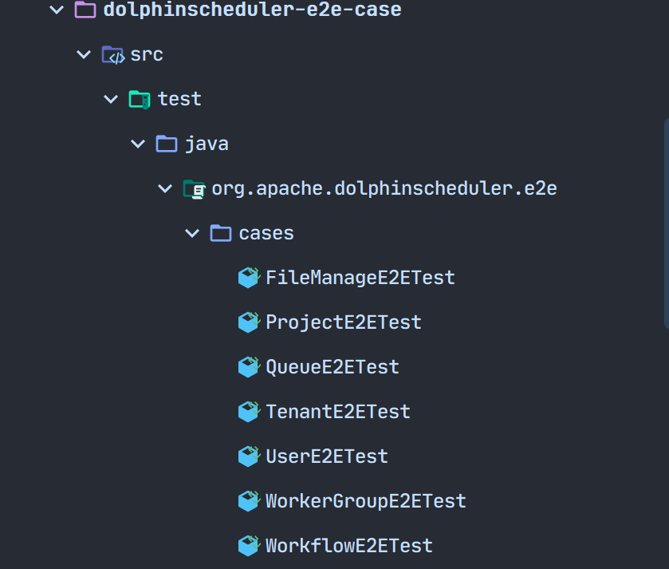
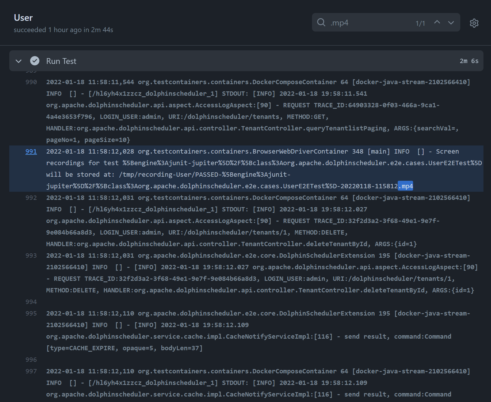

# DolphinScheduler E2E Automation Test

## I. Preparatory knowledge

### 1. The difference between E2E Test and Unit Test

E2E, which stands for "End to End", can be translated as "end-to-end" testing. It imitates the user, starting from a certain entry point and progressively performing actions until a certain job is completed. And unit tests are different, the latter usually requires testing parameters, types and parameter values, the number of arguments, the return value, throw an error, and so on, the purpose is to ensure that a specific function to finishing the work is stable and reliable in all cases. Unit testing assumes that if all functions work correctly, then the whole product will work.

In contrast, E2E test does not emphasize so much the need to cover all usage scenarios, it focuses on whether a complete chain of operations can be completed. For the web front-end, it is also concerned with the layout of the interface and whether the content information meets expectations.

For example, E2E test of the login page is concerned with whether the user is able to enter and log in normally, and whether the error message is correctly displayed if the login fails. It is not a major concern whether input that is not legal is processed.

### 2. Selenium test framework

[Selenium](https://www.selenium.dev) is an open source testing tool for executing automated tests on a web browser. The framework uses WebDriver to transform Web Service commands into browser native calls through the browser's native components to complete operations. In simple words, it simulates the browser and makes selection operations on the elements of the page.

A WebDriver is an API and protocol which defines a language-neutral interface for controlling the behavior of a web browser.  Every browser has a specific WebDriver implementation, called a driver. The driver is the component responsible for delegating to the browser and handling the communication with Selenium and the browser.

The Selenium framework links all these components together through a user-facing interface that allows transparent work with different browser backends, enabling cross-browser and cross-platform automation.

## II. E2E Test

### 1. E2E-Pages

DolphinScheduler's E2E tests are deployed using docker-compose. The current tests are in standalone mode and are mainly used to check some basic functions such as "add, delete, change and check". For further cluster validation, such as collaboration between services or communication mechanisms between services, refer to `deploy/docker/docker-compose.yml` for configuration.

For E2E test (the front-end part),  the [page model](https://www.selenium.dev/documentation/guidelines/page_object_models/) form is used, mainly to create a corresponding model for each page. The following is an example of a login page.

```java
package org.apache.dolphinscheduler.e2e.pages;

import org.apache.dolphinscheduler.e2e.pages.common.NavBarPage;
import org.apache.dolphinscheduler.e2e.pages.security.TenantPage;

import org.openqa.selenium.WebElement;
import org.openqa.selenium.remote.RemoteWebDriver;
import org.openqa.selenium.support.FindBy;
import org.openqa.selenium.support.ui.ExpectedConditions;
import org.openqa.selenium.support.ui.WebDriverWait;

import lombok.Getter;
import lombok.SneakyThrows;

@Getter
public final class LoginPage extends NavBarPage {
    @FindBy(id = "inputUsername")
    private WebElement inputUsername;

    @FindBy(id = "inputPassword")
    private WebElement inputPassword;

    @FindBy(id = "btnLogin")
    private WebElement buttonLogin;

    public LoginPage(RemoteWebDriver driver) {
        super(driver);
    }

    @SneakyThrows
    public TenantPage login(String username, String password) {
        inputUsername().sendKeys(username);
        inputPassword().sendKeys(password);
        buttonLogin().click();

        new WebDriverWait(driver, 10)
            .until(ExpectedConditions.urlContains("/#/security"));

        return new TenantPage(driver);
    }
}
```

During the test process, we only test the elements we need to focus on, not all elements of the page. So on the login page only the username, password and login button elements are declared. The FindBy interface is provided by the Selenium test framework to find the corresponding id or class in a Vue file.

In addition, during the testing process, the elements are not manipulated directly. The general choice is to package the corresponding methods to achieve the effect of reuse. For example, if you want to log in, you input your username and password through the `public TenantPage login()` method to manipulate the elements you pass in to achieve the effect of logging in. That is, when the user finishes logging in, he or she jumps to the Security Centre (which goes to the Tenant Management page by default).

The SecurityPage provides goToTab methods to test the corresponding sidebar jumps, mainly including TenantPage, UserPage, WorkerGroupPage and QueuePage. These pages are implemented in the same way, mainly to test whether the input, add and delete buttons of the form can return to the corresponding page.

```java
public <T extends SecurityPage.Tab> T goToTab(Class<T> tab) {
       if (tab == TenantPage.class) {
           WebElement menuTenantManageElement = new WebDriverWait(driver, 60)
                   .until(ExpectedConditions.elementToBeClickable(menuTenantManage));
           ((JavascriptExecutor)driver).executeScript("arguments[0].click();", menuTenantManageElement);
           return tab.cast(new TenantPage(driver));
       }
       if (tab == UserPage.class) {
           WebElement menUserManageElement = new WebDriverWait(driver, 60)
                   .until(ExpectedConditions.elementToBeClickable(menUserManage));
           ((JavascriptExecutor)driver).executeScript("arguments[0].click();", menUserManageElement);
           return tab.cast(new UserPage(driver));
       }
       if (tab == WorkerGroupPage.class) {
           WebElement menWorkerGroupManageElement = new WebDriverWait(driver, 60)
                   .until(ExpectedConditions.elementToBeClickable(menWorkerGroupManage));
           ((JavascriptExecutor)driver).executeScript("arguments[0].click();", menWorkerGroupManageElement);
           return tab.cast(new WorkerGroupPage(driver));
       }
       if (tab == QueuePage.class) {
           menuQueueManage().click();
           return tab.cast(new QueuePage(driver));
       }
       throw new UnsupportedOperationException("Unknown tab: " + tab.getName());
   }
```


For navigation bar options jumping, the goToNav method is provided in `org/apache/dolphinscheduler/e2e/pages/common/NavBarPage.java`. The currently supported pages are: ProjectPage, SecurityPage and ResourcePage.

```java
    public <T extends NavBarItem> T goToNav(Class<T> nav) {
        if (nav == ProjectPage.class) {
            WebElement projectTabElement = new WebDriverWait(driver, 60)
                .until(ExpectedConditions.elementToBeClickable(projectTab));
            ((JavascriptExecutor)driver).executeScript("arguments[0].click();", projectTabElement);
            return nav.cast(new ProjectPage(driver));
        }

        if (nav == SecurityPage.class) {
            WebElement securityTabElement = new WebDriverWait(driver, 60)
                .until(ExpectedConditions.elementToBeClickable(securityTab));
            ((JavascriptExecutor)driver).executeScript("arguments[0].click();", securityTabElement);
            return nav.cast(new SecurityPage(driver));
        }

        if (nav == ResourcePage.class) {
            WebElement resourceTabElement = new WebDriverWait(driver, 60)
                .until(ExpectedConditions.elementToBeClickable(resourceTab));
            ((JavascriptExecutor)driver).executeScript("arguments[0].click();", resourceTabElement);
            return nav.cast(new ResourcePage(driver));
        }

        throw new UnsupportedOperationException("Unknown nav bar");
    }
```

### E2E-Cases

Current E2E test cases supported include: File Management, Project Management, Queue Management, Tenant Management, User Management, Worker Group Management and Workflow Test.



The following is an example of a tenant management test. As explained earlier, we use docker-compose for deployment, so for each test case, we need to import the corresponding file in the form of an annotation.

The browser is loaded using the RemoteWebDriver provided with Selenium. Before each test case is started there is some preparation work that needs to be done. For example: logging in the user, jumping to the corresponding page (depending on the specific test case).

```java
@BeforeAll
public static void setup() {
    new LoginPage(browser)
            .login("admin", "dolphinscheduler123") 
            .goToNav(SecurityPage.class) 
            .goToTab(TenantPage.class)
    ;
}
```

When the preparation is complete, it is time for the formal test case writing. We use a form of @Order() annotation for modularity, to confirm the order of the tests. After the tests have been run, assertions are used to determine if the tests were successful, and if the assertion returns true, the tenant creation was successful. The following code can be used as a reference:

```java
    @Test
    @Order(10)
    void testCreateTenant() {
        final TenantPage page = new TenantPage(browser);
        page.create(tenant);

        await().untilAsserted(() -> assertThat(page.tenantList())
                .as("Tenant list should contain newly-created tenant")
                .extracting(WebElement::getText)
                .anyMatch(it -> it.contains(tenant)));
    }
```

The rest are similar cases and can be understood by referring to the specific source code.

https://github.com/apache/dolphinscheduler/tree/dev/dolphinscheduler-e2e/dolphinscheduler-e2e-case/src/test/java/org/apache/dolphinscheduler/e2e/cases

## III. Supplements

When running E2E tests locally, First, you need to start the local service, you can refer to this page:
[development-environment-setup](./development-environment-setup.md)

When running E2E tests locally, the `-Dlocal=true` parameter can be configured to connect locally and facilitate changes to the UI.

When running E2E tests with `M1` chip, you can use `-Dm1_chip=true` parameter to configure containers supported by
`ARM64`.


If a connection timeout occurs during a local run, increase the load time to a recommended 30 and above.


The test run will be available as an MP4 file.


