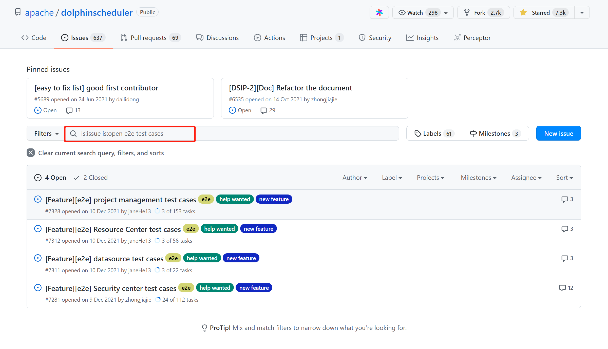

# DolphinScheduler E2E Test Contribution Guide

The main purpose of E2E test is to verify the integration and data integrity of the system, and its components, by simulating real user scenarios. This makes it possible to extend the scope of testing and ensure the health and stability of the system. To a certain extent, the test workload and costs are reduced. In simple terms, E2E testing is about treating a program as a black box and simulating the access behaviour of a real system from the user's point of view to see if the input to the test (user behaviour/simulated data) gives the expected results. Therefore, the community decided to add E2E automated testing to DolphinScheduler.

The current community E2E test has not yet reached full coverage, so this document has been written with the aim of guiding more partners to get involved.

### How to find the corresponding ISSUE?

The E2E test pages are currently divided into four pages: Project Management, Resource Center, DataSource, and Security Center.

Contributors can find the task by going to GitHub, searching for [apace/dolphinscheduler](https://github.com/apache/dolphinscheduler), and then searching for `e2e test cases` in the [issue list](https://github.com/apache/dolphinscheduler/issues?q=is%3Aissue+is%3Aopen+e2e+test+cases). As shown below.

In each issue, we list the content to be tested and the expected results, which can be seen in the Description. Once you are on the current page, you can select the issue you are interested in, for example, to participate in the Security Center test, just leave a comment under the corresponding issue about the case you want to test.

- Task status: If the test has been completed, it is considered finished and as a contributor you need to find the outstanding tests.
- number: Test case serial number.
- function module: Functional modules to be tested, a functional module containing multiple test cases.
- test point: Specific examples of what needs to be tested. For example button click actions on pages, page jump functions.
- priority: The priority of the test case, **which is recommended to find a high priority**.
- service: The service that needs to be started during the test process.
- test steps: The test steps to be performed for each test case.
- expected results: The expected test results.
- actual results: The actual results.
- remarks: The precautions needed during the test process.

### How to write test code?

After taking up the corresponding task, the next step is to get to the crux of writing the code. Many partners may not be familiar with E2E test codes, so you can refer to this page: [e2e-test](../e2e-test.md).

### How to submit a Pull Request?

Participation in the open source community can take many forms, including issue, pull request and translation. To participate in the E2E testing process, contributors are first required to understand the simple process of submitting a pull request, see: [Pull Request](./pull-request.md).
