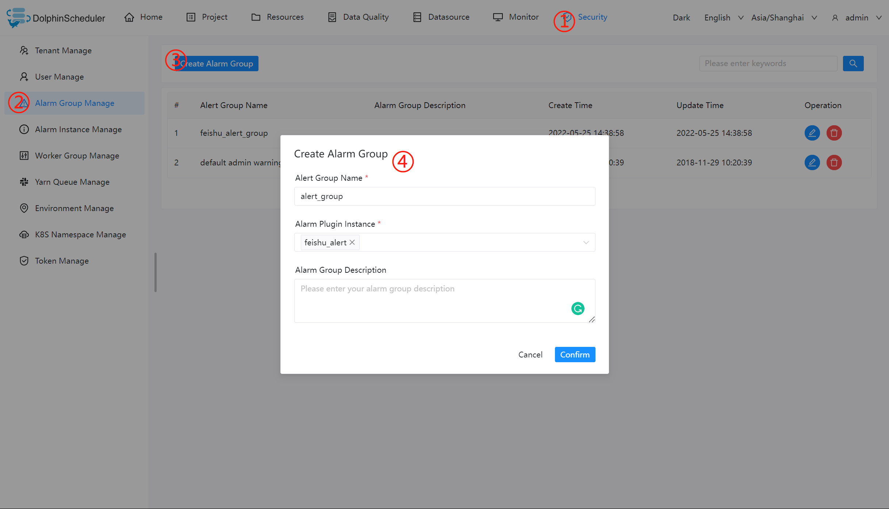

# Alert Component User Guide

## Alert Plugins and Alert Groups Creation

In version 2.0.0, users need to create alert instances, and needs to choose an alarm policy when defining an alarm instance, there are three options: send if the task succeeds, send on failure, and send on both success and failure. when the workflow or task is executed, if an alarm is triggered, calling the alarm instance send method needs a logical judgment, which matches the alarm instance with the task status, executes the alarm instance sending logic if it matches, and filters if it does not match. When create alert instances then associate them with alert groups. Alert group can use multiple alert instances.
The alarm module supports the following scenarios:

Steps to be used are as follows:

- Go to `Security -> Alarm Group Management -> Alarm Instance Management -> Alarm Instance`.
- Select the corresponding alarm plug-in and fill in the relevant alarm parameters.
- Select `Alarm Group Management`, create an alarm group, and choose the corresponding alarm instance.

