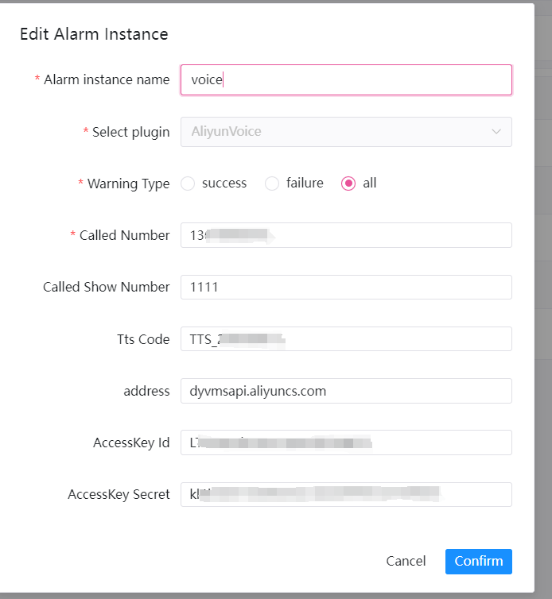

# Alibaba Cloud - Voice alarm

If you need to use `Voice` for alerting, create an alert instance in the alert instance management and select the `Voice` plugin.

## 参数配置

* Called number

  > Called display number

* Call display number

  > The number for receiving voice notifications

* VoiceCode

  > Voice ID of the VoiceCode

* accessKeyId

  > Your AccessKey ID

* accessKeySecret

  > Your AccessKey Secret

### example

Voice notification Sends a voice notification of the file type to a specified number。
The following shows the `voice` configuration example:

