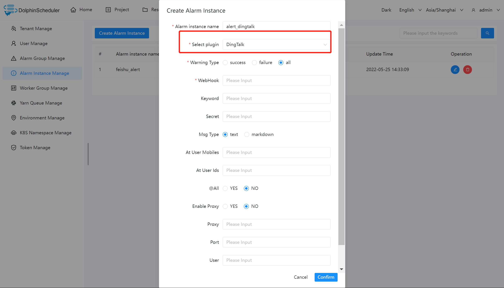

# DingTalk

If you need to use `DingTalk` for alerting, create an alert instance in the alert instance management and select the `DingTalk` plugin.

The following shows the `DingTalk` configuration example:

## Parameter Configuration

| **Parameter**  |                                                                                                                                                                               **Description**                                                                                                                                                                               |
|----------------|-----------------------------------------------------------------------------------------------------------------------------------------------------------------------------------------------------------------------------------------------------------------------------------------------------------------------------------------------------------------------------|
| Warning Type   | Alert on success or failure or both.                                                                                                                                                                                                                                                                                                                                        |
| WebHook        | The format is: [https://oapi.dingtalk.com/robot/send?access\_token=XXXXXX](https://oapi.dingtalk.com/robot/send?access_token=XXXXXX)                                                                                                                                                                                                                                        |
| Keyword        | Custom keywords for security settings.                                                                                                                                                                                                                                                                                                                                      |
| Secret         | Signature of security settings                                                                                                                                                                                                                                                                                                                                              |
| Msg Type       | Message parse type (support txt, markdown, markdownV2, html).                                                                                                                                                                                                                                                                                                               |
| At User Mobile | When a custom bot sends a message, you can specify the "@person list" by their mobile phone number. When the selected people in the "@people list" receive the message, there will be a `@` message reminder. `No disturb` mode always receives reminders, and "someone @ you" appears in the message. The "At User Mobile" represents mobile phone number of the "@person" |
| At User Ids    | The user ID by "@person"                                                                                                                                                                                                                                                                                                                                                    |
| Proxy          | The proxy address of the proxy server.                                                                                                                                                                                                                                                                                                                                      |
| Port           | The proxy port of Proxy-Server.                                                                                                                                                                                                                                                                                                                                             |
| User           | Authentication(Username) for the proxy server.                                                                                                                                                                                                                                                                                                                              |
| Password       | Authentication(Password) for the proxy server.                                                                                                                                                                                                                                                                                                                              |

## Reference

- [DingTalk Custom Robot Access Development Documentation](https://open.dingtalk.com/document/robots/custom-robot-access)

