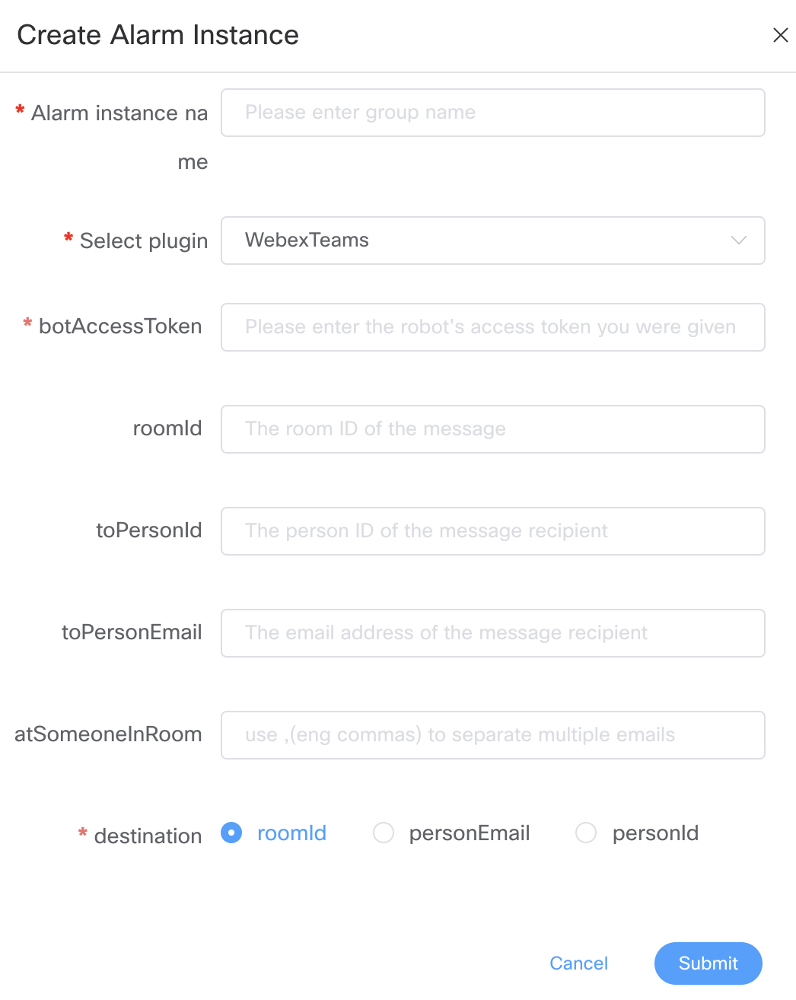
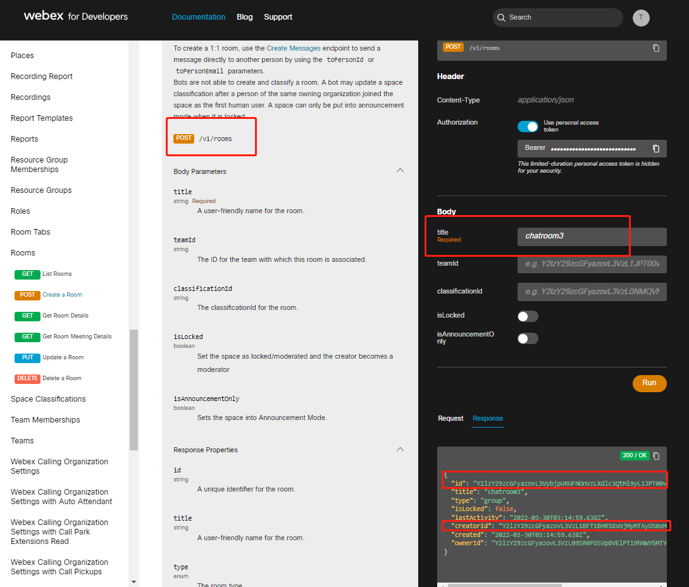

# Webex Teams

If you need to use `Webex Teams` to alert, create an alert instance in the alert instance management, and choose the WebexTeams plugin. You can pick private alert or room group chat alert.
The following is the `WebexTeams` configuration example:

## Parameter Configuration

|  **Parameter**  |                                                     **Description**                                                     |
|-----------------|-------------------------------------------------------------------------------------------------------------------------|
| botAccessToken  | The access token of robot.                                                                                              |
| roomID          | The ID of the room that receives message (only support one room ID).                                                    |
| toPersonId      | The person ID of the recipient when sending a private 1:1 message.                                                      |
| toPersonEmail   | The email address of the recipient when sending a private 1:1 message.                                                  |
| atSomeoneInRoom | If the message destination is room, the emails of the person being @, use `,` (eng commas) to separate multiple emails. |
| destination     | The destination of the message (one message only support one destination).                                              |

## Create Bot

Create a bot visit [Official Website My-Apps](https://developer.webex.com/my-apps) to `Create a New APP` and select `Create a Bot`, fill in the bot information and acquire `bot username` and `bot ID` for further usage.

## Create a Room

Create a root visit [Official Website for Developer APIs](https://developer.webex.com/docs/api/v1/rooms/create-a-room) to create a new room, fill in the room name and acquire `id`(room ID) and `creatorId` for further usage.

### Invite Bot to the Room

Invite bot to the room by invite bot Email (bot username).

## Send Private Message

In this way, you can send private message to a person by `User Email` or `UserId` in a private conversation. Fill in the `To Person Id` or `To Person Email`(recommended) and `Bot Access Token` and select `Destination` `personEmail` or `personId`.
The `user Email` is user register Email.
The `userId` we can acquire it from the `creatorId` of creating a new group chat room API.

### Private Alert Message Example

## Send Group Room Message

In this way, you can send group room message to a room by `Room ID`. Fill in the `Room Id` and `Bot Access Token` and select `Destination` `roomId`.
The `Room ID` we can acquire it from the `id` of creating a new group chat room API.

### Group Room Alert Message Example

## References:

- [WebexTeams Application Bot Guide](https://developer.webex.com/docs/bots)
- [WebexTeams Message Guide](https://developer.webex.com/docs/api/v1/messages/create-a-message)

