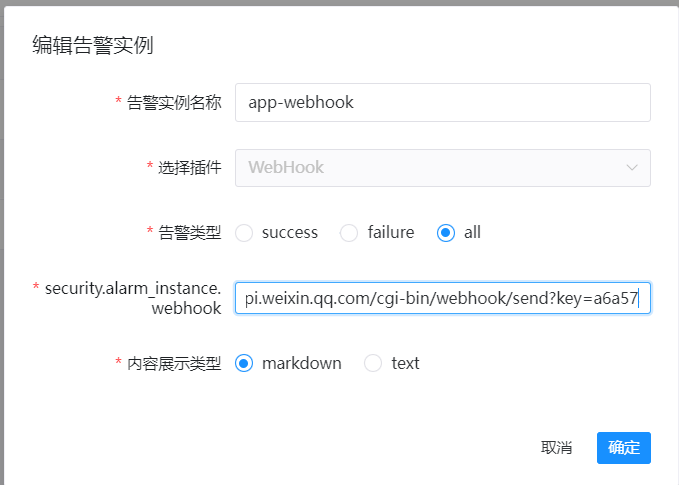
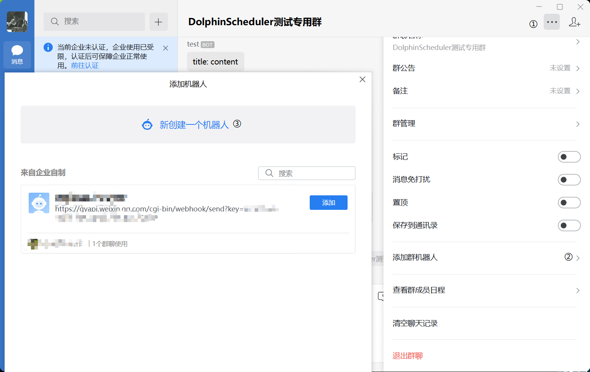
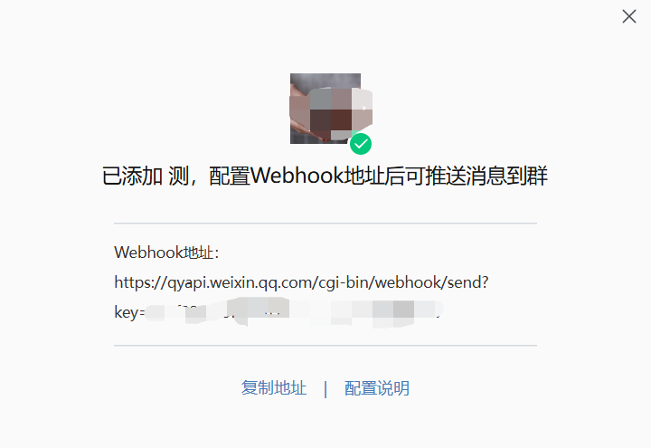
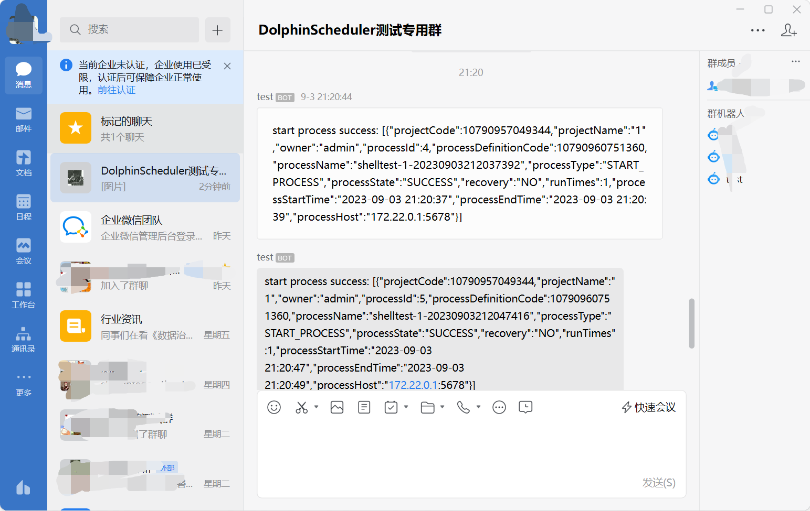

# Enterprise WeChat WebHook

If you need to use Enterprise WeChat WebHook for alarms, please create an alarm instance and select the WeChat WebHook plugin. 

The configuration example of WeChat WebHook is as follows:

## Prerequisites: WeChat WebHook Obtain

'webhook' is the address where the robot sends messages. 

Taking enterprise WeChat for example, adding a robot can be done as follows:

After adding a robot, you can obtain the corresponding webhook address:

## Send Alert Message

Message sending refers to the notification of alarm results through WebHook, which supports sending text and MarkDown format information.

The following figure is an example of message sending:

## Reference

Robot configuration instructions of Enterprise WeChat: https://developer.work.weixin.qq.com/document/path/91770
