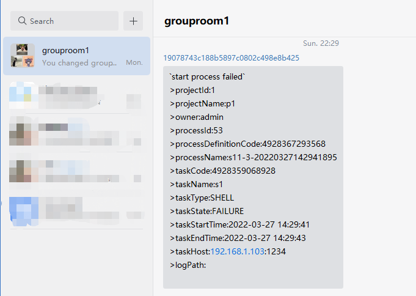

# Enterprise WeChat

If you need to use `Enterprise WeChat` to alert, create an alert instance in the alert instance management, and choose the `WeChat` plugin.
The following is the `WeChat` configuration example:

## Send Type

The parameter `send.type` corresponds to sending messages to Enterprise WeChat customized APP and group chat created by API respectively.

### APP

The APP sends type means to notify the alert results via Enterprise WeChat customized APPs, supports sending messages to both specified users and all members. Currently, send to specified enterprise department and tags are not supported, a new PR to contribute is welcomed.
The following is the `APP` alert config example:

The following is the `APP` `MARKDOWN` alert message example:

The following is the `APP` `TEXT` alert message example:

#### Prerequisites

Need to create a new customized APP in Enterprise WeChat before sending messages to APP, create at the [APP Page](https://work.weixin.qq.com/wework_admin/frame#apps) and acquire the APP `AgentId` and set its visible scope to the root of the hierarchy.

#### Send Messages to Specified Users

The Enterprise WeChat APPs support sending messages to both specified users and all members, using `|` to separate multiple `userIds` and using `@all` to send messages to everyone.
To acquire user `userId` refer to [Official Doc](https://developer.work.weixin.qq.com/document/path/95402), acquire `userId` by user phone number.
The following is the `query userId` API example:

#### References

APP: https://work.weixin.qq.com/api/doc/90000/90135/90236

### Group Chat

The Group Chat send type means to notify the alert results via group chat created by Enterprise WeChat API, sending messages to all members of the group and specified users are not supported.
The following is the `Group Chat` alert config example:

The following is the `APP` `MARKDOWN` alert message example:

The following is the `Group Chat` `TEXT` alert message example:

#### Prerequisites

Before sending messages to group chat, create a new group chat by Enterprise WeChat API, refer to [Official Doc](https://developer.work.weixin.qq.com/document/path/90245) to create a new one and acquire `chatid`.
To acquire user `userId` refer to [Official Doc](https://developer.work.weixin.qq.com/document/path/95402), acquire `userId` by user phone number.
The following is the `create new group chat` API and `query userId` API example:

## Reference

- Group Chat：https://work.weixin.qq.com/api/doc/90000/90135/90248

