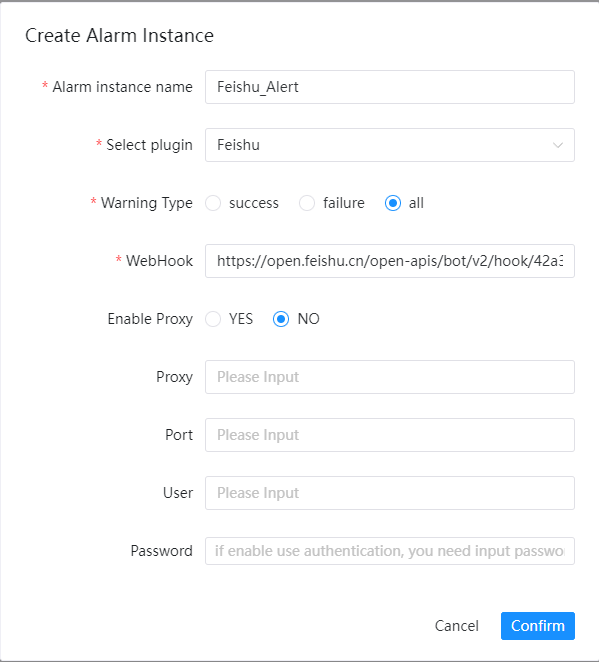

# Feishu

If you need to use `Feishu` for alerting, create an alert instance in the alert instance management and select
the `Feishu` plugin.

The following shows the `Feishu` configuration example:

## Parameter Configuration

* Webhook

  > Copy the robot webhook URL shown below:

  

[Feishu：Use bots in groups](https://www.feishu.cn/hc/en-US/articles/360024984973)
