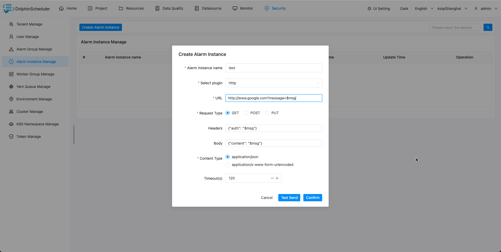

# HTTP

If you need to use `Http script` for alerting, create an alert instance in the alert instance management and select the `Http` plugin.

## Parameter Configuration

| **Parameter** |                                           **Description**                                           |
|---------------|-----------------------------------------------------------------------------------------------------|
| URL           | The `Http` request URL needs to contain protocol, host, path and parameters if the method is `GET`. |
| Request Type  | Select the request type from `POST` or `GET` or `PUT`.                                              |
| Headers       | The headers of the `Http` request in JSON format. Not including content-type.                       |
| Body          | The request body of the `Http` request in JSON format, when using `POST` or `PUT` method to alert.  |
| Content Type  | The content-type of header.                                                                         |

> Alarm message supports variables `$msg`, which can be used in `URL`, `Headers`, and `Body`.

### GET HTTP

Send alert information by `Http` GET method.
The following shows the `GET` configuration example:

