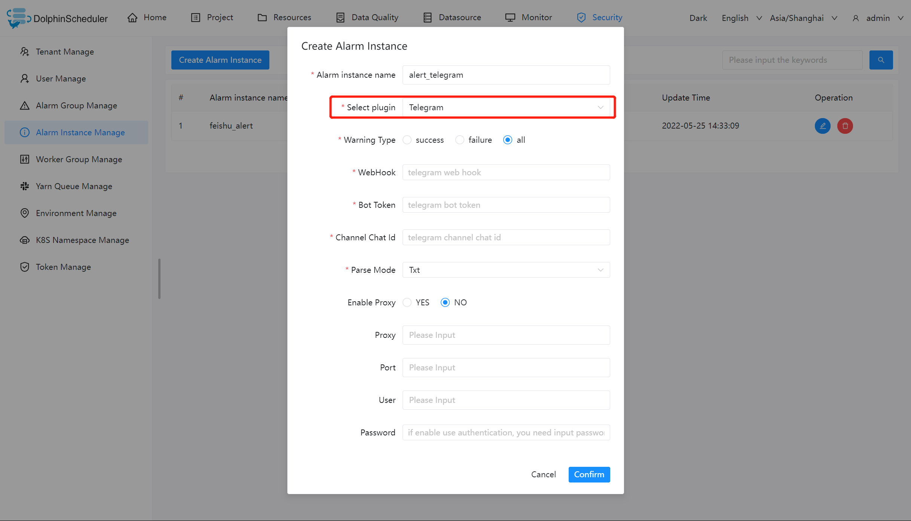

# Telegram

If you need `Telegram` to alert, create an alert instance in the alert instance management, and choose the `Telegram` plugin.
The following shows the `Telegram` configuration example:



## Parameter Configuration

| **Parameter** |                        **Description**                        |
|---------------|---------------------------------------------------------------|
| WebHook       | The WebHook of Telegram when use robot to send message.       |
| botToken      | The access token of robot.                                    |
| chatId        | Sub Telegram Channel.                                         |
| parseMode     | Message parse type (support txt, markdown, markdownV2, html). |
| EnableProxy   | Enable proxy sever.                                           |
| Proxy         | The proxy address of the proxy server.                        |
| Port          | The proxy port of proxy server.                               |
| User          | Authentication(Username) for the proxy server.                |
| Password      | Authentication(Password) for the proxy server.                |

### NOTE

The webhook needs to be able to receive and use the same JSON body of HTTP POST that DolphinScheduler constructs and the following shows the JSON body:

```json
{
    "text": "[{\"projectId\":1,\"projectName\":\"p1\",\"owner\":\"admin\",\"processId\":35,\"processDefinitionCode\":4928367293568,\"processName\":\"s11-3-20220324084708668\",\"taskCode\":4928359068928,\"taskName\":\"s1\",\"taskType\":\"SHELL\",\"taskState\":\"FAILURE\",\"taskStartTime\":\"2022-03-24 08:47:08\",\"taskEndTime\":\"2022-03-24 08:47:09\",\"taskHost\":\"192.168.1.103:1234\",\"logPath\":\"\"}]",
    "chat_id": "chat id number"
}
```

## References:

- [Telegram Application Bot Guide](https://core.telegram.org/bots)
- [Telegram Bots Api](https://core.telegram.org/bots/api)
- [Telegram SendMessage Api](https://core.telegram.org/bots/api#sendmessage)

