# Data Quality

## Introduction

The data quality task is used to check the data accuracy during the integration and processing of data. Data quality tasks in this release include single-table checking, single-table custom SQL checking, multi-table accuracy, and two-table value comparisons. The running environment of the data quality task is Spark 2.4.0, and other versions have not been verified, and users can verify by themselves.

The execution logic of the data quality task is as follows:

- The user defines the task in the interface, and the user input value is stored in `TaskParam`.
- When running a task, `Master` will parse `TaskParam`, encapsulate the parameters required by `DataQualityTask` and send it to `Worker`.
- Worker runs the data quality task. After the data quality task finishes running, it writes the statistical results to the specified storage engine.
- The current data quality task result is stored in the `t_ds_dq_execute_result` table of `dolphinscheduler`
  `Worker` sends the task result to `Master`, after `Master` receives `TaskResponse`, it will judge whether the task type is `DataQualityTask`, if so, it will read the corresponding result from `t_ds_dq_execute_result` according to `taskInstanceId`, and then The result is judged according to the check mode, operator and threshold configured by the user.
- If the result is a failure, the corresponding operation, alarm or interruption will be performed according to the failure policy configured by the user.
- Add config : `<server-name>/conf/common.properties`

```properties
# Change to specific version if you not use dev branch
data-quality.jar.name=dolphinscheduler-data-quality-dev-SNAPSHOT.jar
```

- Please fill in `data-quality.jar.name` according to the actual package name.
- If you package `data-quality` separately, remember to modify the package name to be consistent with `data-quality.jar.name`.
- If the old version is upgraded and used, you need to execute the `sql` update script to initialize the database before running.
- `dolphinscheduler-data-quality-dev-SNAPSHOT.jar` was built with no dependencies. If a `JDBC` driver is required, you can set the `-jars` parameter in the `node settings` `Option Parameters`, e.g. `--jars /lib/jars/mysql-connector-java-8.0.16.jar`.
- Currently only `MySQL`, `PostgreSQL` and `HIVE` data sources have been tested, other data sources have not been tested yet.
- `Spark` needs to be configured to read `Hive` metadata, `Spark` does not use `jdbc` to read `Hive`.

## Detailed Inspection Logic

| **Parameter** |                                                                                 **Description**                                                                                  |
|---------------|----------------------------------------------------------------------------------------------------------------------------------------------------------------------------------|
| CheckMethod   | [CheckFormula][Operator][Threshold], if the result is true, it indicates that the data does not meet expectations, and the failure strategy is executed.                         |
| CheckFormula  | <ul><li>Expected-Actual</li><li>Actual-Expected</li><li>(Actual/Expected)x100%</li><li>(Expected-Actual)/Expected x100%</li></ul>                                                |
| Operator      | =, >, >=, <, <=, !=                                                                                                                                                              |
| ExpectedValue | <ul><li>FixValue</li><li>DailyAvg</li><li>WeeklyAvg</li><li>MonthlyAvg</li><li>Last7DayAvg</li><li>Last30DayAvg</li><li>SrcTableTotalRows</li><li>TargetTableTotalRows</li></ul> |
| Example       | <ul><li>CheckFormula：Actual-Expected</li><li>Operator：></li><li>Threshold：0</li><li>ExpectedValue：FixValue=9</li></ul>                                                           |

In the example, assuming that the actual value is 10, the operator is >, and the expected value is 9, then the result 10 -9 > 0 is true, which means that the row data in the empty column has exceeded the threshold, and the task is judged to fail.

# Task Operation Guide

## Null Value Check for Single Table Check

### Inspection Introduction

The goal of the null value check is to check the number of empty rows in the specified column. The number of empty rows can be compared with the total number of rows or a specified threshold. If it is greater than a certain threshold, it will be judged as failure.

- The SQL statement that calculates the null of the specified column is as follows:

  ```sql
  SELECT COUNT(*) AS miss FROM ${src_table} WHERE (${src_field} is null or ${src_field} = '') AND (${src_filter})
  ```
- The SQL to calculate the total number of rows in the table is as follows:

  ```sql
  SELECT COUNT(*) AS total FROM ${src_table} WHERE (${src_filter})
  ```

### Interface Operation Guide

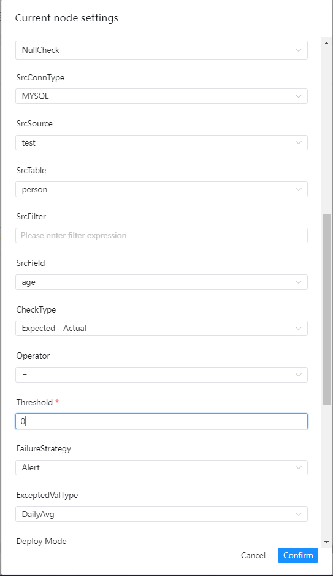

|     **Parameter**      |                                                                                                                **Description**                                                                                                                |
|------------------------|-----------------------------------------------------------------------------------------------------------------------------------------------------------------------------------------------------------------------------------------------|
| Source data type       | Select MySQL, PostgreSQL, etc.                                                                                                                                                                                                                |
| Source data source     | The corresponding data source under the source data type.                                                                                                                                                                                     |
| Source data table      | Drop-down to select the table where the validation data is located.                                                                                                                                                                           |
| Src filter conditions  | Such as the title, it will also be used when counting the total number of rows in the table, optional.                                                                                                                                        |
| Src table check column | Drop-down to select the check column name.                                                                                                                                                                                                    |
| Check method           | <ul><li>[Expected-Actual]</li><li>[Actual-Expected]</li><li>[Actual/Expected]x100%</li><li>[(Expected-Actual)/Expected]x100%</li></ul>                                                                                                        |
| Check operators        | =, >, >=, <, <=, ! =                                                                                                                                                                                                                          |
| Threshold              | The value used in the formula for comparison.                                                                                                                                                                                                 |
| Failure strategy       | <ul><li>Alert: The data quality task failed, the DolphinScheduler task result is successful, and an alert is sent.</li><li>Blocking: The data quality task fails, the DolphinScheduler task result is failed, and an alarm is sent.</li></ul> |
| Expected value type    | Select the desired type from the drop-down menu.                                                                                                                                                                                              |

## Timeliness Check of Single Table Check

### Inspection Introduction

The timeliness check is used to check whether the data is processed within the expected time. The start time and end time can be specified to define the time range. If the amount of data within the time range does not reach the set threshold, the check task will be judged as fail.

### Interface Operation Guide

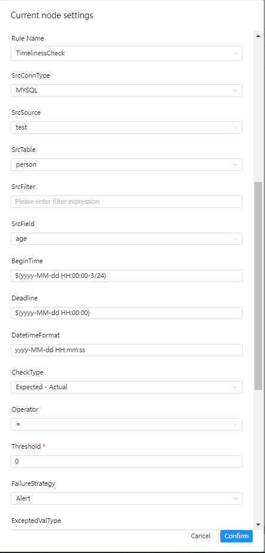

|     **Parameter**      |                                                                                                                **Description**                                                                                                                |
|------------------------|-----------------------------------------------------------------------------------------------------------------------------------------------------------------------------------------------------------------------------------------------|
| Source data type       | Select MySQL, PostgreSQL, etc.                                                                                                                                                                                                                |
| Source data source     | The corresponding data source under the source data type.                                                                                                                                                                                     |
| Source data table      | Drop-down to select the table where the validation data is located.                                                                                                                                                                           |
| Src filter conditions  | Such as the title, it will also be used when counting the total number of rows in the table, optional.                                                                                                                                        |
| Src table check column | Drop-down to select check column name.                                                                                                                                                                                                        |
| Start time             | The start time of a time range.                                                                                                                                                                                                               |
| end time               | The end time of a time range.                                                                                                                                                                                                                 |
| Time Format            | Set the corresponding time format.                                                                                                                                                                                                            |
| Check method           | <ul><li>[Expected-Actual]</li><li>[Actual-Expected]</li><li>[Actual/Expected]x100%</li><li>[(Expected-Actual)/Expected]x100%</li></ul>                                                                                                        |
| Check operators        | =, >, >=, <, <=, ! =                                                                                                                                                                                                                          |
| Threshold              | The value used in the formula for comparison.                                                                                                                                                                                                 |
| Failure strategy       | <ul><li>Alert: The data quality task failed, the DolphinScheduler task result is successful, and an alert is sent.</li><li>Blocking: The data quality task fails, the DolphinScheduler task result is failed, and an alarm is sent.</li></ul> |
| Expected value type    | Select the desired type from the drop-down menu.                                                                                                                                                                                              |

## Field Length Check for Single Table Check

### Inspection Introduction

The goal of field length verification is to check whether the length of the selected field meets the expectations. If there is data that does not meet the requirements, and the number of rows exceeds the threshold, the task will be judged to fail.

### Interface Operation Guide

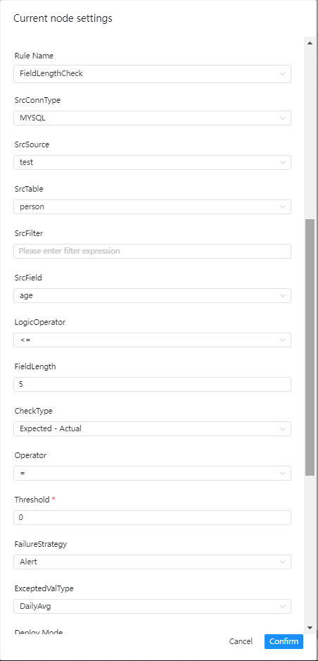

|     **Parameter**      |                                                                                                                **Description**                                                                                                                |
|------------------------|-----------------------------------------------------------------------------------------------------------------------------------------------------------------------------------------------------------------------------------------------|
| Source data type       | Select MySQL, PostgreSQL, etc.                                                                                                                                                                                                                |
| Source data source     | The corresponding data source under the source data type.                                                                                                                                                                                     |
| Source data table      | Drop-down to select the table where the validation data is located.                                                                                                                                                                           |
| Src filter conditions  | Such as the title, it will also be used when counting the total number of rows in the table, optional.                                                                                                                                        |
| Src table check column | Drop-down to select the check column name.                                                                                                                                                                                                    |
| Logical operators      | =, >, >=, <, <=, ! =                                                                                                                                                                                                                          |
| Field length limit     | Like the title.                                                                                                                                                                                                                               |
| Check method           | <ul><li>[Expected-Actual]</li><li>[Actual-Expected]</li><li>[Actual/Expected]x100%</li><li>[(Expected-Actual)/Expected]x100%</li></ul>                                                                                                        |
| Check operators        | =, >, >=, <, <=, ! =                                                                                                                                                                                                                          |
| Threshold              | The value used in the formula for comparison.                                                                                                                                                                                                 |
| Failure strategy       | <ul><li>Alert: The data quality task failed, the DolphinScheduler task result is successful, and an alert is sent.</li><li>Blocking: The data quality task fails, the DolphinScheduler task result is failed, and an alarm is sent.</li></ul> |
| Expected value type    | Select the desired type from the drop-down menu.                                                                                                                                                                                              |

## Uniqueness Check for Single Table Check

### Inspection Introduction

The goal of the uniqueness check is to check whether the fields are duplicated. It is generally used to check whether the primary key is duplicated. If there are duplicates and the threshold is reached, the check task will be judged to be failed.

### Interface Operation Guide

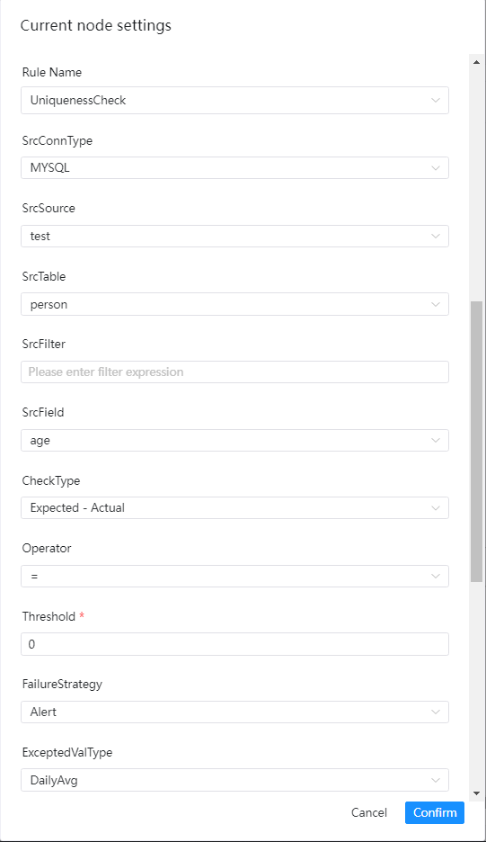

|     **Parameter**      |                                                                                                                **Description**                                                                                                                |
|------------------------|-----------------------------------------------------------------------------------------------------------------------------------------------------------------------------------------------------------------------------------------------|
| Source data type       | Select MySQL, PostgreSQL, etc.                                                                                                                                                                                                                |
| Source data source     | The corresponding data source under the source data type.                                                                                                                                                                                     |
| Source data table      | Drop-down to select the table where the validation data is located.                                                                                                                                                                           |
| Src filter conditions  | Such as the title, it will also be used when counting the total number of rows in the table, optional.                                                                                                                                        |
| Src table check column | Drop-down to select the check column name.                                                                                                                                                                                                    |
| Check method           | <ul><li>[Expected-Actual]</li><li>[Actual-Expected]</li><li>[Actual/Expected]x100%</li><li>[(Expected-Actual)/Expected]x100%</li></ul>                                                                                                        |
| Check operators        | =, >, >=, <, <=, ! =                                                                                                                                                                                                                          |
| Threshold              | The value used in the formula for comparison.                                                                                                                                                                                                 |
| Failure strategy       | <ul><li>Alert: The data quality task failed, the DolphinScheduler task result is successful, and an alert is sent.</li><li>Blocking: The data quality task fails, the DolphinScheduler task result is failed, and an alarm is sent.</li></ul> |
| Expected value type    | Select the desired type from the drop-down menu.                                                                                                                                                                                              |

## Regular Expression Check for Single Table Check

### Inspection Introduction

The goal of regular expression verification is to check whether the format of the value of a field meets the requirements, such as time format, email format, ID card format, etc. If there is data that does not meet the format and exceeds the threshold, the task will be judged as failed.

### Interface Operation Guide

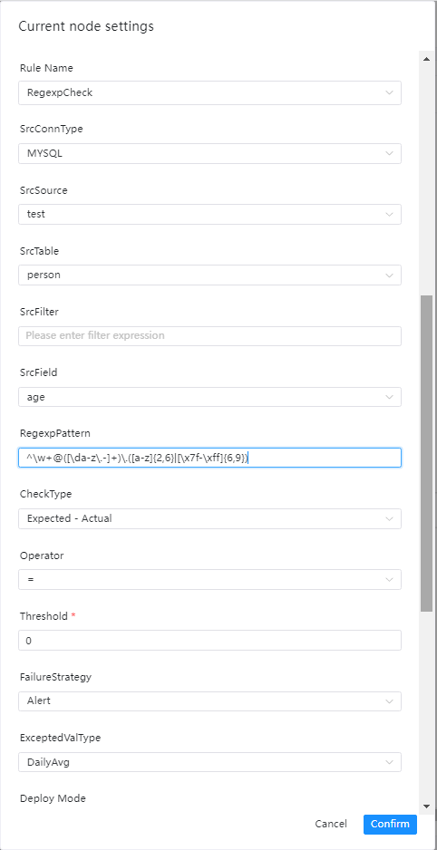

|     **Parameter**      |                                                                                                                **Description**                                                                                                                |
|------------------------|-----------------------------------------------------------------------------------------------------------------------------------------------------------------------------------------------------------------------------------------------|
| Source data type       | Select MySQL, PostgreSQL, etc.                                                                                                                                                                                                                |
| Source data source     | The corresponding data source under the source data type.                                                                                                                                                                                     |
| Source data table      | Drop-down to select the table where the validation data is located.                                                                                                                                                                           |
| Src filter conditions  | Such as the title, it will also be used when counting the total number of rows in the table, optional.                                                                                                                                        |
| Src table check column | Drop-down to select check column name.                                                                                                                                                                                                        |
| Regular expression     | As title.                                                                                                                                                                                                                                     |
| Check method           | <ul><li>[Expected-Actual]</li><li>[Actual-Expected]</li><li>[Actual/Expected]x100%</li><li>[(Expected-Actual)/Expected]x100%</li></ul>                                                                                                        |
| Check operators        | =, >, >=, <, <=, ! =                                                                                                                                                                                                                          |
| Threshold              | The value used in the formula for comparison.                                                                                                                                                                                                 |
| Failure strategy       | <ul><li>Alert: The data quality task failed, the DolphinScheduler task result is successful, and an alert is sent.</li><li>Blocking: The data quality task fails, the DolphinScheduler task result is failed, and an alarm is sent.</li></ul> |
| Expected value type    | Select the desired type from the drop-down menu.                                                                                                                                                                                              |

## Enumeration Value Validation for Single Table Check

### Inspection Introduction

The goal of enumeration value verification is to check whether the value of a field is within the range of the enumeration value. If there is data that is not in the range of the enumeration value and exceeds the threshold, the task will be judged to fail.

### Interface Operation Guide

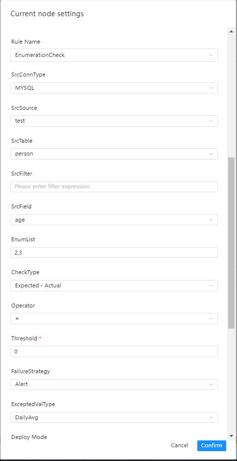

|        **Parameter**        |                                                                                                                **Description**                                                                                                                |
|-----------------------------|-----------------------------------------------------------------------------------------------------------------------------------------------------------------------------------------------------------------------------------------------|
| Source data type            | Select MySQL, PostgreSQL, etc.                                                                                                                                                                                                                |
| Source data source          | The corresponding data source under the source data type.                                                                                                                                                                                     |
| Source data table           | Drop-down to select the table where the validation data is located.                                                                                                                                                                           |
| Src table filter conditions | Such as title, also used when counting the total number of rows in the table, optional.                                                                                                                                                       |
| Src table check column      | Drop-down to select the check column name.                                                                                                                                                                                                    |
| List of enumeration values  | Separated by commas.                                                                                                                                                                                                                          |
| Check method                | <ul><li>[Expected-Actual]</li><li>[Actual-Expected]</li><li>[Actual/Expected]x100%</li><li>[(Expected-Actual)/Expected]x100%</li></ul>                                                                                                        |
| Check operators             | =, >, >=, <, <=, ! =                                                                                                                                                                                                                          |
| Threshold                   | The value used in the formula for comparison.                                                                                                                                                                                                 |
| Failure strategy            | <ul><li>Alert: The data quality task failed, the DolphinScheduler task result is successful, and an alert is sent.</li><li>Blocking: The data quality task fails, the DolphinScheduler task result is failed, and an alarm is sent.</li></ul> |
| Expected value type         | Select the desired type from the drop-down menu.                                                                                                                                                                                              |

## Table Row Number Verification for Single Table Check

### Inspection Introduction

The goal of table row number verification is to check whether the number of rows in the table reaches the expected value. If the number of rows does not meet the standard, the task will be judged as failed.

### Interface Operation Guide

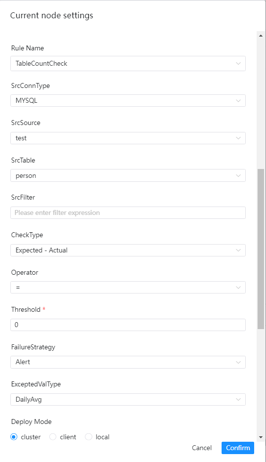

|     **Parameter**      |                                                                                                                **Description**                                                                                                                |
|------------------------|-----------------------------------------------------------------------------------------------------------------------------------------------------------------------------------------------------------------------------------------------|
| Source data type       | Select MySQL, PostgreSQL, etc.                                                                                                                                                                                                                |
| Source data source     | The corresponding data source under the source data type.                                                                                                                                                                                     |
| Source data table      | Drop-down to select the table where the validation data is located.                                                                                                                                                                           |
| Src filter conditions  | Such as the title, it will also be used when counting the total number of rows in the table, optional.                                                                                                                                        |
| Src table check column | Drop-down to select the check column name.                                                                                                                                                                                                    |
| Check method           | <ul><li>[Expected-Actual]</li><li>[Actual-Expected]</li><li>[Actual/Expected]x100%</li><li>[(Expected-Actual)/Expected]x100%</li></ul>                                                                                                        |
| Check operators        | =, >, >=, <, <=, ! =                                                                                                                                                                                                                          |
| Threshold              | The value used in the formula for comparison.                                                                                                                                                                                                 |
| Failure strategy       | <ul><li>Alert: The data quality task failed, the DolphinScheduler task result is successful, and an alert is sent.</li><li>Blocking: The data quality task fails, the DolphinScheduler task result is failed, and an alarm is sent.</li></ul> |
| Expected value type    | Select the desired type from the drop-down menu.                                                                                                                                                                                              |

## Custom SQL Check for Single Table Check

### Interface Operation Guide

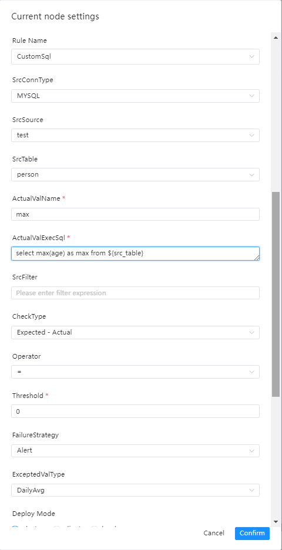

|        **Parameter**         |                                                                                                                                **Description**                                                                                                                                 |
|------------------------------|--------------------------------------------------------------------------------------------------------------------------------------------------------------------------------------------------------------------------------------------------------------------------------|
| Source data type             | Select MySQL, PostgreSQL, etc.                                                                                                                                                                                                                                                 |
| Source data source           | The corresponding data source under the source data type.                                                                                                                                                                                                                      |
| Source data table            | Drop-down to select the table where the data to be verified is located.                                                                                                                                                                                                        |
| Actual value name            | Alias in SQL for statistical value calculation, such as max_num.                                                                                                                                                                                                               |
| Actual value calculation SQL | SQL for outputting actual values. Note:<ul><li>The SQL must be statistical SQL, such as counting the number of rows, calculating the maximum value, minimum value, etc.</li><li>Select max(a) as max_num from ${src_table}, the table name must be filled like this.</li></ul> |
| Src filter conditions        | Such as the title, it will also be used when counting the total number of rows in the table, optional.                                                                                                                                                                         |
| Check method                 | <ul><li>[Expected-Actual]</li><li>[Actual-Expected]</li><li>[Actual/Expected]x100%</li><li>[(Expected-Actual)/Expected]x100%</li></ul>                                                                                                                                         |
| Check operators              | =, >, >=, <, <=, ! =                                                                                                                                                                                                                                                           |
| Threshold                    | The value used in the formula for comparison.                                                                                                                                                                                                                                  |
| Failure strategy             | <ul><li>Alert: The data quality task failed, the DolphinScheduler task result is successful, and an alert is sent.</li><li>Blocking: The data quality task fails, the DolphinScheduler task result is failed, and an alarm is sent.</li></ul>                                  |
| Expected value type          | Select the desired type from the drop-down menu.                                                                                                                                                                                                                               |

## Accuracy Check of Multi-table

### Inspection Introduction

Accuracy checks are performed by comparing the accuracy differences of data records for selected fields between two tables, examples are as follows
- table test1

| c1 | c2 |
|:--:|:--:|
| a  | 1  |
| b  | 2  |

- table test2

| c21 | c22 |
|:---:|:---:|
|  a  |  1  |
|  b  |  3  |

If you compare the data in c1 and c21, the tables test1 and test2 are exactly the same. If you compare c2 and c22, the data in table test1 and table test2 are inconsistent.

### Interface Operation Guide

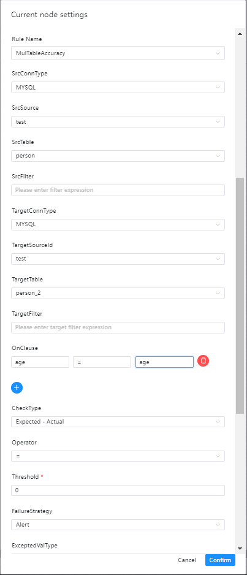

|      **Parameter**       |                                                                                                               **Description**                                                                                                                |
|--------------------------|----------------------------------------------------------------------------------------------------------------------------------------------------------------------------------------------------------------------------------------------|
| Source data type         | Select MySQL, PostgreSQL, etc.                                                                                                                                                                                                               |
| Source data source       | The corresponding data source under the source data type.                                                                                                                                                                                    |
| Source data table        | Drop-down to select the table where the data to be verified is located.                                                                                                                                                                      |
| Src filter conditions    | Such as the title, it will also be used when counting the total number of rows in the table, optional.                                                                                                                                       |
| Target data type         | Choose MySQL, PostgreSQL, etc.                                                                                                                                                                                                               |
| Target data source       | The corresponding data source under the source data type.                                                                                                                                                                                    |
| Target data table        | Drop-down to select the table where the data to be verified is located.                                                                                                                                                                      |
| Target filter conditions | Such as the title, it will also be used when counting the total number of rows in the table, optional.                                                                                                                                       |
| Check column             | Fill in the source data column, operator and target data column respectively.                                                                                                                                                                |
| Verification method      | Select the desired verification method.                                                                                                                                                                                                      |
| Operators                | =, >, >=, <, <=, ! =                                                                                                                                                                                                                         |
| Failure strategy         | <ul><li>Alert: The data quality task failed, the DolphinScheduler task result is successful, and an alert is sent.</li><li>Blocking: The data quality task fails, the DolphinScheduler task result is failed, and an alarm is sent.</li><ul> |
| Expected value type      | Select the desired type in the drop-down menu, only `SrcTableTotalRow`, `TargetTableTotalRow` and fixed value are suitable for selection here.                                                                                               |

## Comparison of the values checked by the two tables

### Inspection Introduction

Two-table value comparison allows users to customize different SQL statistics for two tables and compare the corresponding values. For example, for the source table A, the total amount of a certain column is calculated, and for the target table, the total amount of a certain column is calculated. value sum2, compare sum1 and sum2 to determine the check result.

### Interface Operation Guide

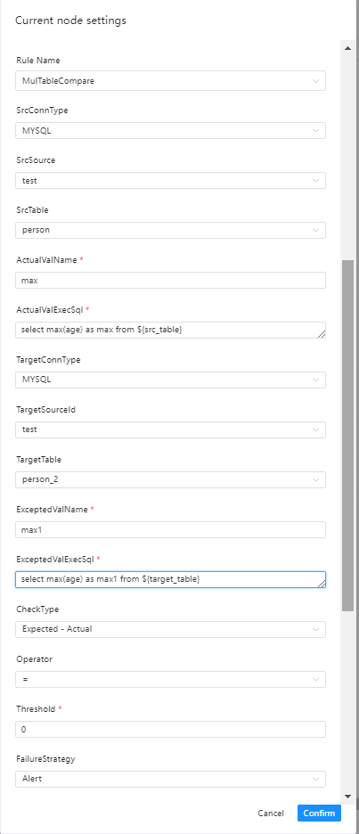

|         **Parameter**          |                                                                                                                                    **Description**                                                                                                                                    |
|--------------------------------|---------------------------------------------------------------------------------------------------------------------------------------------------------------------------------------------------------------------------------------------------------------------------------------|
| Source data type               | Select MySQL, PostgreSQL, etc.                                                                                                                                                                                                                                                        |
| Source data source             | The corresponding data source under the source data type.                                                                                                                                                                                                                             |
| Source data table              | The table where the data is to be verified.                                                                                                                                                                                                                                           |
| Actual value name              | Calculate the alias in SQL for the actual value, such as max_age1.                                                                                                                                                                                                                    |
| Actual value calculation SQL   | SQL for outputting actual values. Note: <ul><li>The SQL must be statistical SQL, such as counting the number of rows, calculating the maximum value, minimum value, etc.</li><li>Select max(age) as max_age1 from ${src_table} The table name must be filled like this.</li></ul>     |
| Target data type               | Choose MySQL, PostgreSQL, etc.                                                                                                                                                                                                                                                        |
| Target data source             | The corresponding data source under the source data type.                                                                                                                                                                                                                             |
| Target data table              | The table where the data is to be verified.                                                                                                                                                                                                                                           |
| Expected value name            | Calculate the alias in SQL for the expected value, such as max_age2.                                                                                                                                                                                                                  |
| Expected value calculation SQL | SQL for outputting expected value. Note: <ul><li>The SQL must be statistical SQL, such as counting the number of rows, calculating the maximum value, minimum value, etc.</li><li>Select max(age) as max_age2 from ${target_table} The table name must be filled like this.</li></ul> |
| Verification method            | Select the desired verification method.                                                                                                                                                                                                                                               |
| Operators                      | =, >, >=, <, <=, ! =                                                                                                                                                                                                                                                                  |
| Failure strategy               | <ul><li>Alert: The data quality task failed, the DolphinScheduler task result is successful, and an alert is sent.</li><li>Blocking: The data quality task fails, the DolphinScheduler task result is failed, and an alarm is sent.</li></ul>                                         |

## Task result view

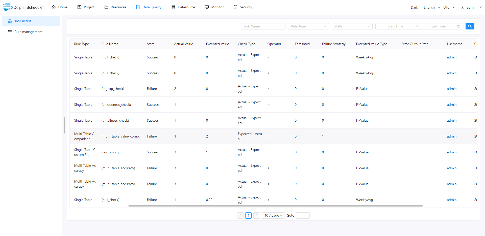

## Rule View

### List of rules

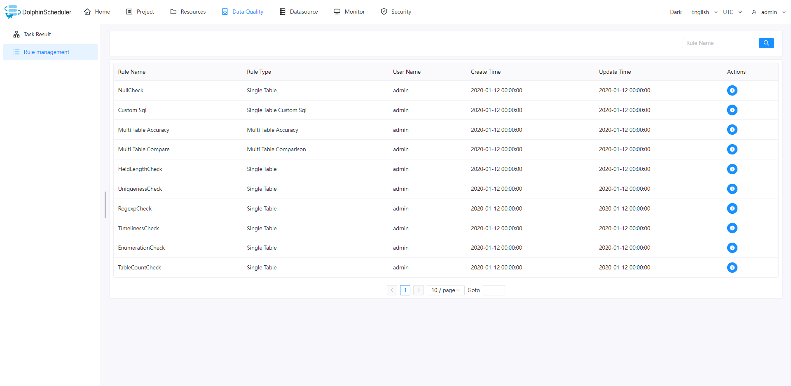

### Rules Details

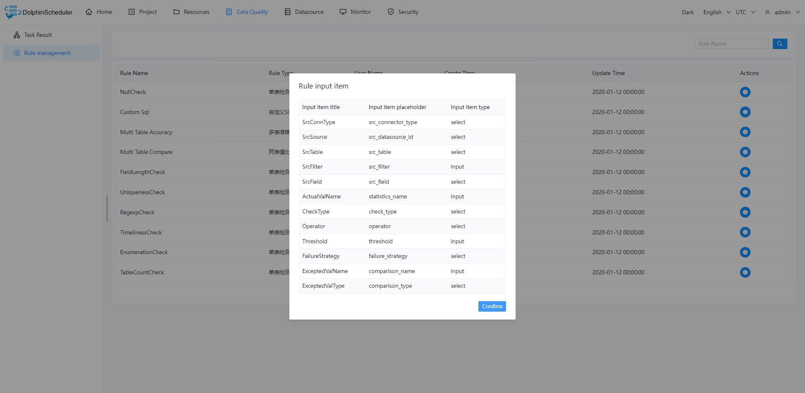
