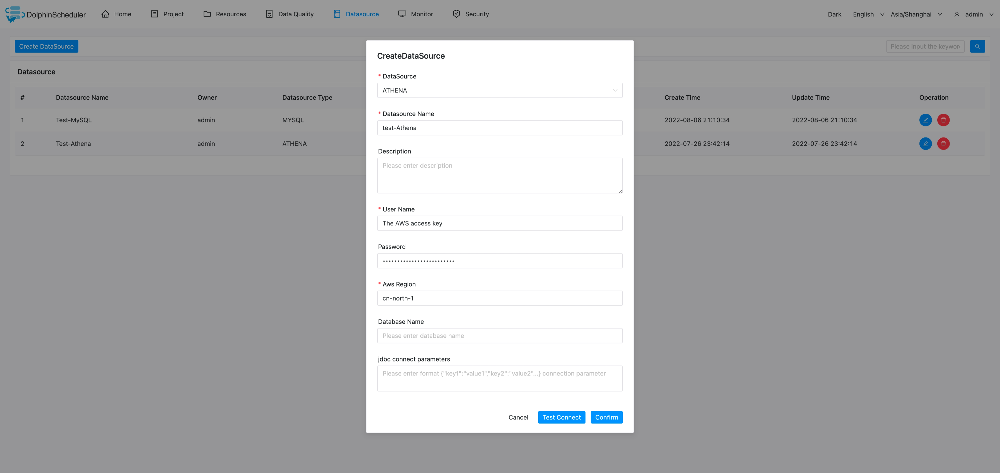

# AWS Athena

## Datasource Parameters

|       **Datasource**       |                      **Description**                      |
|----------------------------|-----------------------------------------------------------|
| Datasource                 | Select ATHENA.                                            |
| Datasource name            | Enter the name of the DataSource.                         |
| Description                | Enter a description of the DataSource.                    |
| Username                   | Set the AWS access key.                                   |
| Password                   | Set the AWS secret access key.                            |
| AwsRegion                  | Set the AWS region.                                       |
| Database name              | Enter the database name of the ATHENA connection.         |
| Jdbc connection parameters | Parameter settings for ATHENA connection, in JSON format. |

## Native Supported

- No, read section example in [datasource-setting](../howto/datasource-setting.md) `DataSource Center` section to activate this datasource.
- JDBC driver configuration reference document [athena-connect-with-jdbc](https://docs.amazonaws.cn/athena/latest/ug/connect-with-jdbc.html)
- Driver download link [SimbaAthenaJDBC-2.0.31.1000/AthenaJDBC42.jar](https://s3.cn-north-1.amazonaws.com.cn/athena-downloads-cn/drivers/JDBC/SimbaAthenaJDBC-2.0.31.1000/AthenaJDBC42.jar)

