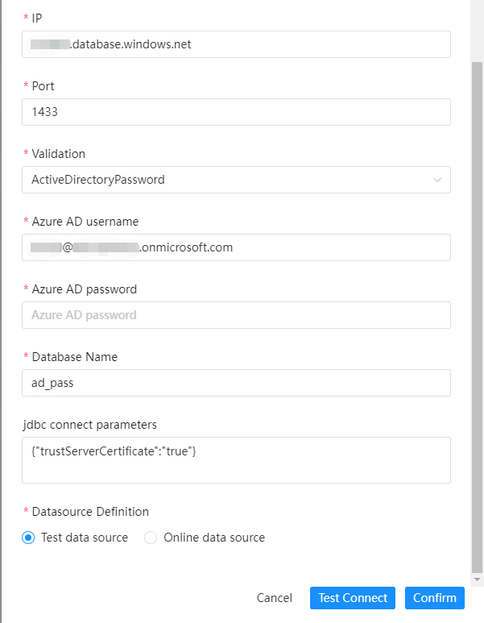
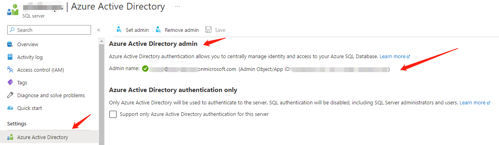
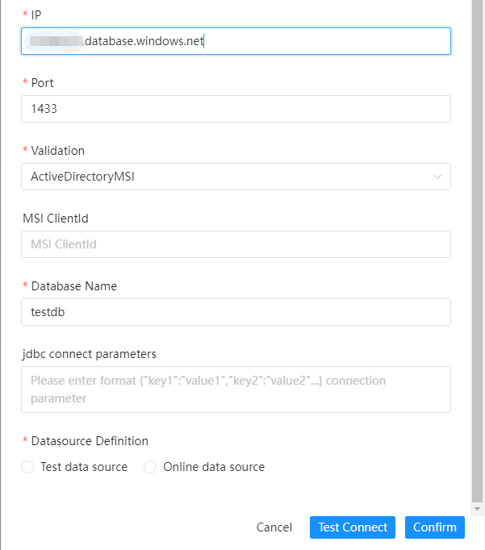
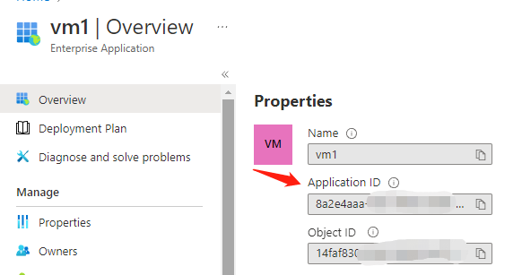
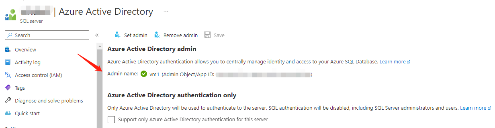
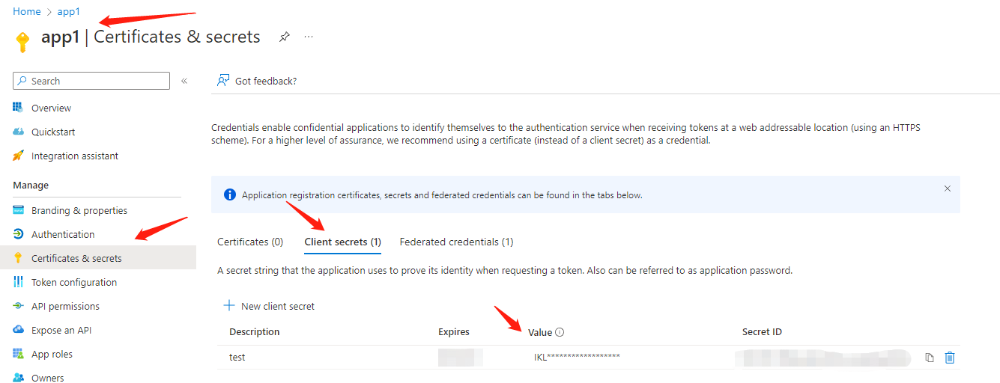
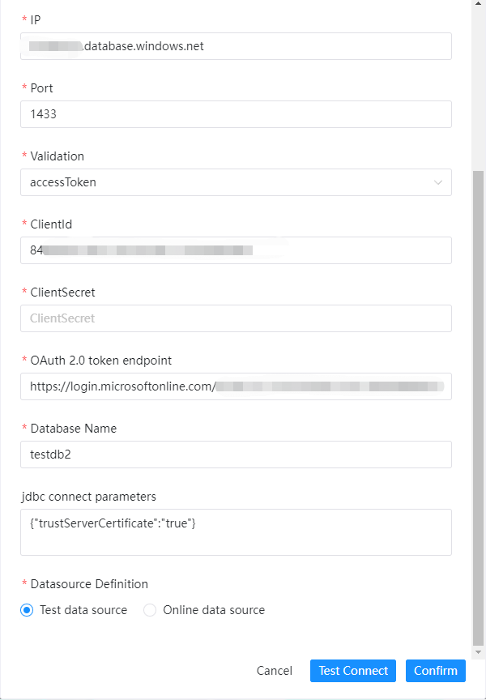
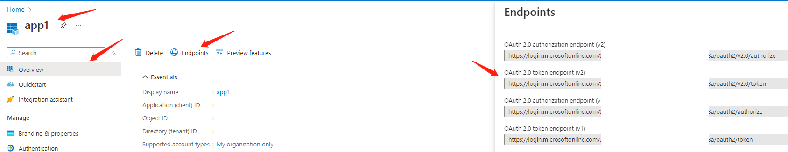

# AZURE SQL

## AUTH Mode

### SqlPassword

Use Azure SQL server username and password to login.

|       **Datasource**       |                                                                   **Description**                                                                    |
|----------------------------|------------------------------------------------------------------------------------------------------------------------------------------------------|
| Datasource                 | Select AZURE SQL.                                                                                                                                    |
| Datasource name            | Enter the name of the DataSource.                                                                                                                    |
| Description                | Enter a description of the DataSource.                                                                                                               |
| IP/Host Name               | Enter the AZURE SQL service Host or IP, eg: xxx.database.windows.net.                                                                                |
| Port                       | Enter the AZURE SQL service port, 1433 by default.                                                                                                   |
| Auth Mode                  | Set the connection auth mode. Currently support: SqlPassword,ActiveDirectoryPassword,ActiveDirectoryMSI,ActiveDirectoryServicePrincipal,accessToken. |
| Username                   | Set the username for AZURE SQL connection.                                                                                                           |
| Password                   | Set the password for AZURE SQL connection.                                                                                                           |
| Database name              | Enter the database name of the AZURE SQL connection.                                                                                                 |
| Jdbc connection parameters | Parameter settings for AZURE SQL connection, in JSON format.                                                                                         |

The following only describes the different attributes.

### ActiveDirectoryPassword

Use Azure AD username and password to login.

Prerequisites: set AD account to be the admin of the Azure SQL server.

- Azure AD username: Azure AD account name, eg: xx@xx.onmicrosoft.com
- Password: Azure AD password

### ActiveDirectoryMSI

Use Azure internal services to login.
Prerequisites: set Azure virtual machine to be the admin of the Azure SQL server. MSIClientId should be VM's Application ID and it is not required.

- MSIClientId: input the clientId of the internal resources (eg: Azure VM, applications or Azure Active Directory application functions) of the ActiveDirectoryMSI mode.

### ActiveDirectoryServicePrincipal

Use application (client) ID and secret to login.
Prerequisites: set application to be the admin of the Azure SQL server. Meanwhile, apply for client secret for the application and use both secret and ID to login.

- clientId: application (client) ID
- clientSecret: application client secret

### accessToken

Use application (client) ID and secret to apply for temporary token, and use token to login (not JDBC connection).

- clientId: application (client) ID
- clientSecret: application client secret
- OAuth 2.0 token endpoint (v2): application OAuth 2.0 token endpoint (v2)

## Support Native

Yes, can use this datasource directly in SQL task.
