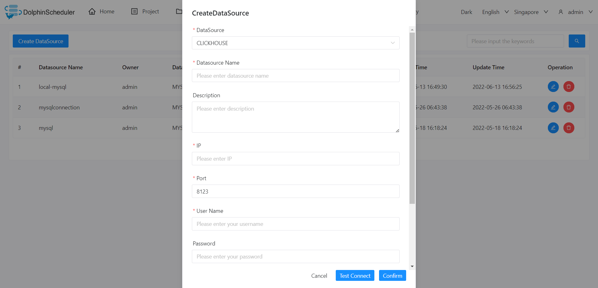

# ClickHouse

## Datasource Parameters

|     **Datasource**      |                        **Description**                        |
|-------------------------|---------------------------------------------------------------|
| Datasource              | Select CLICKHOUSE.                                            |
| Datasource Name         | Enter the name of the datasource.                             |
| Description             | Enter a description of the datasource.                        |
| IP/Host Name            | Enter the CLICKHOUSE service IP.                              |
| Port                    | Enter the CLICKHOUSE service port.                            |
| Username                | Set the username for CLICKHOUSE connection.                   |
| Password                | Set the password for CLICKHOUSE connection.                   |
| Database Name           | Enter the database name of the CLICKHOUSE connection.         |
| jdbc connect parameters | Parameter settings for CLICKHOUSE connection, in JSON format. |

## Native Supported

Yes, could use this datasource by default.
