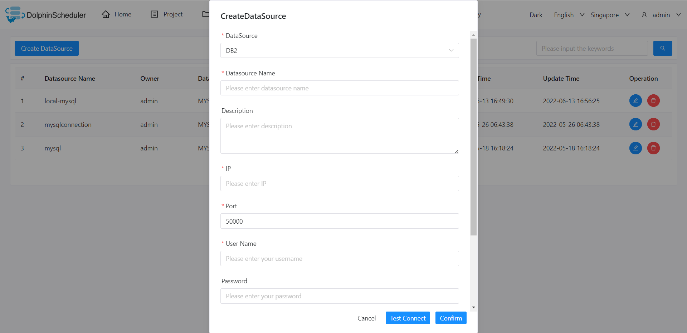

# DB2

## Datasource Parameters

|     **Datasource**      |                    **Description**                     |
|-------------------------|--------------------------------------------------------|
| Datasource              | Select DB2.                                            |
| Datasource Name         | Enter the name of the datasource.                      |
| Description             | Enter a description of the datasource.                 |
| IP/Host Name            | Enter the DB2 service IP.                              |
| Port                    | Enter the DB2 service port.                            |
| Username                | Set the username for DB2 connection.                   |
| Password                | Set the password for DB2 connection.                   |
| Database Name           | Enter the database name of the DB2 connection.         |
| jdbc connect parameters | Parameter settings for DB2 connection, in JSON format. |

## Native Supported

Yes, could use this datasource by default.
