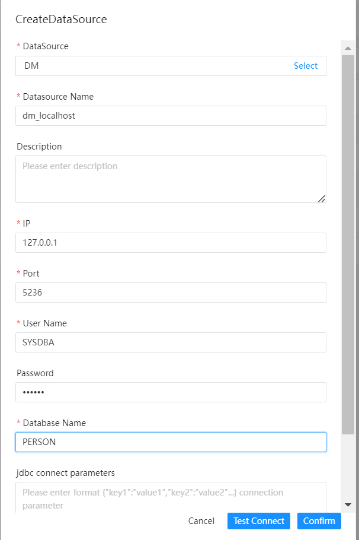

# DM

## Datasource Parameters

|       **Datasource**       |                    **Description**                    |
|----------------------------|-------------------------------------------------------|
| Datasource                 | Select DM.                                            |
| Datasource name            | Enter the name of the DataSource.                     |
| Description                | Enter a description of the DataSource.                |
| IP/Host Name               | Enter the DM service IP.                              |
| Port                       | Enter the DM service port.                            |
| Username                   | Set the username for DM connection.                   |
| Password                   | Set the password for DM connection.                   |
| Database name              | Enter the schema name of the DM connection.           |
| Jdbc connection parameters | Parameter settings for DM connection, in JSON format. |

## Native Supported

No, read section example in [datasource-setting](../howto/datasource-setting.md) `DataSource Center` section to activate this datasource.

