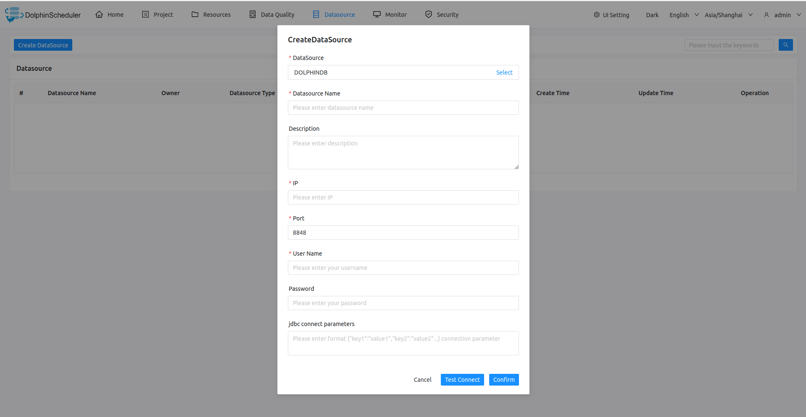

# DolphinDB

## Datasource Parameters

|       **Parameter**        |                       **Description**                        |
|----------------------------|--------------------------------------------------------------|
| Datasource                 | Select DOLPHINDB.                                            |
| Datasource Name            | Enter the name of the DataSource.                            |
| Description                | Enter a description of the DataSource.                       |
| IP/Host Name               | Enter the DolphinDB service IP.                              |
| Port                       | Enter the DolphinDB service port.                            |
| Username                   | Set the username for DolphinDB connection.                   |
| Password                   | Set the password for DolphinDB connection.                   |
| Jdbc connection parameters | Parameter settings for DolphinDB connection, in JSON format. |

## Native Supported

Yes, could use this datasource by default.
