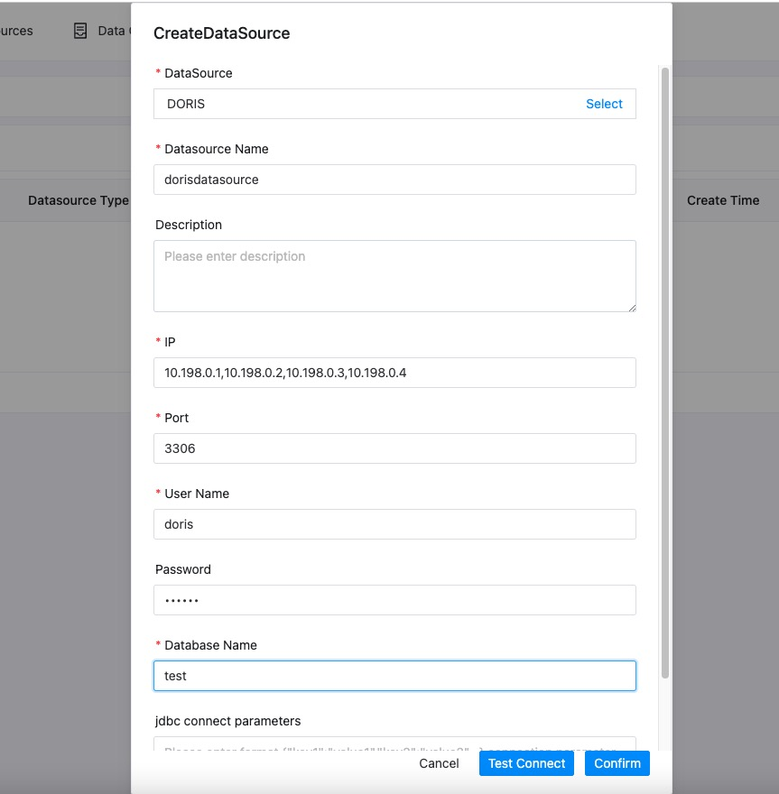

# DORIS

## Datasource Parameters

|       **Datasource**       |                                    **Description**                                    |
|----------------------------|---------------------------------------------------------------------------------------|
| Datasource                 | Select DORIS.                                                                         |
| Datasource name            | Enter the name of the DataSource.                                                     |
| Description                | Enter a description of the DataSource.                                                |
| IP/Host Name               | Enter the DORIS service IP.(If there are multiple IPs, please separate them with `,`) |
| Port                       | Enter the DORIS service port.                                                         |
| Username                   | Set the username for DORIS connection.                                                |
| Password                   | Set the password for DORIS connection.                                                |
| Database name              | Enter the database name of the DORIS connection.                                      |
| Jdbc connection parameters | Parameter settings for DORIS connection, in JSON format.                              |

## Native Supported

No, read section example in [datasource-setting](../howto/datasource-setting.md) `DataSource Center` section to activate
this datasource.

