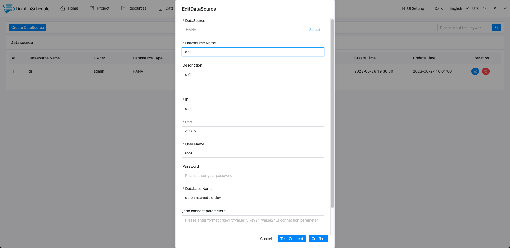

# HANA

## Datasource Parameters

|       **Datasource**       |                     **Description**                     |
|----------------------------|---------------------------------------------------------|
| Datasource                 | Select HANA.                                            |
| Datasource name            | Enter the name of the DataSource.                       |
| Description                | Enter a description of the DataSource.                  |
| IP/Host Name               | Enter the HANA service IP.                              |
| Port                       | Enter the HANA service port.                            |
| Username                   | Set the username for HANA connection.                   |
| Password                   | Set the password for HANA connection.                   |
| Database name              | Enter the database name of the HANA connection.         |
| Jdbc connection parameters | Parameter settings for HANA connection, in JSON format. |

## Native Supported

No, read section example in [datasource-setting](../howto/datasource-setting.md) `DataSource Center` section to activate this datasource.

