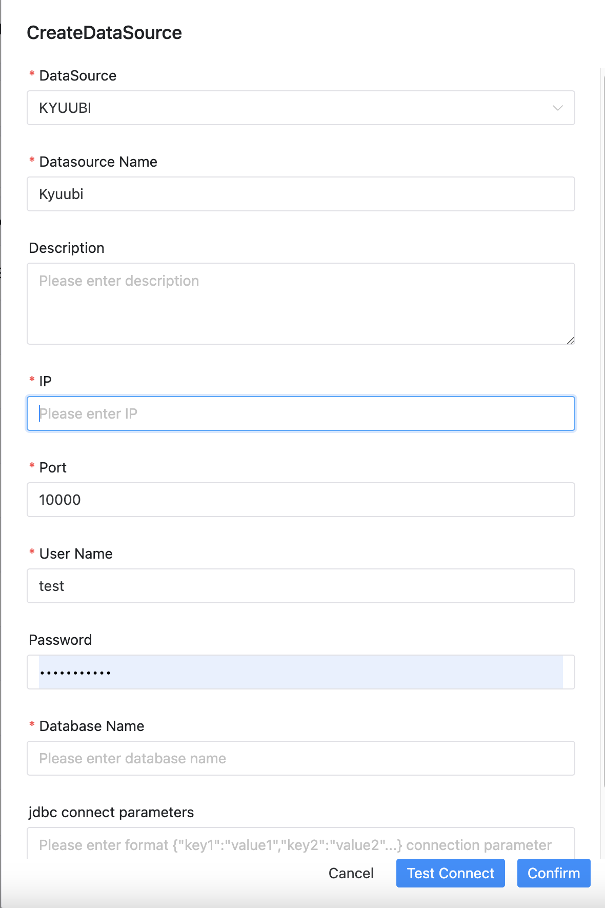

# KYUUBI

## Use HiveServer2



## Datasource Parameters

|       **Datasource**       |                      **Description**                      |
|----------------------------|-----------------------------------------------------------|
| Datasource                 | Select KYUUBI.                                            |
| Datasource name            | Enter the name of the DataSource.                         |
| Description                | Enter a description of the DataSource.                    |
| IP/Host Name               | Enter the KYUUBI service IP.                              |
| Port                       | Enter the KYUUBI service port.                            |
| Username                   | Set the username for KYUUBI connection.                   |
| Password                   | Set the password for KYUUBI connection.                   |
| Database name              | Enter the database name of the KYUUBI connection.         |
| Jdbc connection parameters | Parameter settings for KYUUBI connection, in JSON format. |

```Kerberos Authentication
just simply configure them in the connection parameters if kerberos authentication is required.

clientKeytab: path of Kerberos keytab file for client authentication

clientPrincipal: Kerberos principal for client authentication

serverPrincipal: Kerberos principal configured by kyuubi.kinit.principal at the server side.
```

## Native Supported

Yes, could use this datasource by default.
