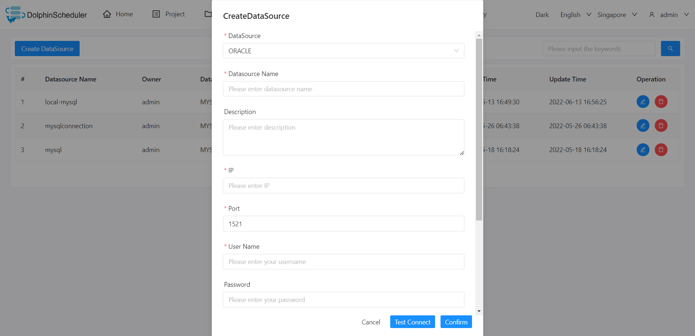

# Oracle

## Datasource Parameters

|     **Datasource**      |                                                             **Description**                                                             |
|-------------------------|-----------------------------------------------------------------------------------------------------------------------------------------|
| Datasource              | Select Oracle.                                                                                                                          |
| Datasource Name         | Enter the name of the datasource.                                                                                                       |
| Description             | Enter a description of the datasource.                                                                                                  |
| IP/Host Name            | Enter the Oracle service IP.                                                                                                            |
| Port                    | Enter the Oracle service port.                                                                                                          |
| Username                | Set the username for Oracle connection.                                                                                                 |
| Password                | Set the password for Oracle connection.                                                                                                 |
| Database Name           | Enter the ServiceName or SID of the Oracle connection.                                                                                  |
| ServiceName or SID      | Choose ServiceName or SID according to your entry in Database Name column.                                                              |
| jdbc connect parameters | Parameter settings for Oracle connection, in JSON format. For example, you can use {"schema": "abc"} to specify database abc for using. |

## Native Supported

Yes, could use this datasource by default.
