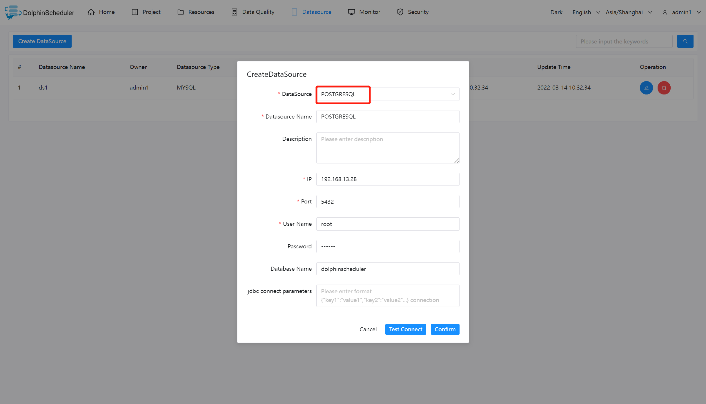

# PostgreSQL

## Datasource Parameters

|       **Datasource**       |                        **Description**                        |
|----------------------------|---------------------------------------------------------------|
| Datasource                 | Select POSTGRESQL.                                            |
| Datasource name            | Enter the name of the DataSource.                             |
| Description                | Enter a description of the DataSource.                        |
| IP/Host Name               | Enter the PostgreSQL service IP.                              |
| Port                       | Enter the PostgreSQL service port.                            |
| Username                   | Set the username for PostgreSQL connection.                   |
| Password                   | Set the password for PostgreSQL connection.                   |
| Database name              | Enter the database name of the PostgreSQL connection.         |
| Jdbc connection parameters | Parameter settings for PostgreSQL connection, in JSON format. |

## Native Supported

Yes, could use this datasource by default.
