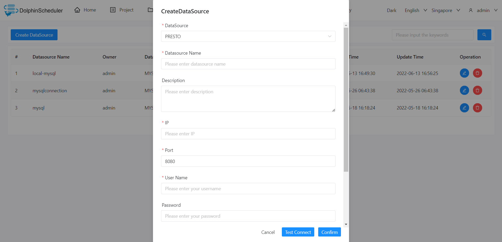

# Presto

## Datasource Parameters

|     **Datasource**      |                      **Description**                      |
|-------------------------|-----------------------------------------------------------|
| Datasource              | Select Presto.                                            |
| Datasource Name         | Enter the name of the datasource.                         |
| Description             | Enter a description of the datasource.                    |
| IP/Host Name            | Enter the Presto service IP.                              |
| Port                    | Enter the Presto service port.                            |
| Username                | Set the username for Presto connection.                   |
| Password                | Set the password for Presto connection.                   |
| Database Name           | Enter the database name of the Presto connection.         |
| jdbc connect parameters | Parameter settings for Presto connection, in JSON format. |

## Native Supported

Yes, could use this datasource by default.
