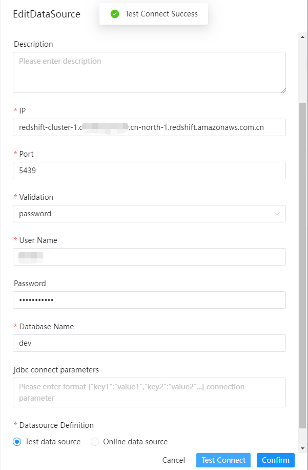
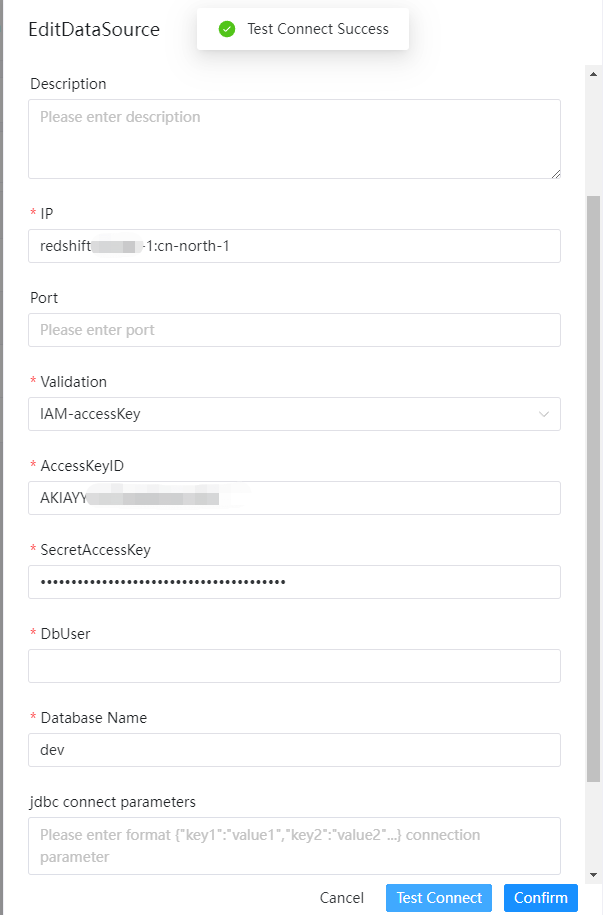
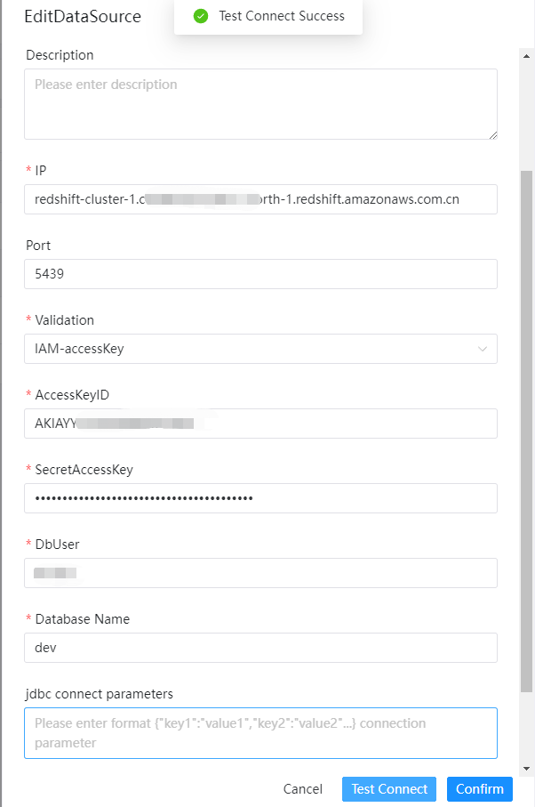

# Amazon Redshift

## Datasource Parameters

|     **Datasource**      |                       **Description**                       |
|-------------------------|-------------------------------------------------------------|
| Datasource              | Select Redshift.                                            |
| Datasource Name         | Enter the name of the datasource.                           |
| Description             | Enter a description of the datasource.                      |
| IP/Host Name            | Enter the Redshift service IP.                              |
| Port                    | Enter the Redshift service port.                            |
| Validation              | Enter the Redshift authentication mode.                     |
| Username                | Set the username for Redshift connection.                   |
| Password                | Set the password for Redshift connection.                   |
| Database Name           | Enter the database name of the Redshift connection.         |
| jdbc connect parameters | Parameter settings for Redshift connection, in JSON format. |
| AccessKeyID             | Mode IAM-accessKey access key ID.                           |
| SecretAccessKey         | Mode IAM-accessKey secret access key.                       |

### Validation: Password

Use AWS redshift database username and password to login.

### Validation: IAM-accessKey

Use cluster ID, AWS Region, port(optional) and IAM to login.

## Native Supported

Yes, could use this datasource by default.

Read more about Redshift IAM JDBC driver configuration reference document [redshift-connect-IAM-jdbc](https://docs.aws.amazon.com/redshift/latest/mgmt/generating-iam-credentials-configure-jdbc-odbc.html)
