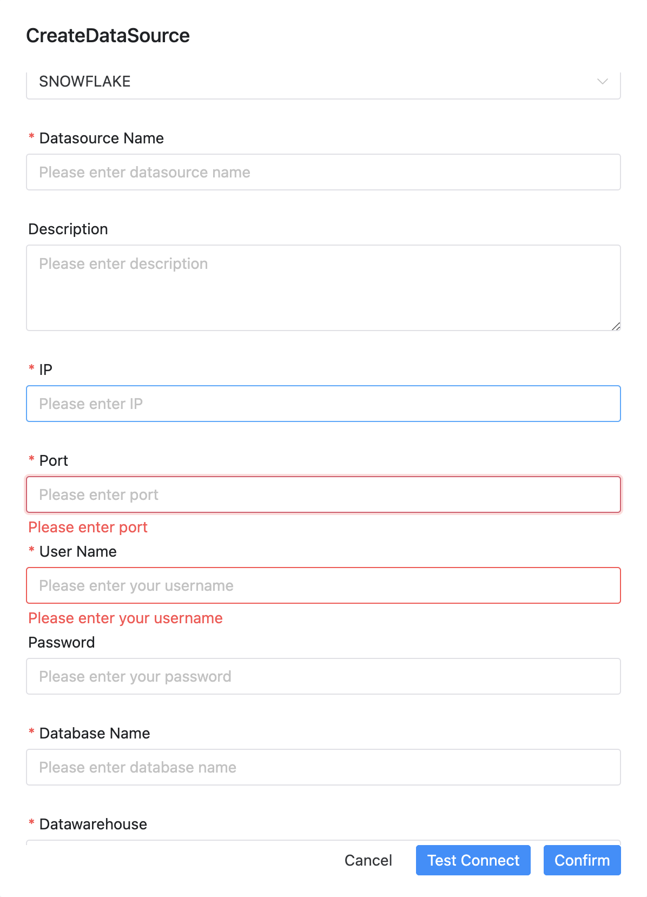

# SNOWFLAKE

## Use Snowflake

## Datasource Parameters

|       **Datasource**       |                       **Description**                        |
|----------------------------|--------------------------------------------------------------|
| Datasource                 | Select SNOWFLAKE.                                            |
| Datasource name            | Enter the name of the DataSource.                            |
| Description                | Enter a description of the DataSource.                       |
| IP/Host Name               | Enter the SNOWFLAKE service IP.                              |
| Port                       | Enter the SNOWFLAKE service port.                            |
| Username                   | Set the username for SNOWFLAKE connection.                   |
| Password                   | Set the password for SNOWFLAKE connection.                   |
| Database name              | Enter the database name of the SNOWFLAKE connection.         |
| Datawarehouse name         | Enter the datawarehouse name of the SNOWFLAKE connection.    |
| Jdbc connection parameters | Parameter settings for SNOWFLAKE connection, in JSON format. |

