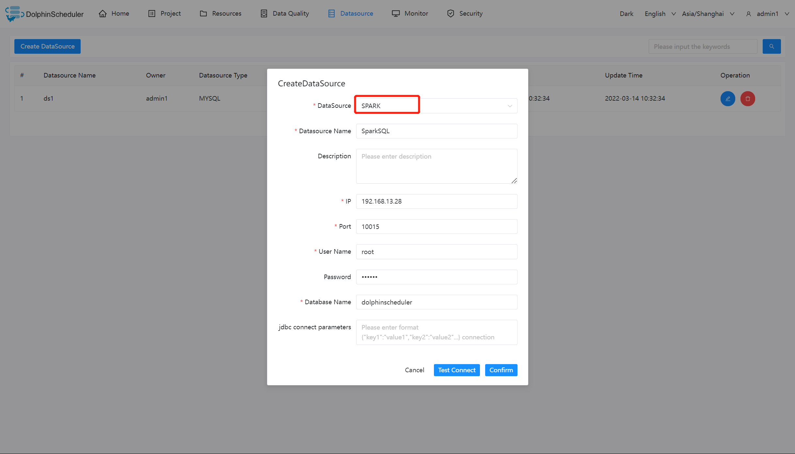

# Spark

## Datasource Parameters

|       **Datasource**       |                     **Description**                      |
|----------------------------|----------------------------------------------------------|
| Datasource                 | Select Spark.                                            |
| Datasource name            | Enter the name of the DataSource.                        |
| Description                | Enter a description of the DataSource.                   |
| IP/Host Name               | Enter the Spark service IP.                              |
| Port                       | Enter the Spark service port.                            |
| Username                   | Set the username for Spark connection.                   |
| Password                   | Set the password for Spark connection.                   |
| Database name              | Enter the database name of the Spark connection.         |
| Jdbc connection parameters | Parameter settings for Spark connection, in JSON format. |

## Native Supported

Yes, could use this datasource by default.
