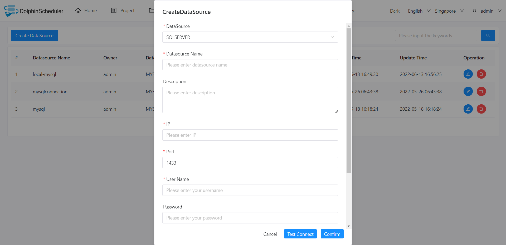

# SQL Server

## Datasource Parameters

|     **Datasource**      |                       **Description**                        |
|-------------------------|--------------------------------------------------------------|
| Datasource              | Select SQLSERVER.                                            |
| Datasource Name         | Enter the name of the datasource.                            |
| Description             | Enter a description of the datasource.                       |
| IP/Host Name            | Enter the SQLSERVER service IP.                              |
| Port                    | Enter the SQLSERVER service port.                            |
| Username                | Set the username for SQLSERVER connection.                   |
| Password                | Set the password for SQLSERVER connection.                   |
| Database Name           | Enter the database name of the SQLSERVER connection.         |
| jdbc connect parameters | Parameter settings for SQLSERVER connection, in JSON format. |

## Native Supported

Yes, could use this datasource by default.
