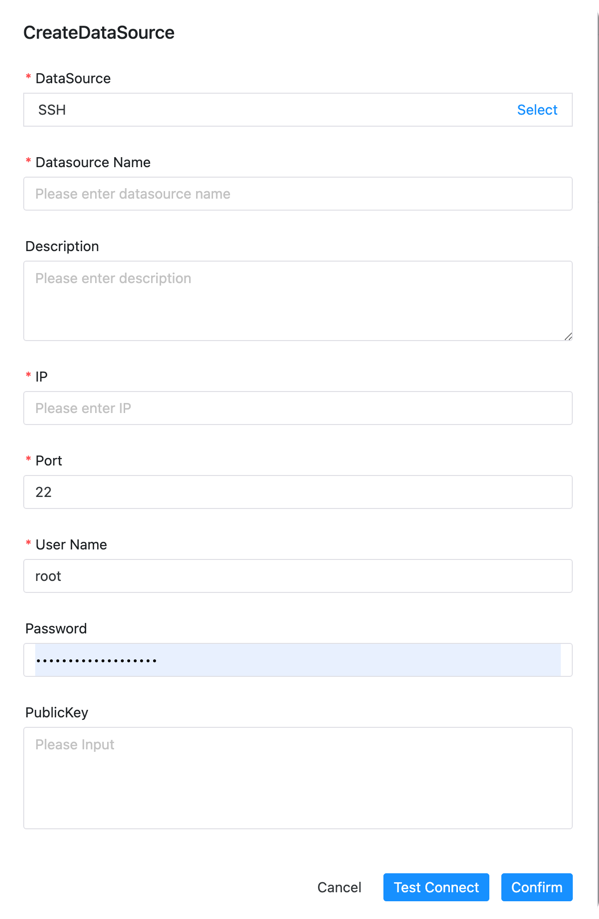

# SSH Data Source

This data source is used for RemoteShell component to execute commands remotely.

- Data Source: SSH
- Data Source Name: Enter the name of the data source
- Description: Enter the description of the data source
- IP Hostname: Enter the IP to connect to SSH
- Port: Enter the port to connect to SSH
- Username: Set the username to connect to SSH
- Password: Set the password to connect to SSH
- Public Key: Set the public key to connect to SSH

