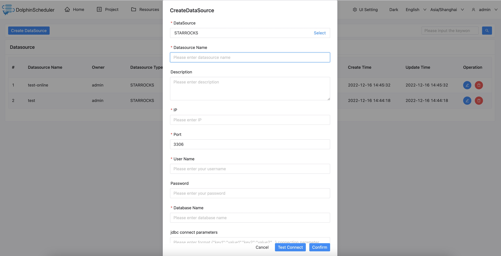

# StarRocks

## Datasource Parameters

|       **Datasource**       |                       **Description**                        |
|----------------------------|--------------------------------------------------------------|
| Datasource                 | Select StarRocks.                                            |
| Datasource name            | Enter the name of the DataSource.                            |
| Description                | Enter a description of the DataSource.                       |
| IP/Host Name               | Enter the StarRocks service IP.                              |
| Port                       | Enter the StarRocks service port.                            |
| Username                   | Set the username for StarRocks connection.                   |
| Password                   | Set the password for StarRocks connection.                   |
| Database name              | Enter the database name of the StarRocks connection.         |
| Jdbc connection parameters | Parameter settings for StarRocks connection, in JSON format. |

## Native Supported

No, you need to import Mysql jdbc driver first, read section example in [datasource-setting](../howto/datasource-setting.md) `DataSource Center` section to import Mysql JDBC Driver.

