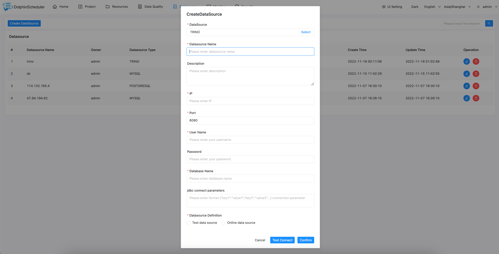

# Trino

## Datasource Parameters

|     **Datasource**      |                                **Description**                                |
|-------------------------|-------------------------------------------------------------------------------|
| Datasource              | Select Trino.                                                                 |
| Datasource Name         | Enter the name of the datasource.                                             |
| Description             | Enter a description of the datasource.                                        |
| IP/Host Name            | Enter the Trino service IP.                                                   |
| Port                    | Enter the Trino service port.                                                 |
| Username                | Set the username for Trino connection.                                        |
| Password                | Set the password for Trino connection.                                        |
| Database Name           | Enter the database name of the Trino connection.                              |
| jdbc connect parameters | Parameter settings for Trino connection, in JSON format.                      |
| Datasource Definition   | Define whether the data source is a test data source or an online data source |

## Native Supported

Yes, could use this datasource by default.
