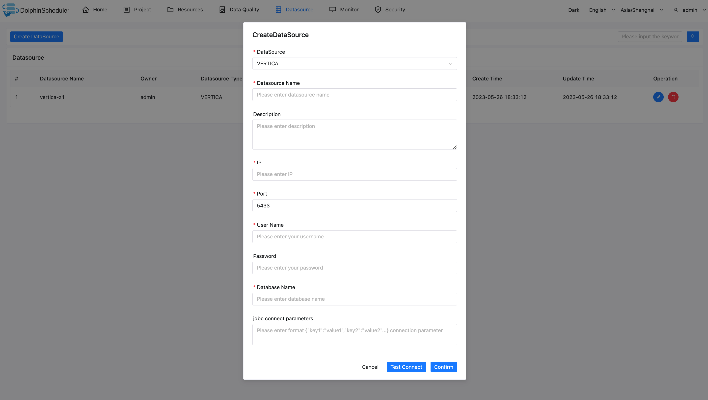

# Vertica

## Datasource Parameters

|       **Parameter**        |                      **Description**                       |
|----------------------------|------------------------------------------------------------|
| Datasource                 | Select VERTICA.                                            |
| Datasource Name            | Enter the name of the DataSource.                          |
| Description                | Enter a description of the DataSource.                     |
| IP/Host Name               | Enter the Vertica service IP.                              |
| Port                       | Enter the Vertica service port.                            |
| Username                   | Set the username for Vertica connection.                   |
| Password                   | Set the password for Vertica connection.                   |
| Database name              | Enter the database name of the Vertica connection.         |
| Jdbc connection parameters | Parameter settings for Vertica connection, in JSON format. |

## Native Supported

Yes, could use this datasource by default.
