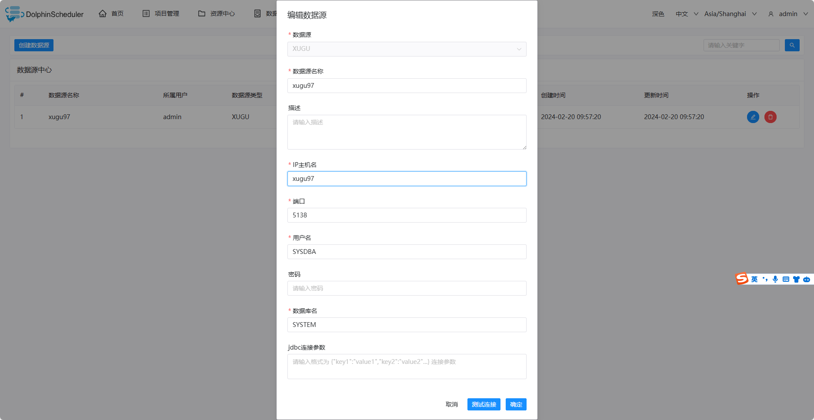

# XUGU

## Datasource Parameters

|       **Datasource**       |                      **Description**                      |
|----------------------------|-----------------------------------------------------------|
| Datasource                 | Select XUGU.                                            |
| Datasource name            | Enter the name of the DataSource.                         |
| Description                | Enter a description of the DataSource.                    |
| IP/Host Name               | Enter the XUGU service IP.                              |
| Port                       | Enter the XUGU service port.                            |
| Username                   | Set the username for XUGU connection.                   |
| Password                   | Set the password for XUGU connection.                   |
| Database name              | Enter the schema name of the XUGU connection.           |
| Jdbc connection parameters | Parameter settings for XUGU connection, in JSON format. |

## Native Supported

No, read section example in [datasource-setting](../howto/datasource-setting.md) `DataSource Center` section to activate this datasource.

