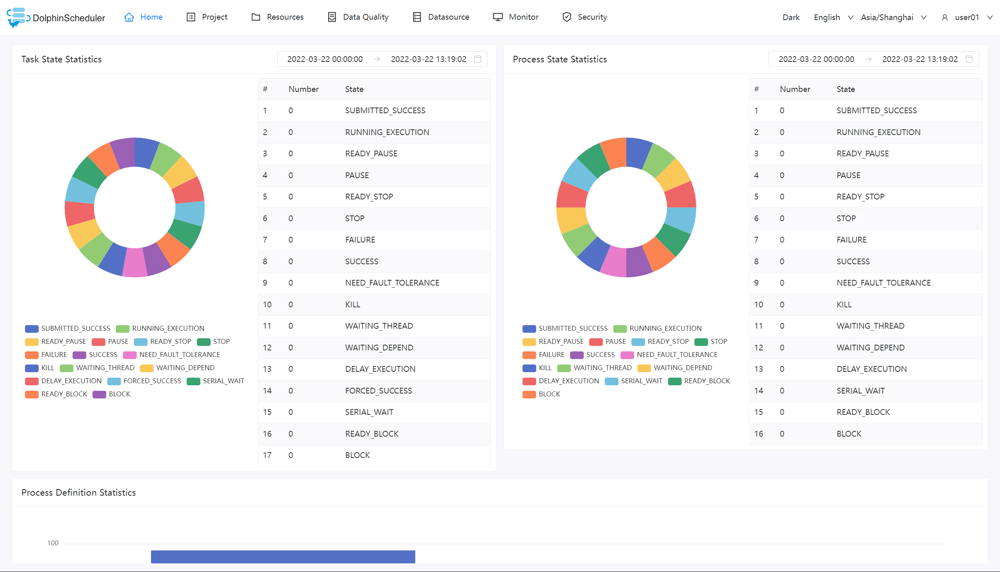

# Home Page

Apache DolphinScheduler home page lets you see task state statistics, workflow state statistics, and project statistics for all projects of users. It is the best way to observe status of your system as a whole as well as diving into individual process to check each status of task and task logs.

