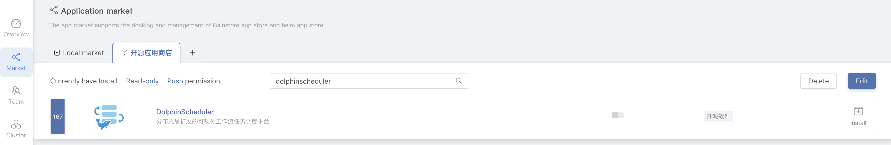
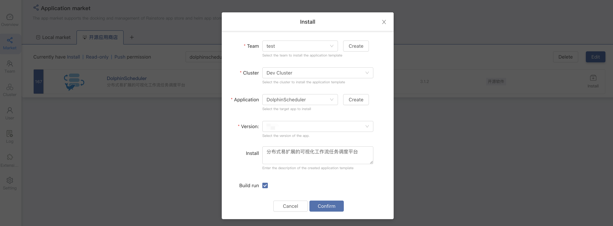
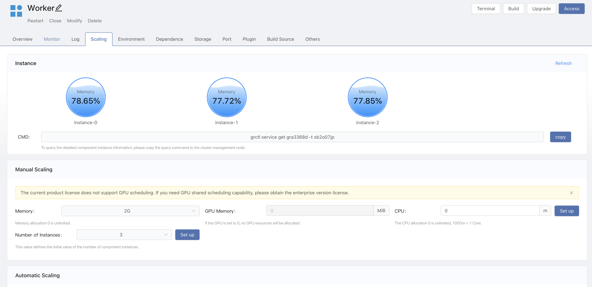
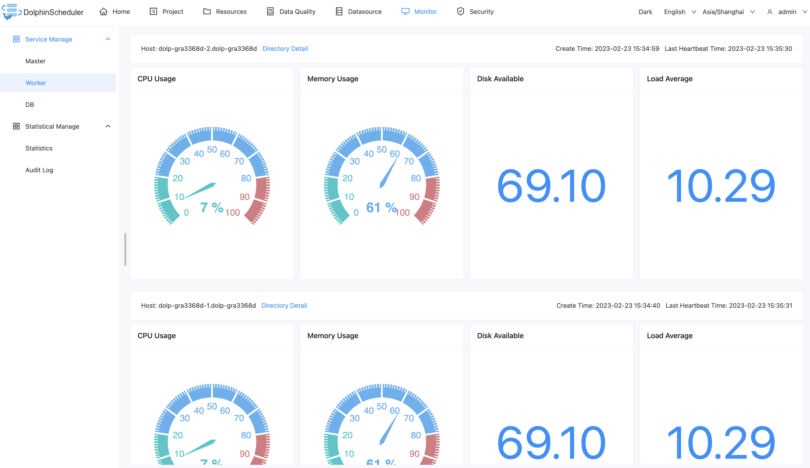
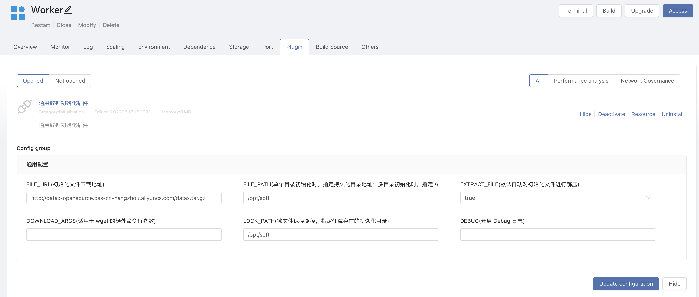

# Use Rainbond Deployment

This section describes the one-click deployment of high availability DolphinScheduler clusters through the [Rainbond](https://www.rainbond.com/) cloud native application management platform. This method is suitable for users who don't know much about complex technologies such as `Kubernetes`, lowering the threshold for deploying DolphinScheduler in `Kubernetes` mode.

## Prerequisites

* Available Rainbond cloud native application management platform is a prerequisite，please refer to the official `Rainbond` documentation [Rainbond Quick install](https://www.rainbond.com/docs/quick-start/quick-install)

## DolphinScheduler Cluster One-click Deployment

1. Go to Rainbond **Platform Management -> App Marketplace -> Open Source App Store** and search for **dolphinScheduler** to find the DolphinScheduler application.

2. Click **install** on the right side of DolphinScheduler to go to the installation page. Fill in the corresponding information and click `OK` to start the installation. You will get automatically redirected to the application view.

| Select item  |             Description             |
|--------------|-------------------------------------|
| Team name    | user workspace，Isolate by namespace |
| Cluster name | select kubernetes cluster           |
| Select app   | select application                  |
| app version  | select DolphinScheduler version     |

3. Wait a few minutes, the installation completes and `DolphinScheduler` will be running.

4. Click the `access` button in the application to access the DolphinScheduler-API components through the domain name provided by Rainbond by default. Default user password is **admin/dolphinscheduler123**.

## API Master Worker Node Telescopic

DolphinScheduler API、Master、Worker all support scaling multiple instances, ensuring the high availability of the entire service.

Take `worker` as an example: enter the `component -> Telescopic` page, and set the number of instances.

To verify `worker` node, enter `DolphinScheduler UI -> Monitoring -> Worker` page to view detailed node information.

## Configuration file

API and Worker Services share the configuration file `/opt/dolphinscheduler/conf/common.properties`. To modify the configurations, you only need to modify that of the API service.

## How to support Python 3？

Worker service is installed with default `Python3`，you can add environment variables `PYTHON_LAUNCHER=/usr/bin/python3`

## How to support Hadoop, Spark, DataX ？

Take `DataX` as an example:

1. Install the plugin。Rainbond Team View -> Plugin -> Install plugin from the App Store -> search `initialization plugin` Install.
2. Open plugin.enter Worker component -> plugin -> open `initialization plugin` and modify the configuration.
   * FILE_URL：http://datax-opensource.oss-cn-hangzhou.aliyuncs.com/datax.tar.gz
   * FILE_PATH：/opt/soft
   * LOCK_PATH：/opt/soft
3. Update component, the plug-in `Datax` will be downloaded automatically and decompress to `/opt/soft`
   

---

