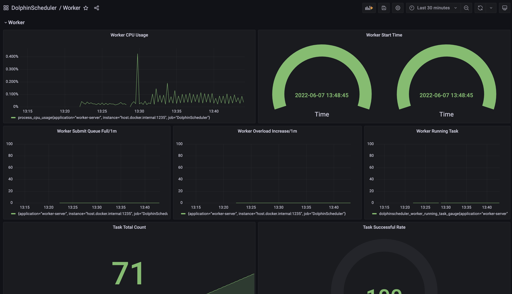

# Introduction

Apache DolphinScheduler exports metrics for system observability. We use [Micrometer](https://micrometer.io/) as application metrics facade.
Currently, we only support `Prometheus Exporter` but more are coming soon.

## Quick Start 

- We enable Apache DolphinScheduler export metrics in `standalone` mode to help users get hands dirty easily. 
- After triggering tasks in `standalone` mode, you could access metrics list by visiting url `http://localhost:12345/dolphinscheduler/actuator/metrics`.
- After triggering tasks in `standalone` mode, you could access `prometheus-format` metrics by visiting url `http://localhost:12345/dolphinscheduler/actuator/prometheus`.
- For a better experience with `Prometheus` and `Grafana`, we have prepared the out-of-the-box `Grafana` configuration for you, you could find the `Grafana` dashboard
at `dolphinscheduler-meter/resources/grafana` and directly import these dashboards to your `Grafana` instance.
- If you want to try with `docker`, you can use the following command to start the out-of-the-box `Prometheus` and `Grafana`:

```shell
cd dolphinscheduler-meter/src/main/resources/grafana-demo
docker compose up
```

then access the `Grafana` by the url: `http://localhost/3001` for dashboards.    




      
- If you prefer to have some experiments in `cluster` mode, please refer to the [Configuration](#configuration) section below:

## Configuration

- Please add the following config in master/worker/alert/api's yaml file to enable the metrics exporter.

```yaml
metrics:
  enabled: true
```

- Once the metrics exporter enabled, you could access the metrics by the url `http://ip:port/actuator/prometheus`.

The exporter port is the `server.port` defined in application.yaml, e.g: master: `server.port: 5679`, worker: `server.port: 1235`, alert: `server.port: 50053`, api: `server.port: 12345`.

For example, you can get the master metrics by `curl http://localhost:5679/actuator/prometheus`.

## Naming Convention & Mapping

- Apache DolphinScheduler metrics naming follows the officially-recommended approach by [Micrometer](https://github.com/micrometer-metrics/micrometer-docs/blob/main/src/docs/concepts/naming.adoc#:~:text=Micrometer%20employs%20a%20naming%20convention,between%20one%20system%20and%20another.)
- `Micrometer` automatically maps the metrics name to suit the external metrics system you configured. Currently, we only support `Prometheus Exporter` but more are coming soon.

### Prometheus

- all dots mapped to underscores
- metric name starting with number added with prefix `m_` 
- COUNTER: add `_total` suffix if not ending with it
- LONG_TASK_TIMER: `_timer_seconds` suffix added if not ending with them
- GAUGE: `_baseUnit` suffix added if not ending with it

## Dolphin Scheduler Metrics Cheatsheet

- We categorize metrics by dolphin scheduler components such as `master server`, `worker server`, `api server` and `alert server`.
- Although task / workflow related metrics exported by `master server` and `worker server`, we categorize them separately for users to query them more conveniently.  

### Task Related Metrics

- ds.task.timeout.count: (counter) the number of timeout tasks
- ds.task.finish.count: (counter) the number of finished tasks, both succeeded and failed included
- ds.task.success.count: (counter) the number of successful tasks
- ds.task.failure.count: (counter) the number of failed tasks
- ds.task.stop.count: (counter) the number of stopped tasks
- ds.task.retry.count: (counter) the number of retried tasks 
- ds.task.submit.count: (counter) the number of submitted tasks
- ds.task.failover.count: (counter) the number of task fail-overs
- ds.task.dispatch.count: (counter) the number of tasks dispatched to worker
- ds.task.dispatch.failure.count: (counter) the number of tasks failed to dispatch, retry failure included
- ds.task.dispatch.error.count: (counter) the number of task dispatch errors
- ds.task.execution.count.by.type: (counter) the number of task executions grouped by tag `task_type`
- ds.task.running: (gauge) the number of running tasks 
- ds.task.prepared: (gauge) the number of tasks prepared for task queue 
- ds.task.execution.count: (histogram) the number of executed tasks  
- ds.task.execution.duration: (histogram) duration of task executions


### Workflow Related Metrics

- ds.workflow.create.command.count: (counter) the number of commands created and inserted by workflows
- ds.workflow.instance.submit.count: (counter) the number of submitted workflow instances
- ds.workflow.instance.running: (gauge) the number of running workflow instances
- ds.workflow.instance.timeout.count: (counter) the number of timeout workflow instances
- ds.workflow.instance.finish.count: (counter) indicates the number of finished workflow instances, both successes and failures included
- ds.workflow.instance.success.count: (counter) the number of successful workflow instances
- ds.workflow.instance.failure.count: (counter) the number of failed workflow instances 
- ds.workflow.instance.stop.count: (counter) the number of stopped workflow instances 
- ds.workflow.instance.failover.count: (counter) the number of workflow instance fail-overs

### Master Server Metrics

- ds.master.overload.count: (counter) the number of times the master overloaded
- ds.master.consume.command.count: (counter) the number of commands consumed by master 
- ds.master.scheduler.failover.check.count: (counter) the number of scheduler (master) fail-over checks
- ds.master.scheduler.failover.check.time: (histogram) the total time cost of scheduler (master) fail-over checks
- ds.master.quartz.job.executed: the total number of quartz jobs executed
- ds.master.quartz.job.execution.time: the total execution time of quartz jobs

### Worker Server Metrics

- ds.worker.overload.count: (counter) the number of times the worker overloaded
- ds.worker.full.submit.queue.count: (counter) the number of times the worker's submit queue being full


### Api Server Metrics

### Alert Server Related

In each server, there are some default system-level metrics related to `database connection`, `JVM`, etc. We list them below for your reference:

### Database Related Metrics (Default)

- hikaricp.connections: the total number of connections
- hikaricp.connections.creation: connection creation time (max, count, sum included)
- hikaricp.connections.acquire: connection acquirement time (max, count, sum included) 
- hikaricp.connections.usage: connection usage time (max, count, sum included)
- hikaricp.connections.max: the max number of connections
- hikaricp.connections.min: the min number of connections
- hikaricp.connections.active: the number of active connections
- hikaricp.connections.idle: the number of idle connections
- hikaricp.connections.pending: the number of pending connections
- hikaricp.connections.timeout: the total number of timeout connections
- jdbc.connections.max: the max number of active connections that can be allocated at the same time
- jdbc.connections.min: the min number of idle connections in the pool
- jdbc.connections.idle: the number of established but idle connections
- jdbc.connections.active: the current number of active connections allocated from the data source

### JVM Related Metrics (Default)

- jvm.buffer.total.capacity: an estimate of the total capacity of the buffers in the pool
- jvm.buffer.count: an estimate of the number of buffers in the pool
- jvm.buffer.memory.used: an estimate of the memory that the JVM is using for this buffer pool
- jvm.memory.committed: the amount of memory in bytes committed for the JVM to use
- jvm.memory.max: the maximum amount of memory in bytes that can be used for memory management
- jvm.memory.used: the amount of used memory
- jvm.threads.peak: the peak live thread count since the JVM started or peak reset
- jvm.threads.states: the current number of threads having NEW state
- jvm.gc.memory.allocated: incremented for an increase in the size of the (young) heap memory pool after one GC to before the next
- jvm.gc.max.data.size: max size of long-lived heap memory pool
- jvm.gc.pause: time spent in GC pause (count, sum, max included)
- jvm.gc.live.data.size: the size of long-lived heap memory pool after reclamation
- jvm.gc.memory.promoted: the count of positive increases in the size of the old generation memory pool before GC to after GC.
- jvm.classes.loaded: the number of classes currently loaded in the JVM
- jvm.threads.live: the current number of live threads including both daemon and non-daemon threads
- jvm.threads.daemon: the current number of live daemon threads
- jvm.classes.unloaded: the total number of classes unloaded since the JVM started
- process.cpu.usage: the `recent cpu usage` for the JVM process
- process.start.time: start time of the process since unix epoch
- process.uptime: the uptime of the JVM

### Others (Default)

- jetty.threads.config.max: the max number of threads in the pool
- jetty.threads.config.min: the min number of threads in the pool
- jetty.threads.current: the total number of threads in the pool
- jetty.threads.idle: the number of idle threads in the pool
- jetty.threads.busy: the number of busy threads in the pool
- jetty.threads.jobs: number of queued jobs waiting for a thread
- process.files.max: the max number of file descriptors
- process.files.open: the number of open file descriptors
- system.cpu.usage: the recent cpu usage for the whole system
- system.cpu.count: the number of processors available to the JVM
- system.load.average.1m: the total number of runnable entities queued to available processors and runnable entities running on the available processors averaged over a period
- logback.events: the number of events that made it to the logs grouped by the tag `level`
- http.server.requests: total number of http requests
