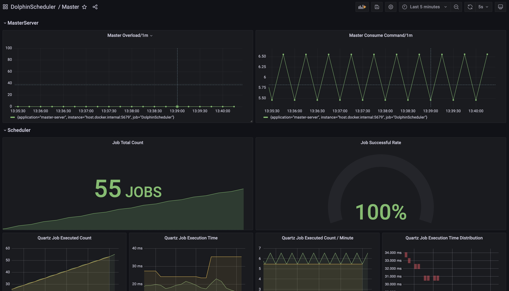
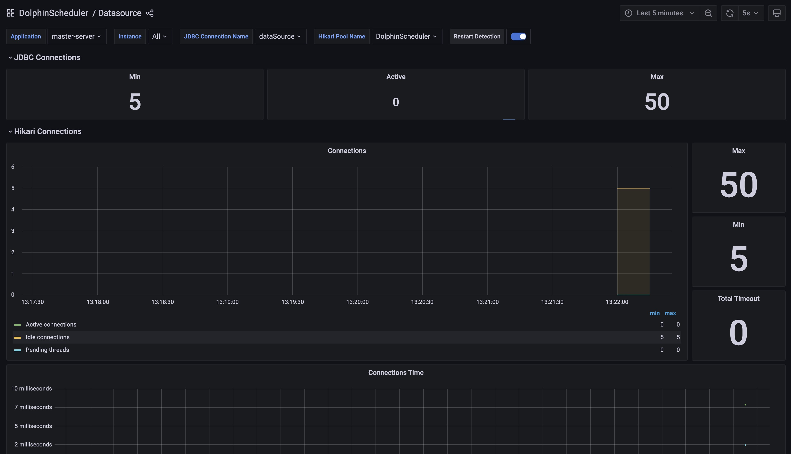

# Introduction

Apache DolphinScheduler exports metrics for system observability. We use [micrometer](https://micrometer.io/) as application metrics facade.
Currently, we only support `Prometheus Exporter` but more are coming soon.

## Quick Start 

- Standalone mode

## Configuration

You can add the following config in master/worker/alert/api's yaml file to enable the metrics exporter.

```yaml
metrics:
  enabled: true
```

Once you enable the metrics exporter, you can access the metrics by the url: `http://ip:port/actuator/prometheus`

The exporter port is the `server.port` defined in application.yaml, e.g: master: `server.port: 5679`, worker: `server.port: 1235`, alert: `server.port: 50053`, api: `server.port: 12345`.

For example, you can get the master metrics by `curl http://localhost:5679/actuator/prometheus`

We have prepared the out-of-the-box Grafana configuration for you, you can find the Grafana dashboard
at `dolphinscheduler-meter/resources/grafana`, you can directly import these dashboards to grafana.

If you want to try at docker, you can use the following command to start the prometheus with grafana:

```shell
cd dolphinscheduler-meter/src/main/resources/grafana-demo
docker compose up
```

Then you can access the grafana by the url: `http://localhost/3001`





## Name Mapping

### Prometheus

## Metrics List

- We categorize metrics by dolphin scheduler components such as `master server`, `worker server`, `api server` and `alert server`.
- Although task / workflow related metrics exported by `master server` and `worker server`, we categorize them separately for users to find them more conveniently.  

### Task Related Metrics

- ds.task.timeout.count: (counter) the number of timeout tasks
- ds.task.finish.count: (counter) the number of finished tasks, both succeeded and failed included
- ds.task.success.count: (counter) the number of successful tasks
- ds.task.retry.count: (counter) the number of retried tasks 
- ds.task.failover.count: (counter) the number of task fail-overs
- ds.task.dispatch.count: (counter) the number of tasks dispatched to worker
- ds.task.dispatch.failure.count: (counter) the number of tasks failed to dispatch, retry failure included
- ds.task.dispatch.error.count: (counter) the number of task dispatch errors
- ds.task.execution.count.by.type: (counter) the number of task executions grouped by tag `task_type`
- ds.task.running: (gauge) the number of running tasks 
- ds.task.execution.count: (histogram) the number of executed tasks  
- ds.task.execution.duration: (histogram) duration of task executions


### Workflow Related Metrics

- ds.workflow.create.command.count: (counter) the number of commands created and inserted by workflows
- ds.workflow.instance.submit.count: (counter) the number of submitted workflow instances
- ds.workflow.instance.running: (gauge) the number of running workflow instances
- ds.workflow.instance.timeout.count: (counter) the number of timeout workflow instances
- ds.workflow.instance.finish.count: (counter) indicates the number of finished workflow instances, both successes and failures included
- ds.workflow.instance.success.count: (counter) the number of successful workflow instances
- ds.workflow.instance.stop.count: (counter) the number of stopped workflow instances 
- ds.workflow.instance.failover.count: (counter) the number of workflow instance fail-overs

### Master Server Metrics

- ds.master.overload.count: the number of times the master overloaded
- ds.master.consume.command.count: the number of commands consumed by master 

### Worker Server Metrics

- ds.worker.overload.count: the number of times the worker overloaded
- ds.worker.full.submit.queue.count: the number of times the worker's submit queue being full


### Api Server Metrics

### Alert Server Related

In each server, there are some default system-level metrics related to `database connection`, `JVM`, etc. We list them below for your reference:

### Database Related Metrics (Default)

- hikaricp_connections_creation_seconds_max: Connection creation time max.
- hikaricp_connections_creation_seconds_count: Connection creation time count.
- hikaricp_connections_creation_seconds_sum: Connection creation time sum.
- hikaricp_connections_acquire_seconds_max: Connection acquire time max.
- hikaricp_connections_acquire_seconds_count: Connection acquire time count.
- hikaricp_connections_acquire_seconds_sum: Connection acquire time sum.
- hikaricp_connections_usage_seconds_max: Connection usage max.
- hikaricp_connections_usage_seconds_count: Connection usage time count.
- hikaricp_connections_usage_seconds_sum: Connection usage time sum.
- hikaricp_connections_max: Max connections.
- hikaricp_connections_min Min connections
- hikaricp_connections_active: Active connections.
- hikaricp_connections_idle: Idle connections.
- hikaricp_connections_pending: Pending connections.
- hikaricp_connections_timeout_total: Timeout connections.
- hikaricp_connections: Total connections
- jdbc_connections_max: Maximum number of active connections that can be allocated at the same time.
- jdbc_connections_min: Minimum number of idle connections in the pool.
- jdbc_connections_idle: Number of established but idle connections.
- jdbc_connections_active: Current number of active connections that have been allocated from the data source.

### JVM Related Metrics (Default)

- jvm_buffer_total_capacity_bytes: An estimate of the total capacity of the buffers in this pool.
- jvm_buffer_count_buffers: An estimate of the number of buffers in the pool.
- jvm_buffer_memory_used_bytes: An estimate of the memory that the Java virtual machine is using for this buffer pool.
- jvm_memory_committed_bytes: The amount of memory in bytes that is committed for the Java virtual machine to use.
- jvm_memory_max_bytes: The maximum amount of memory in bytes that can be used for memory management.
- jvm_memory_used_bytes: The amount of used memory.
- jvm_threads_peak_threads: The peak live thread count since the Java virtual machine started or peak was reset.
- jvm_threads_states_threads: The current number of threads having NEW state.
- jvm_gc_memory_allocated_bytes_total: Incremented for an increase in the size of the (young) heap memory pool after one GC to before the next.
- jvm_gc_max_data_size_bytes: Max size of long-lived heap memory pool.
- jvm_gc_pause_seconds_count: Time spent count in GC pause.
- jvm_gc_pause_seconds_sum: Time spent sum in GC pause.
- jvm_gc_pause_seconds_max: Time spent max in GC pause.
- jvm_gc_live_data_size_bytes: Size of long-lived heap memory pool after reclamation.
- jvm_gc_memory_promoted_bytes_total: Count of positive increases in the size of the old generation memory pool before GC to after GC.
- jvm_classes_loaded_classes: The number of classes that are currently loaded in the Java virtual machine.
- jvm_threads_live_threads: The current number of live threads including both daemon and non-daemon threads.
- jvm_threads_daemon_threads: The current number of live daemon threads.
- jvm_classes_unloaded_classes_total: The total number of classes unloaded since the Java virtual machine has started execution.
- process_cpu_usage: The "recent cpu usage" for the Java Virtual Machine process.
- process_start_time_seconds: Start time of the process since unix epoch.
- process_uptime_seconds: The uptime of the Java virtual machine.

### Others (Default)

- jetty_threads_config_max: The maximum number of threads in the pool.
- jetty_threads_config_min: The minimum number of threads in the pool.
- jetty_threads_current: The total number of threads in the pool.
- jetty_threads_idle: The number of idle threads in the pool.
- jetty_threads_busy: The number of busy threads in the pool.
- jetty_threads_jobs: Number of jobs queued waiting for a thread.
- process_files_max_files: The maximum file descriptor count.
- process_files_open_files: The open file descriptor count.
- system_cpu_usage: The "recent cpu usage" for the whole system.
- system_cpu_count: The number of processors available to the Java virtual machine.
- system_load_average_1m: The sum of the number of runnable entities queued to available processors and the number of runnable entities running on the available processors averaged over a period of time.
- logback_events_total: Number of level events that made it to the logs
