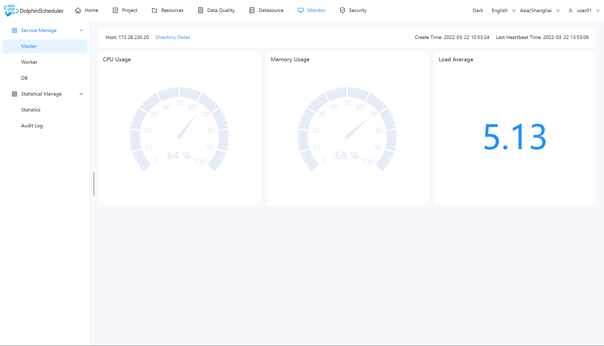
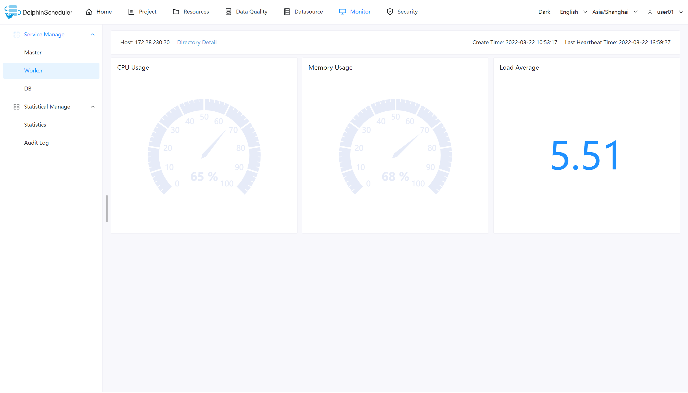
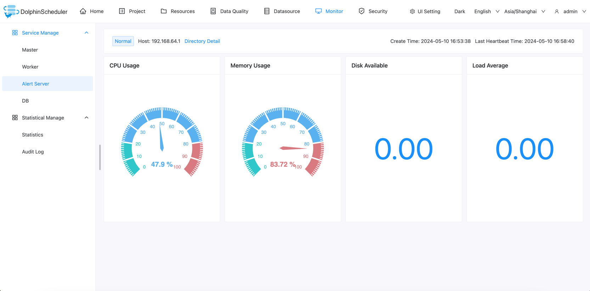
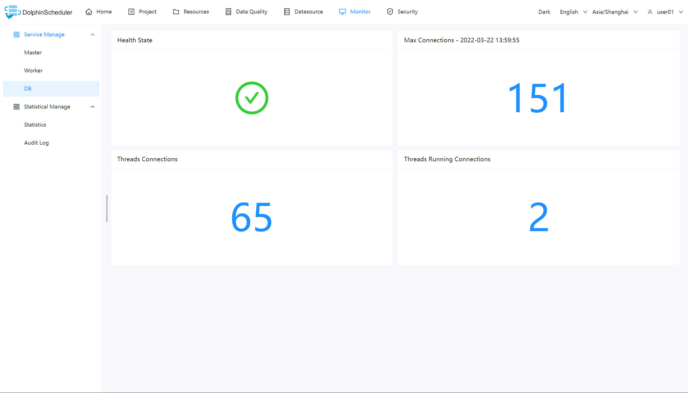
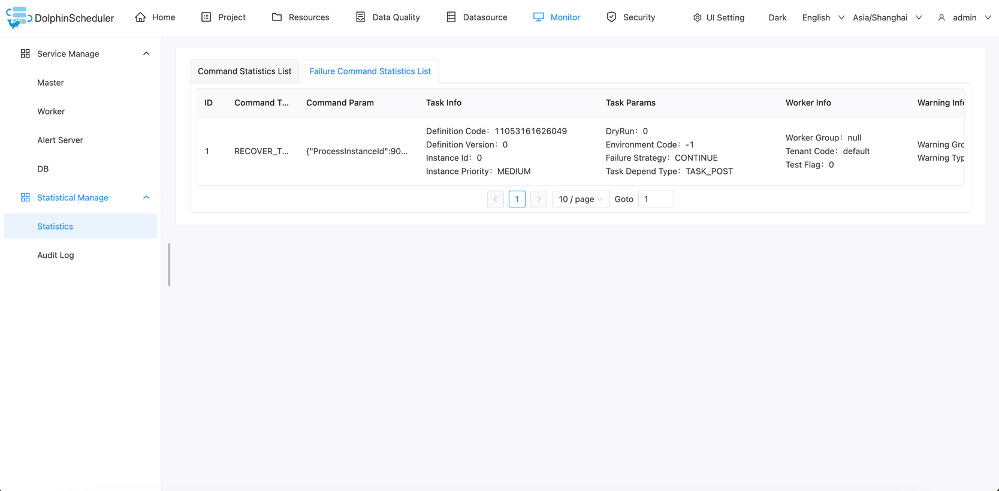
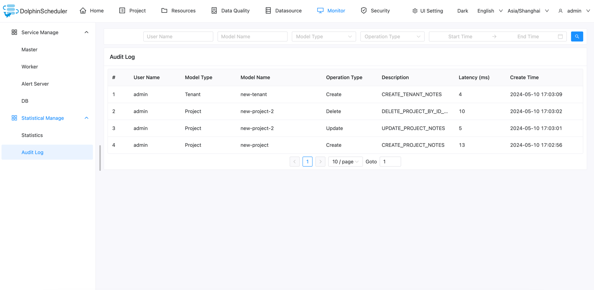

# Monitor

## Service Management

- Service management is mainly to monitor and display the health status and basic information of each service in the system.

### Master Server

- Mainly related to master information.

### Worker Server

- Mainly related to worker information.

### Alert Server

- Mainly related to alert server information.

### Database

- Mainly the health status of the DB.

## Statistics Management

### Statistics

Shows the command list in the system. Data is from the `t_ds_command` table.

Shows the failure command list in the system. Data is from the `t_ds_error_command` table.

### Audit Log

The audit log provides information about who accesses the system and the operations made to the system and record related
time, which strengthen the security of the system and maintenance.

