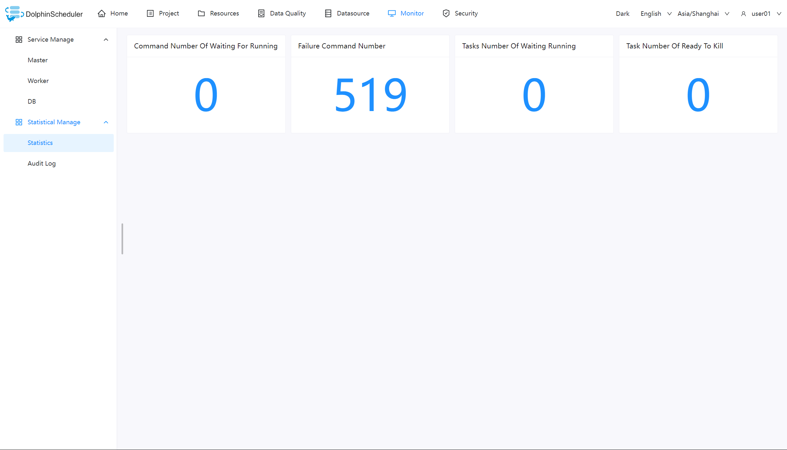
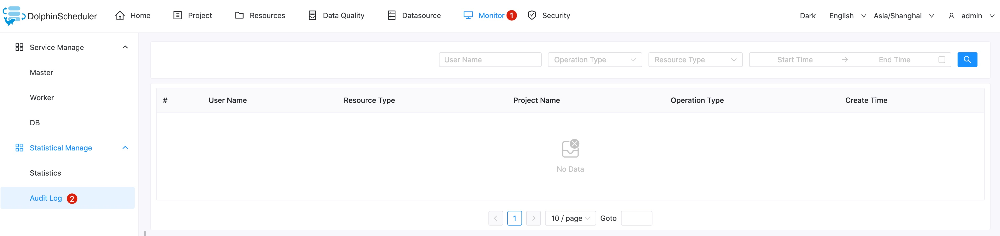

# Monitor

## Service Management

- Service management is mainly to monitor and display the health status and basic information of each service in the system.

### Master Server

- Mainly related to master information.

### Worker Server

- Mainly related to worker information.

### Database

- Mainly the health status of the DB.

## Statistics Management

### Statistics

|             **Parameter**              |                  **Description**                   |
|----------------------------------------|----------------------------------------------------|
| Number of commands wait to be executed | Statistics of the `t_ds_command` table data.       |
| The number of failed commands          | Statistics of the `t_ds_error_command` table data. |
| Number of tasks wait to run            | Count the data of `task_queue` in the ZooKeeper.   |
| Number of tasks wait to be killed      | Count the data of `task_kill` in the ZooKeeper.    |

### Audit Log

The audit log provides information about who accesses the system and the operations made to the system and record related
time, which strengthen the security of the system and maintenance.

