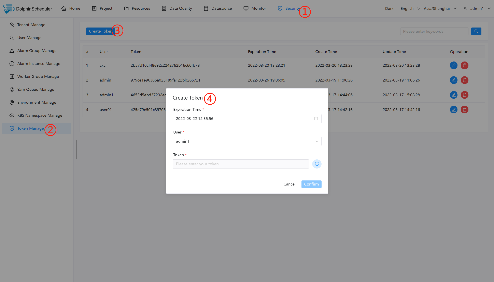

# Open API

## Background

Generally, projects and processes are created through pages, but considering the integration with third-party systems requires API calls to manage projects and workflows.

## The Operation Steps of DolphinScheduler API Calls

### Create a Token

1. Log in to the scheduling system, click "Security", then click "Token manage" on the left, and click "Create token" to create a token.



2. Select the "Expiration time" (Token validity time), select "User" (choose the specified user to perform the API operation), click "Generate token", copy the `Token` string, and click "Submit".


### Examples

#### Query project list

1. Open the API documentation

> Address：http://{API server ip}:12345/dolphinscheduler/swagger-ui/index.html?language=en_US&lang=en


2. select a test API, the API selected for this test is `queryAllProjectList`

   > projects/list

3. Open `Postman`, fill in the API address, enter the `Token` in `Headers`, and then send the request to view the result:

   ```
   token: The Token just generated
   ```


#### Create a Project

This demonstrates how to use the calling api to create the corresponding project.

By consulting the api documentation, configure the KEY as Accept and VALUE as the parameter of application/json in the headers of Postman.


And then configure the required projectName and description parameters in Body.


Check the post request result.


The returned `msg` information is "success", indicating that we have successfully created the project through API.

If you are interested in the source code of creating a project, please continue to read the following：

### Appendix： The Source Code of Creating a Project


